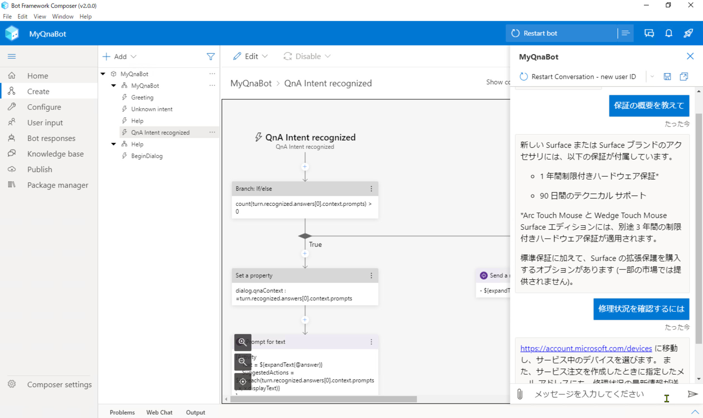

# Bot Framework Composer + QnA Maker で作る Q&A チャットボット ハンズオン

このハンズオンでは、[**Bot Framework Composer**](https://docs.microsoft.com/ja-jp/composer/) + [**QnA Maker**](https://www.qnamaker.ai/) を使って Q&A チャットボットを作成します。

1. [開発環境の構築](./docs/01_install.md)
2. [Bot Framework Composer の基礎 - 1 (Echo Bot)](./docs/02_composer_basic.md)
3. [Bot Framework Composer の基礎 - 2 (機能追加)](./docs/03_composer_basic2.md)  
4. [QnA Maker でナレッジベース作成](./docs/04_create_qnamaker_knowledgebase.md)  
5. [Bot アプリケーションに Q&A 機能を実装](./docs/05_composer_qna.md)  
6. [Language Understanding でユーザーの意図を予測](./docs/06_composer_luis.md)  
<!-- 7. [Bot アプリケーションをクラウドに発行](./docs/07_deploy_bot.md) -->

> このハンズオンでは [**Bot Framework Composer 1.3.1**](https://techcommunity.microsoft.com/t5/azure-ai/build-2020-conversational-ai-updates/ba-p/1397685) を使用しています。

> Bot Framework Composer v.1.3.0 以降では、マイクロソフトアカウントで Azure に発行する操作はエラーとなるようです。  
> 現在は 1章～6章の手順のみ公開しています。  
> 今後のバージョンアップで改善されたところで、7章として Azure への発行の操作を追加します。  

---

Bot Framework Composer は、Bot アプリケーションを GUI で開発できるツールです。

- GUI の操作で Bot Framework ベースの C# のコードを自動生成
- ダイアログ（一連の対話）の作成や管理が簡単
- [LUIS](https://luis.ai/) との統合
- [QnA Maker](https://qnamaker.ai/) と簡単に連携
- 外部サービスの利用で機能拡張が可能

Bot Framework Composer の公式ドキュメントは [**こちら**](https://docs.microsoft.com/ja-jp/composer/) です。

---

Copyright (C) 2020-2021 Seosoft All rights reserved.  
本コンテンツの著作権、および本コンテンツ中に出てくる商標権、団体名、ロゴ、製品、サービスなどはそれぞれ、各権利保有者に帰属します。