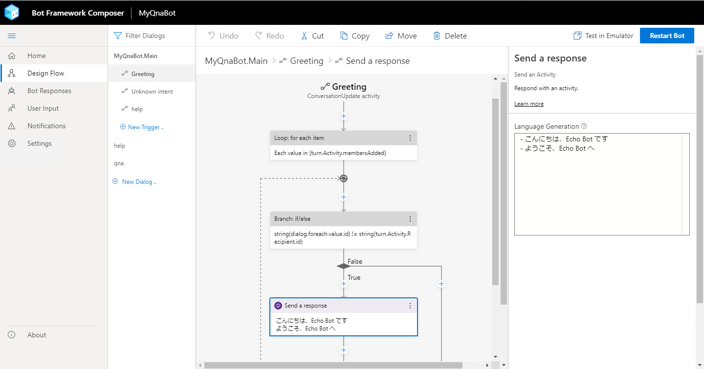

# Bot Framework Composer + QnA Maker で作る Q&A チャットボット ハンズオン

このハンズオンでは、[**Bot Framework Composer**](https://docs.microsoft.com/ja-jp/composer/) + [**QnA Maker**](https://www.qnamaker.ai/) を使って Q&A チャットボットを作成します。

1. [開発環境の構築](./docs/01_install.md)
2. [Bot Framework Composer の基礎 - 1 (Echo Bot)](./docs/02_composer_basic.md)
3. [Bot Framework Composer の基礎 - 2 (機能追加)](./docs/03_composer_basic2.md)  
4. [QnA Maker でナレッジベース作成](./docs/04_create_qnamaker_knowledgebase.md)  
5. [Bot アプリケーションに Q&A 機能を実装](./docs/05_composer_qna.md)  
6. [LUIS でユーザーの意図を予測する](./docs/06_composer_luis.md)  
7. [QnA Bot アプリケーションをクラウドに配置](./docs/07_deploy_to_azure.md)

---

 

Bot Framework Composer は、Bot アプリケーションを GUI で開発できるツールです。

- GUI の操作で Bot Framework ベースの C# のコードを自動生成
- ダイアログ（一連の対話）の作成や管理が簡単
- [LUIS](https://luis.ai/) との統合
- [QnA Maker](https://qnamaker.ai/) と簡単に連携
- 外部サービスの利用で機能拡張が可能

Bot Framework Composer の公式ドキュメントは [**こちら**](https://docs.microsoft.com/ja-jp/composer/) です。

> Bot Framework Composer は現在 Preview であり、仕様や操作方法、インストール方法、配布元などが今後変更される可能性があります。  
> 本コンテンツは 2020年4月末時点の情報を掲載しています。
