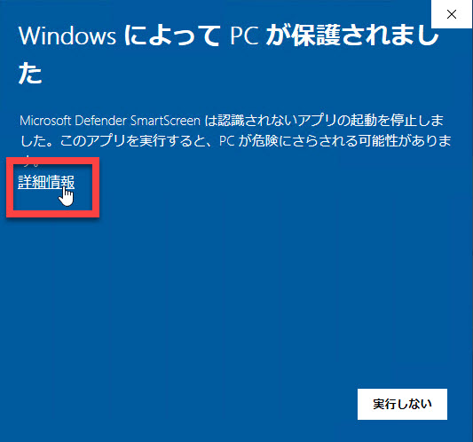
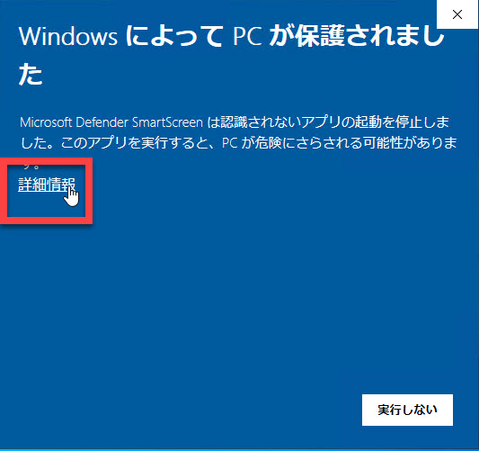
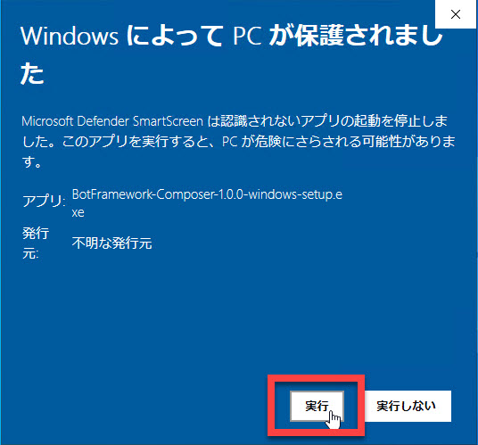
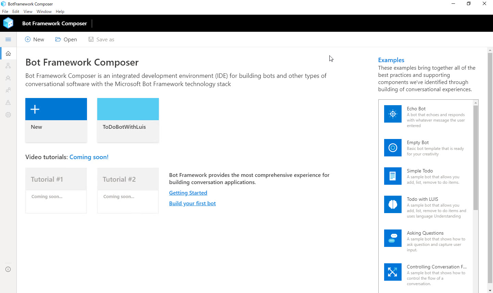

# 開発環境の構築

ハンズオンの最初に [**Bot Framework Composer**](https://docs.microsoft.com/ja-jp/composer/) で Bot 開発する環境を構築します。

ここでは [**Yarn でソースコードからインストールする**](#yarn-%e3%81%a7%e3%82%bd%e3%83%bc%e3%82%b9%e3%82%b3%e3%83%bc%e3%83%89%e3%81%8b%e3%82%89%e3%82%a4%e3%83%b3%e3%82%b9%e3%83%88%e3%83%bc%e3%83%ab) 方法をお勧めします。

[ローカルアプリケーション版のインストール方法](#%e5%8f%82%e8%80%83-%e3%83%ad%e3%83%bc%e3%82%ab%e3%83%ab%e3%82%a2%e3%83%97%e3%83%aa%e3%82%b1%e3%83%bc%e3%82%b7%e3%83%a7%e3%83%b3%e7%89%88%e3%82%92%e3%82%a4%e3%83%b3%e3%82%b9%e3%83%88%e3%83%bc%e3%83%ab) も記載しますが、時期により最新のコードや画面・仕様に追従できていないことがあるため、参考情報と考えてください。

> 2020年4月末時点では、Bot Framework Composer は Preview であり、互換性のない変更が行われる可能性があります。  
> Bot Framework Composer 自体の開発は GitHub 上で進められていますが、ローカルアプリケーション版は最新のソースコードに追従していません。
>
> このため、このハンズオン資料に掲載する操作や画面とは一部異なります。

---

## Yarn でソースコードからインストール

ここでは、[**Yarn**](https://classic.yarnpkg.com/ja/) で Bot Framework Composer のソースコードからインストールします。

1. (オプション) Visual Studio Code インストール  
   [Visual Studio Code](https://code.visualstudio.com/) をダウンロードしてインストールします。  
   このハンズオンの範囲では VSCode のインストールは必須ではありませんが、Bot Framework 開発を勧めると必要になることがあります。  
   このタイミングでインストールすることをお勧めします。

   なお git のデフォルトエディターとして Visaul Studio Code を選択できます。特に好みのエディターがない場合は、ここで Visual Studio Code をインストールしてください。

2. git インストール  
   [git](https://git-scm.com/downloads) をダウンロードしてインストールします。

3. Node.js インストール  
   [Node.js](https://nodejs.org/ja/download/) をダウンロードしてインストールします。  
   Version 12.13.0 以上が必要です。

4. Yarn インストール  
   [Yarn](https://classic.yarnpkg.com/en/docs/install#windows-stable) をダウンロードしてインストールします。  
   最新の安定版を選択してください。
  
   インストール時に警告画面が表示されることがあります。  
   [詳細情報] - [実行] でインストールを実行します。

   
   

5. .NET Core 3.1 インストール
   [.NET Core 3.1 SDK](https://dotnet.microsoft.com/download/dotnet-core/3.1) をダウンロードしてインストールします。

6. Bot Framework Emulator インストール
   [Bot Framework Emulator](https://github.com/microsoft/BotFramework-Emulator/releases) 最新版をダウンロードしてインストールします。  
   Bot Framework Emulator は Bot 開発時にテスト用クライアントとして使用します。

7. Bot Framework Composer ソースコード入手およびビルド  
   7-1. コマンドプロンプト、PowerShell または Git Bash を開きます。(Windows の場合)  
   その他の OS ではターミナルクライアントを開きます。  
   7-2. Bot Framework Composer をインストールするために任意のフォルダーに移動します。  
   7-3. GitHub のリポジトリからソースコードをクローンまたはダウンロードします。  

   ```cmd
   git clone https://github.com/microsoft/BotFramework-Composer.git
   ```

   7-4. Composer フォルダーに移動します。  

   ```cmd
   cd BotFramework-Composer\Compose
   ```

   7-5. ビルドに必要なパッケージを取得します。  
   数分程度の時間がかかるので完了するまで待ちます。

   ```cmd
   yarn
   ```

   7-6. Bot Framework Composer アプリケーションをビルドします。  
   数分程度の時間がかかるので完了するまで待ちます。

   ```cmd
   yarn build
   ```

   

   7-7. Bot Framework Composer サーバー起動  
   Bot Framework Composer サーバーを起動します。

   ```cmd
   yarn startall
   ```

   > 一度 Bot Framework Composer のインストールに成功した環境では、ビルドまでの手順は不要です。  
   > "yarn startall" で Bot Framework Composer を起動できます。

   7-8. Bot Framework Composer にブラウザーで接続  
   Web ブラウザーを起動して "**http://localhost:3000**" に接続します。  
   Bot Framework Composer アプリケーションが表示されます。

   

8. ngrok インストール  
   [ngrok](https://ngrok.com/download) をダウンロードして、ZIP ファイル内の "ngrok.exe" をローカル PC の任意のフォルダーにコピーします。  
   インストーラーはないので exe ファイルをコピーするだけです。パスが通ったフォルダーでなくてもかまいません。  

以上で、Bot Framework Composer で Bot 開発する準備できました。

[ページ先頭に戻る](#開発環境の構築)

---

## (参考) ローカルアプリケーション版をインストール

> 参考としてローカルアプリケーション版のインストールについて記載しますが、できるだけ [**ソースコードからインストール**](#yarn-%e3%81%a7%e3%82%bd%e3%83%bc%e3%82%b9%e3%82%b3%e3%83%bc%e3%83%89%e3%81%8b%e3%82%89%e3%82%a4%e3%83%b3%e3%82%b9%e3%83%88%e3%83%bc%e3%83%ab) することをお勧めします。

ここでは、Bot Framework Composer のローカルアプリケーション版を使用するための環境構築を行います。  
ローカルアプリケーションは Windows 版のみ用意されています。

1. .NET Core 3.1 インストール  
   [.NET Core 3.1 SDK](https://dotnet.microsoft.com/download/dotnet-core/3.1) をダウンロードしてインストールします。

2. Bot Framework Emulator インストール  
   [Bot Framework Emulator](https://github.com/microsoft/BotFramework-Emulator/releases) 最新版をダウンロードしてインストールします。  
   Bot Framework Emulator は Bot 開発時にテスト用クライアントとして使用します。

3. Bot Framework Composer インストール  
   [Bot Framework Composer](https://gist.github.com/christopheranderson/e652ce1983547fbcde1457a5dcedfccd) をダウンロードしてインストールします。  
  
   インストール時に警告画面が表示されることがあります。  
   [詳細情報] - [実行] でインストールを実行します。

   
   

4. Bot Framework Composer 起動確認  
   確認のために Bot Framework Composer を起動します。

   

5. ngrok インストール  
   [ngrok](https://ngrok.com/download) をダウンロードして、ZIP ファイル内の "ngrok.exe" をローカル PC の任意のフォルダーにコピーします。  
   インストーラーはないので exe ファイルをコピーするだけです。パスが通ったフォルダーでなくてもかまいません。 
6. (オプション) Visual Studio Code インストール  
   [Visual Studio Code](https://code.visualstudio.com/) をダウンロードしてインストールします。  
   このハンズオンの範囲では VSCode のインストールは必須ではありませんが、Bot Framework 開発を勧めると必要になることがあります。  
   このタイミングでインストールすることをお勧めします。

以上で、ローカルアプリケーション版 Bot Framework Composer のインストールは完了です。

[ページ先頭に戻る](#開発環境の構築)

---

以上で、Bot Framework Composer のインストールが完了しました。  
次のステップでは、Composer を使って実際に Bot アプリケーションを開発します。

[次に進む](02_create_qnamaker_knowledgebase.md)  
[目次に戻る](../README.md)
