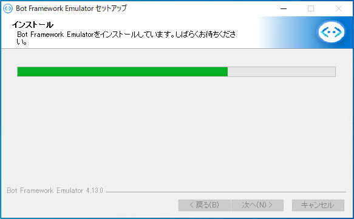
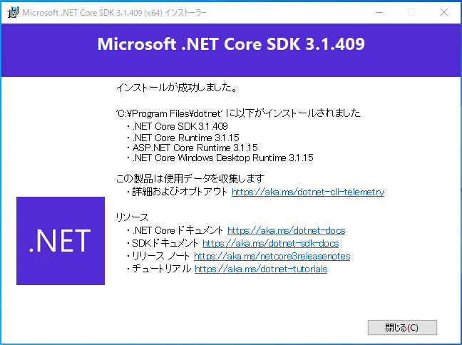

# 開発環境の構築

ハンズオンの最初に [**Bot Framework Composer**](https://docs.microsoft.com/ja-jp/composer/) で Bot 開発のための環境を構築します。

このハンズオンでは、[**Bot Framework Composer v2.0.0**](https://techcommunity.microsoft.com/t5/azure-ai/build-2021-conversational-ai-update/ba-p/2375203) を使用します。  
ハンズオン実施の時期によっては画面の構成などが一部異なる可能性があります。

 

> Bot Framework Composer は [ソースコードからビルドする](https://docs.microsoft.com/ja-jp/composer/install-composer#build-composer-from-source) も紹介します。  
> 不具合修正や機能追加・変更が、アプリケーション版より早いタイミングで行われる可能性があります。  
興味がある方はソースコードからビルドする方法を検討してください。

---

## デスクトップアプリケーション版をインストール

Bot Framework Composer を使用するには、構築が簡単なデスクトップアプリケーション版をお勧めします。  
Windows 版、macOS 版、Linux 版が用意されています。

1. **Bot Framework Emulator インストール**  
   [**Bot Framework Emulator**](https://github.com/microsoft/BotFramework-Emulator/releases) をダウンロードしてインストールします。  

   
    
   

   Bot Framework Emulator は Bot 開発の **テスト用クライアント** として使用します。

 

2. **.NET Core 3.1 SDK インストール**  
   [**.NET Core 3.1 SDK**](https://dotnet.microsoft.com/download/dotnet-core/3.1) をダウンロードしてインストールします。

   
    
   

 

3. **Node.js インストール**  
   [**Node.js**](https://nodejs.org/ja/download/) をダウンロードしてインストールします。  

   このハンズオンの Bot 開発の範囲では Node.js のインストールは必須ではありませんが、Bot Framework Composer は Node.js のコードを生成するプロジェクト テンプレートが用意されています。  
   このタイミングでインストールすることをお勧めします。

    

   > Windows を使用している場合、Node.js のインストーラーの途中で Chocolatey もインストールするかを確認されます。  
   > Bot Framework Composer での開発には Chocolatey は不要なので、任意で追加インストールしてください。

   > Node.js をインストールしていない環境で Bot Framework Composer で新規プロジェクトを作成すると、Node.js のインストールを促すポップアップが表示されます。  
   キャンセルすれば C# のテンプレートを利用して Bot 開発を進めることができますが、毎回メッセージが表示されるのが気になる場合や Node.js 用のテンプレートを利用したい場合は、Node.js のインストールをしてください。  
   >  
   > 

 

4. **Bot Framework Composer インストール**  
   使用している OS にあわせて、**Bot Framework Composer** のインストーラーをダウンロードしてインストールします。

   |OS|インストーラーのアドレス|
   |---|---|
   |Windows|[https://aka.ms/bf-composer-download-win](https://aka.ms/bf-composer-download-win)|
   |macOS|[https://aka.ms/bf-composer-download-mac](https://aka.ms/bf-composer-download-mac)|
   |Linux|[https://aka.ms/bf-composer-download-linux](https://aka.ms/bf-composer-download-linux)|

   
    
   

 

5. **Bot Framework Composer 起動確認**  
   確認のために Bot Framework Composer を起動します。

   

 

6. **ngrok インストール**  
   [**ngrok**](https://ngrok.com/download) をダウンロードして、ZIP ファイル内の "ngrok.exe" をローカル PC の任意のフォルダーにコピーします。  
   インストーラーはないので exe ファイルをコピーするだけです。パスが通ったフォルダーでなくてもかまいません。  

   ngrok は [ステップ 6](06_composer_luis.md) までの Bot アプリケーション開発の範囲では不要です。  
   [ステップ 7](07_deploy_to_azure.md) で Bot アプリケーションを Azure に発行したあとの動作確認に使用します。

    

   > Bot Framework Composer で開発する場合、以下のケースで ngrok が必要になります。
   > - Azure に発行した Bot アプリケーションを Bot Framework Emulator でテストしたい場合
   > - ローカルで実行している Bot アプリケーションに他のマシンから接続したい場合

 

以上で、Bot アプリケーション開発環境の構築は完了です。  

---

以上で、Bot Framework Composer のインストールが完了しました。  
次のステップでは、Bot Framework Composer 操作の超基礎を理解するために、Echo Bot を作ります。

[次に進む](./02_composer_basic.md)  
[目次に戻る](../README.md)
