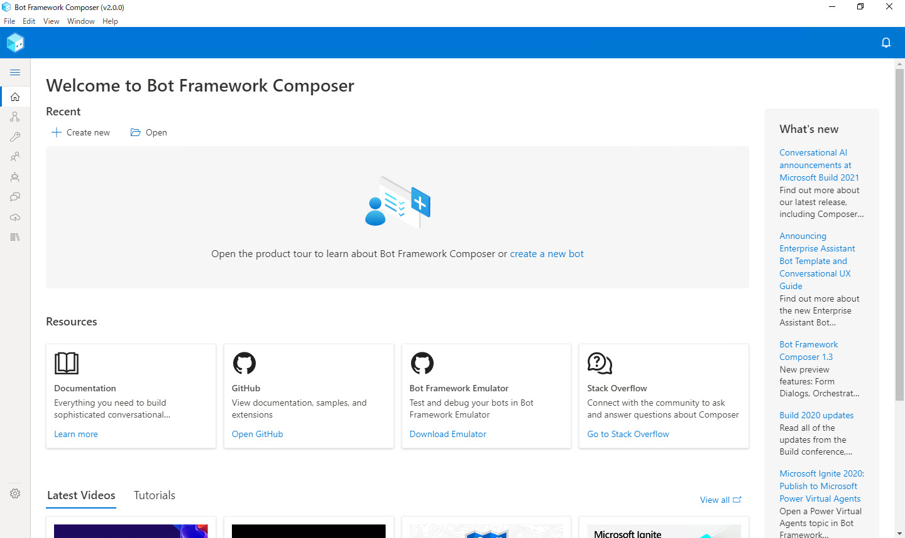

# 開発環境の構築

ハンズオンの最初に [**Bot Framework Composer**](https://docs.microsoft.com/ja-jp/composer/) で Bot 開発のための環境を構築します。

このハンズオンでは、2020年5月に GA、7月前半にリビジョンアップした [**Bot Framework Composer 1.0.2**](https://techcommunity.microsoft.com/t5/azure-ai/build-2020-conversational-ai-updates/ba-p/1397685) を使用します。  
ハンズオン実施の時期によっては画面の構成などが一部異なる可能性があります。

> 参考として [ソースコードからビルドする方法](#%e5%8f%82%e8%80%83-%e3%82%bd%e3%83%bc%e3%82%b9%e3%82%b3%e3%83%bc%e3%83%89%e3%81%8b%e3%82%89%e3%83%93%e3%83%ab%e3%83%89%e3%81%99%e3%82%8b%e6%96%b9%e6%b3%95) も紹介します。  
> 不具合修正や機能追加・変更が、アプリケーション版より早いタイミングで行われる可能性があります。  
興味がある方はソースコードからビルドする方法を検討してください。

---

## デスクトップアプリケーション版をインストール

Bot Framework Composer を使用するには、構築が簡単なデスクトップアプリケーション版をお勧めします。  
Windows 版、macOS 版、Linux 版が用意されています。

1. **Bot Framework Emulator インストール**  
   [**Bot Framework Emulator**](https://github.com/microsoft/BotFramework-Emulator/releases) をダウンロードしてインストールします。  

   
   <br />
   

   Bot Framework Emulator は Bot 開発の **テスト用クライアント** として使用します。

2. **.NET Core 3.1 SDK インストール**  
   [**.NET Core 3.1 SDK**](https://dotnet.microsoft.com/download/dotnet-core/3.1) をダウンロードしてインストールします。

   
   <br />
   

3. **Bot Framework Composer インストール**  
   使用している OS にあわせて、**Bot Framework Composer** のインストーラーをダウンロードしてインストールします。

   > 以下のリンクは公式サイトに掲載されているものですが、時期によっては少し古いバージョンのインストーラーを指すことがあるようです。  
   > インストール後に最新版であることを確認して、必要に応じてアップデートしてください。（このあとの手順に記載します）

   |OS|インストーラーのアドレス|
   |---|---|
   |Windows|[https://aka.ms/bf-composer-download-win](https://aka.ms/bf-composer-download-win)|
   |macOS|[https://aka.ms/bf-composer-download-mac](https://aka.ms/bf-composer-download-mac)|
   |Linux|[https://aka.ms/bf-composer-download-linux](https://aka.ms/bf-composer-download-linux)|

   
   <br />
   

4. **Bot Framework Composer 起動確認**  
   確認のために Bot Framework Composer を起動します。

   

   起動時に "**New update available**" というダイアログが表示されるかもしれません。  
   その場合は次の手順で最新版にアップデートします。

5. **Bot Framework Composer を最新版にアップデート**  
   起動時に "**New update available**" というダイアログが表示された場合は、[**Okay**] をクリックしてアップデートを開始します。

   

   アップデートダイアログが表示されない場合でも、Bot Framework Composer インストール直後の **初回起動時** は [**Help**] - [**Check for Updates**] でアップデートの確認をします。

   

6. **ngrok インストール**  
   [**ngrok**](https://ngrok.com/download) をダウンロードして、ZIP ファイル内の "ngrok.exe" をローカル PC の任意のフォルダーにコピーします。  
   インストーラーはないので exe ファイルをコピーするだけです。パスが通ったフォルダーでなくてもかまいません。  

   ngrok は [ステップ 6](06_composer_luis.md) までの Bot アプリケーション開発の範囲では不要です。  
   [ステップ 7](07_deploy_to_azure.md) で Bot アプリケーションを Azure に発行したあとの動作確認に使用します。

   > Bot Framework Composer で開発する場合、以下のケースで ngrok が必要になります。
   >
   > - Azure に発行した Bot アプリケーションを Bot Framework Emulator でテストしたい場合
   > - OAuth で認証したい場合
   > - ローカルで実行している Bot アプリケーションに他のマシンから接続したい場合

7. **(オプション) Visual Studio Code インストール**  
   [**Visual Studio Code**](https://code.visualstudio.com/) をダウンロードしてインストールします。

   このハンズオンの範囲では VSCode のインストールは必須ではありませんが、Bot Framework 開発を継続すると必要になることがあります。  
   このタイミングでインストールすることをお勧めします。

以上で、Bot アプリケーション開発環境の構築は完了です。  

デスクトップアプリケーション版をインストールした場合は、以下の手順の "ソースからビルド" は不要です。

---

## (参考) ソースコードからビルドする方法

GA したことで、Bot Framework Composer はデスクトップアプリケーション版のインストーラーが整備されました。  
このハンズオンの実施、および一般的な利用にはデスクトップアプリケーション版の利用をお勧めします。

最新の機能を利用したい、デスクトップアプリケーション版の不具合が問題になるような場合には、ソースコードからのビルドを検討してください。


ここでは、[**Yarn**](https://classic.yarnpkg.com/ja/) で Bot Framework Composer のソースコードからインストールします。

1. **Git インストール**  
   [**Git**](https://git-scm.com/downloads) をダウンロードしてインストールします。

2. **Node.js インストール**  
   [**Node.js**](https://nodejs.org/ja/download/) をダウンロードしてインストールします。  
   Version 12.13.0 以上が必要です。

3. **Yarn インストール**  
   [**Yarn**](https://classic.yarnpkg.com/en/docs/install#windows-stable) をダウンロードしてインストールします。  
   最新の安定版を選択してください。
  
   > インストール時に警告画面が表示されることがあります。  
   > [詳細情報] - [実行] でインストールを実行します。

4. Bot Framework Composer ソースコード入手およびビルド  

   4-1. コマンドプロンプト、PowerShell、Git Bash または [Windows Terminal](https://www.microsoft.com/ja-jp/p/windows-terminal/9n0dx20hk701) など、好みのターミナルを開きます。(Windows の場合)  
   その他の OS ではターミナルクライアントを開きます。  

   4-2. Bot Framework Composer をインストールする任意のフォルダーを作成して、そこに移動します。  

   4-3. GitHub のリポジトリからソースコードをクローンまたはダウンロードします。  

   ```cmd
   git clone https://github.com/microsoft/BotFramework-Composer.git
   ```

   4-4. Composer フォルダーに移動します。  

   ```cmd
   cd BotFramework-Composer\Compose
   ```

   5-5. ビルドに必要なパッケージを取得します。  
   数分程度の時間がかかるので完了するまで待ちます。

   ```cmd
   yarn
   ```

   5-6. Bot Framework Composer アプリケーションをビルドします。  
   数分程度の時間がかかるので完了するまで待ちます。

   ```cmd
   yarn build
   ```

   5-7. Bot Framework Composer サーバーを起動します。

   ```cmd
   yarn startall
   ```

   Bot Framework Composer のビルドは PC ごとに一度だけ実行する必要があります。  
   二度目以降は "yarn startall" で Bot Framework Composer を起動できます。

   5-8. Bot Framework Composer を開きます。  
   Web ブラウザーを起動して "**http://localhost:3000**" に接続します。  
   Bot Framework Composer アプリケーションが表示されます。

5. **ngrok インストール**  
   [**ngrok**](https://ngrok.com/download) をダウンロードして、ZIP ファイル内の "ngrok.exe" をローカル PC の任意のフォルダーにコピーします。  
   インストーラーはないので exe ファイルをコピーするだけです。パスが通ったフォルダーでなくてもかまいません。  

   ngrok は [ステップ 6](06_composer_luis.md) までの Bot アプリケーション開発の範囲では不要です。  
   [ステップ 7](07_deploy_to_azure.md) で Bot アプリケーションを Azure に発行したあとの動作確認に使用します。

6. **(オプション) Visual Studio Code インストール**  
   [**Visual Studio Code**](https://code.visualstudio.com/) をダウンロードしてインストールします。

   このハンズオンの範囲では VSCode のインストールは必須ではありませんが、Bot Framework 開発を継続すると必要になることがあります。  
   このタイミングでインストールすることをお勧めします。

---

以上で、Bot Framework Composer のインストールが完了しました。  
次のステップでは、Bot Framework Composer 操作の超基礎を理解するために、Echo Bot を作ります。

[次に進む](02_composer_basic.md)  
[目次に戻る](../README.md)
