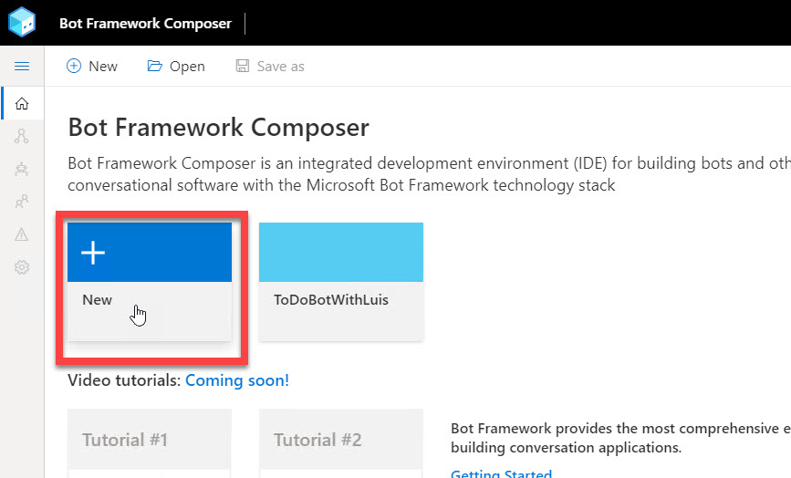
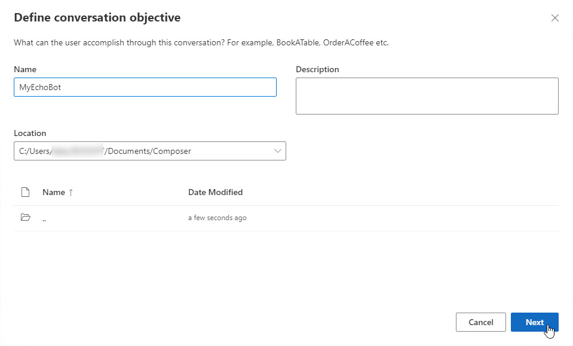
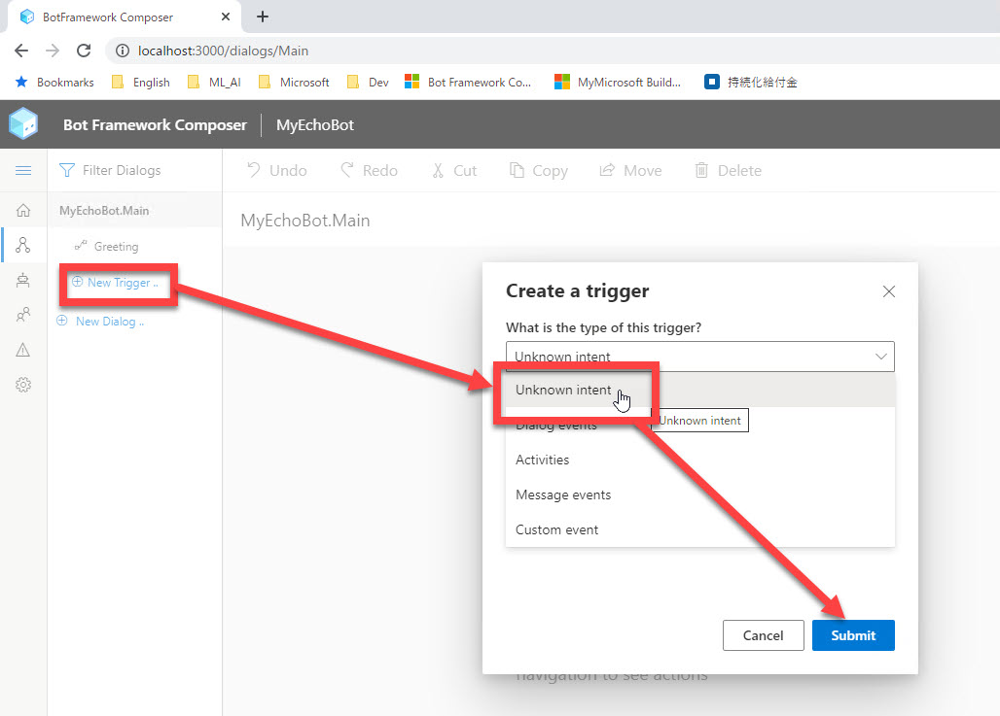
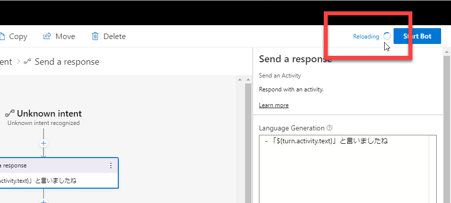
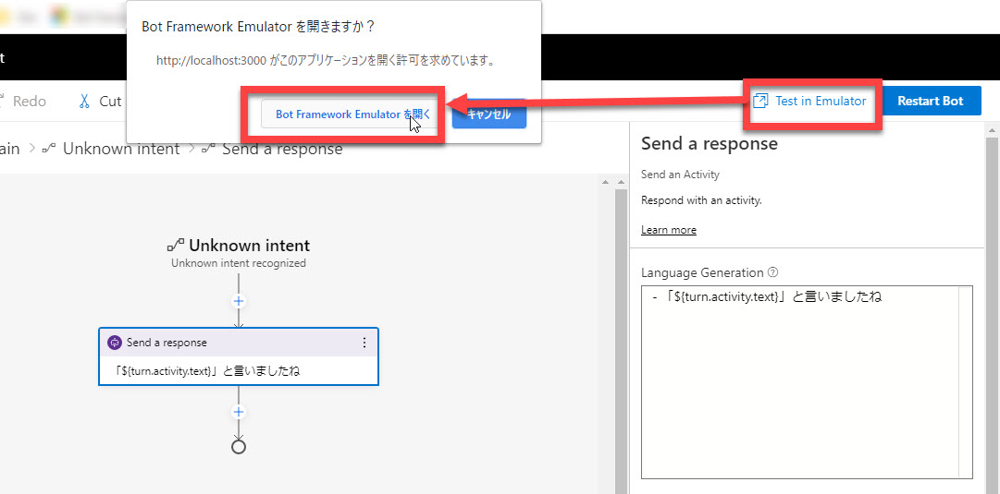

# Bot Framework Composer の基礎 - 1 (Echo Bot)

[前のステップ](01_install.md) で Bot Framework Composer と他のツールのインストールが終わりました。

このステップでは、Bot Framework Composer の "超基礎" として **Echo bot** (オウム返し Bot) を作ります。

[1. Bot Framework Composer 起動](#bot-framework-composer-%e8%b5%b7%e5%8b%95)  
[2. 新規プロジェクト作成](#%e6%96%b0%e8%a6%8f%e3%83%97%e3%83%ad%e3%82%b8%e3%82%a7%e3%82%af%e3%83%88%e4%bd%9c%e6%88%90)  
[3. オウム返しの Trigger を追加](#%e3%82%aa%e3%82%a6%e3%83%a0%e8%bf%94%e3%81%97%e3%81%ae-trigger-%e3%82%92%e8%bf%bd%e5%8a%a0)  
[4. Bot Framework Emulator で実行](#bot-framework-composer-%e8%b5%b7%e5%8b%95)

---

## Bot Framework Composer 起動

Bot Framework Composer を起動していない場合は、以下のコマンドで起動します。

> Bot Framework Composer をインストールしていない場合は、[前のステップ](01_install.md) を済ませてください。
>
> ローカルアプリケーション版の Bot Framework Composer をインストールした場合は、スタートメニューから起動します。

1. Composer フォルダーに移動  
   コマンドプロンプト（または他のターミナル）で Bot Framework Composer のフォルダーに移動します。

   ```cmd
   cd  BotFramework-Composer\Compose
   ```

2. Composer 起動  
    以下のコマンドで Bot Framework Composer サーバー起動します。

   ```cmd
   yarn startall
   ```

3. Web ブラウザーを起動して "**http://localhost:3000**" に接続  
   Bot Framework Composer アプリケーションが表示されます。

   

---

## 新規プロジェクト作成

Bot　Framework Composer で新規プロジェクトを作成します。

1. Home 画面で [New] をクリックします。

   

2. 今回は "Create from Scratch" を選択します。

   

3. 任意の名前でプロジェクトを作成します。  
   以下の説明では "MyEchoBot" とします。

   

---

## オウム返しの Trigger を追加

空の（何も応答しない） Bot に、オウム返しの機能を実装します。

1. "**MyEchoBot.Main**" (別の名前で Bot を作った場合はその Bot 名) の [**New Trigger**] をクリックします。

2. "**Create a trigger**" ダイアログで "**Unknown intent**" を選択します。

   

   > Trigger とは、ユーザーの入力に対して、処理を行い応答を返す契機になるものです。
   >
   > Unknown intent とは、他のインテント（＝意図、ユーザーが Bot に何をさせようとしているのか）には分類されないユーザー入力を扱うものです。  
   > このハンズオンでは Unknown intent 以外のインテントはないので、Unknown intent が全てのユーザー入力を受け付けます。  
   > なお既存の "Greeting" は特別な Trigger で、ユーザー入力を受け付けるものではありません。これについてはあとの手順で見てみます。

3. 画面中央の "**Authoring canvas**" に Unknown intent のダイアログが表示されたら、[**+**] をクリックします。  
   続いて [**Send a message**] を選択します。

   

   > ユーザーが何か入力したら「メッセージを返す」処理を追加しました。

4. [**Send a message**] アクションをクリックします。  
   続いて、画面右側の Property の [**Language Generation**] に以下を入力します。

   ```txt
   - 「${turn.activity.text}」と言いましたね
   ```

   > 先頭のハイフンおよび半角スペースは必須です。  

   

---

## Bot Framework Emulator で実行

オウム返し Bot ができました。  
Bot Framework Emulator を起動して動作を確認します。

1. [**Start Bot**] をクリックします。  
   Bot の準備中はボタンの左隣に [**Reloading**] と表示され、Bot が起動すると [**Test in emulator**] と表示されます。  
   初めての [Start Bot] の操作では起動までに少し時間がかかります。

   
   <br />
   

2. [**Test in Emulator**] をクリックします。  
   ブラウザーのポップアップで [**Bot Framework Emulator を開く**] をクリックします。

   

3. Bot Framewoek Emulator が起動したら、何か入力します。  
   入力した内容で Bot が応答することを確認します。

   

Bot は期待通りに動作しました。

---

以上で、Bot Framework Composer の基礎的な操作方法をりかいするためにオウム返し Bot を作りました。  
次のステップでは、Echo Bot に二つの機能を追加することで、Bot Framework Composer の理解を深めます。

[前に戻る](01_install.md) | 次に進む  
[目次に戻る](../README.md)
