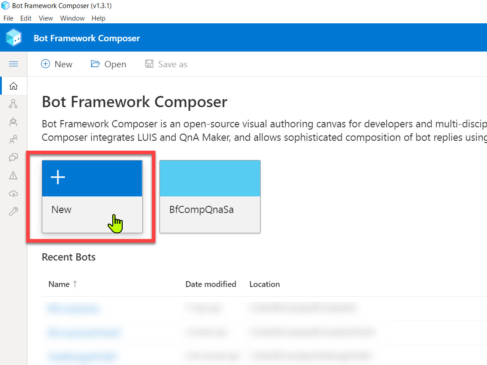
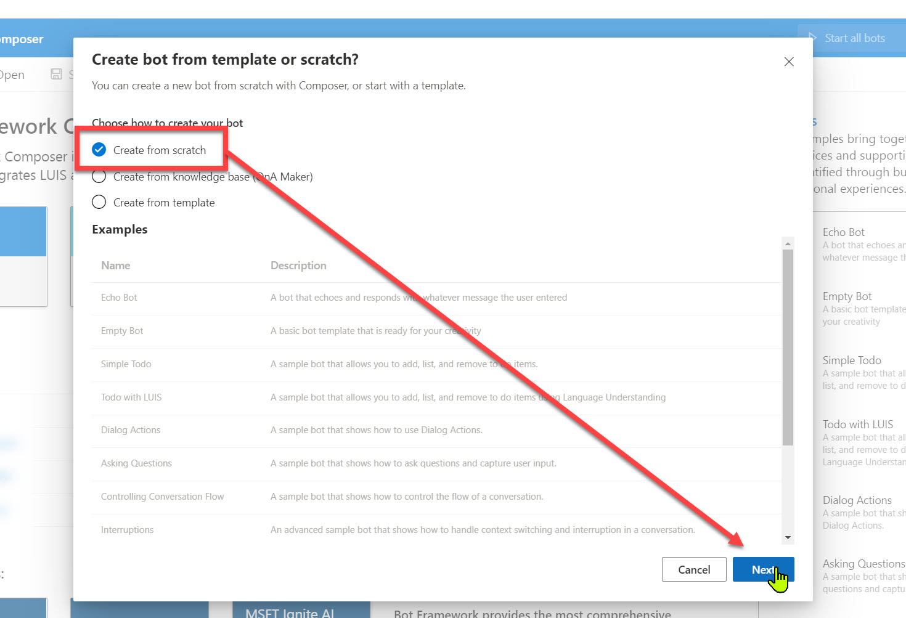
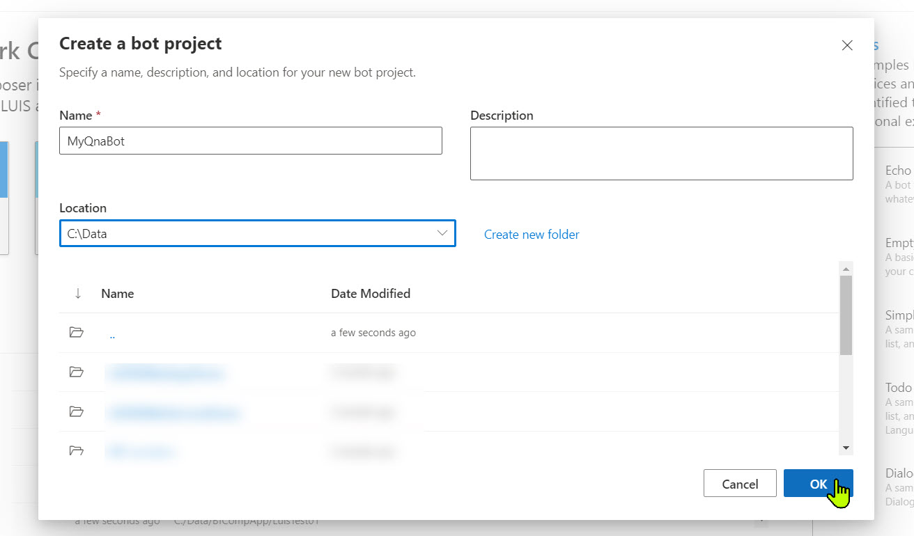
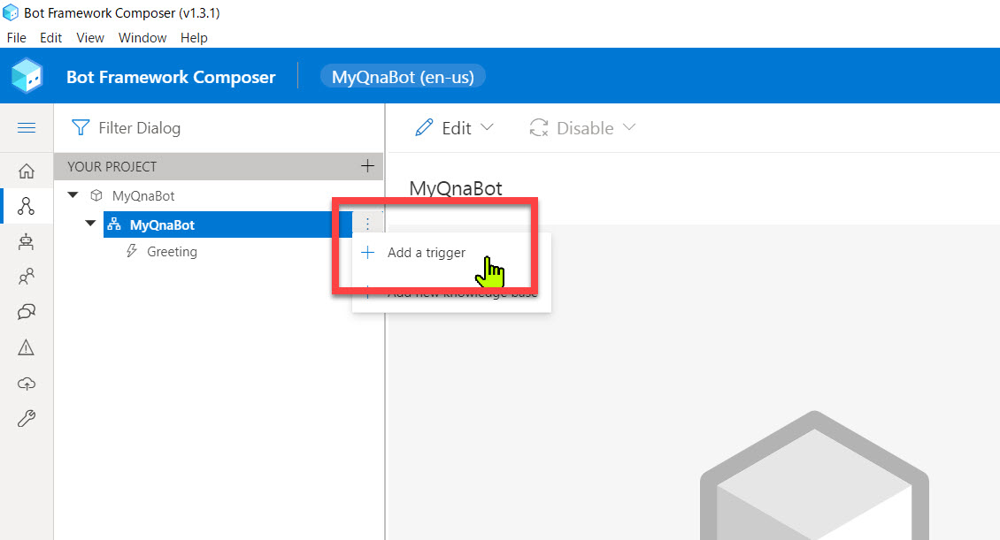
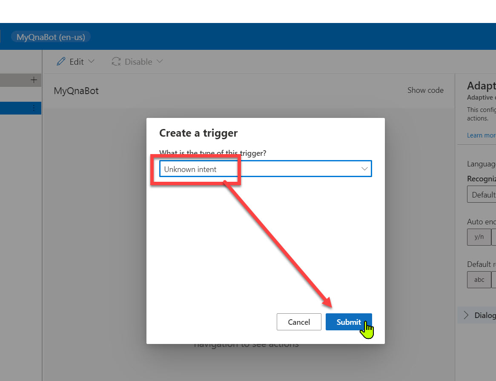
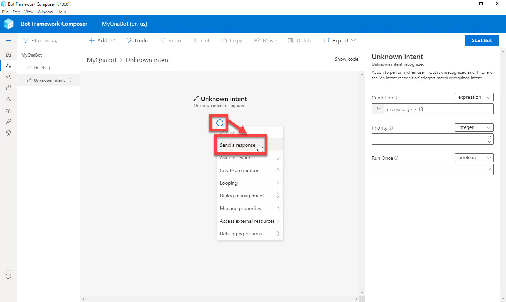
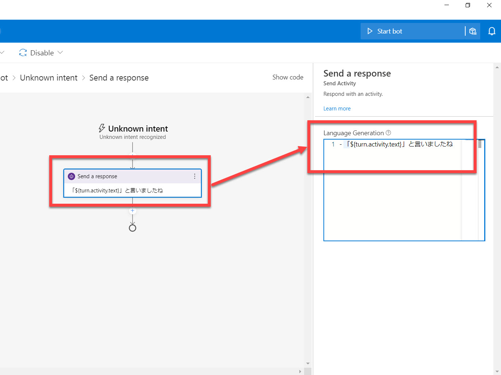
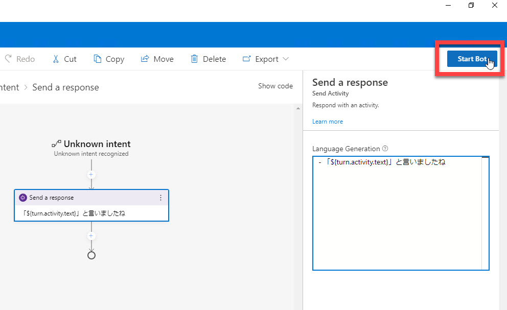
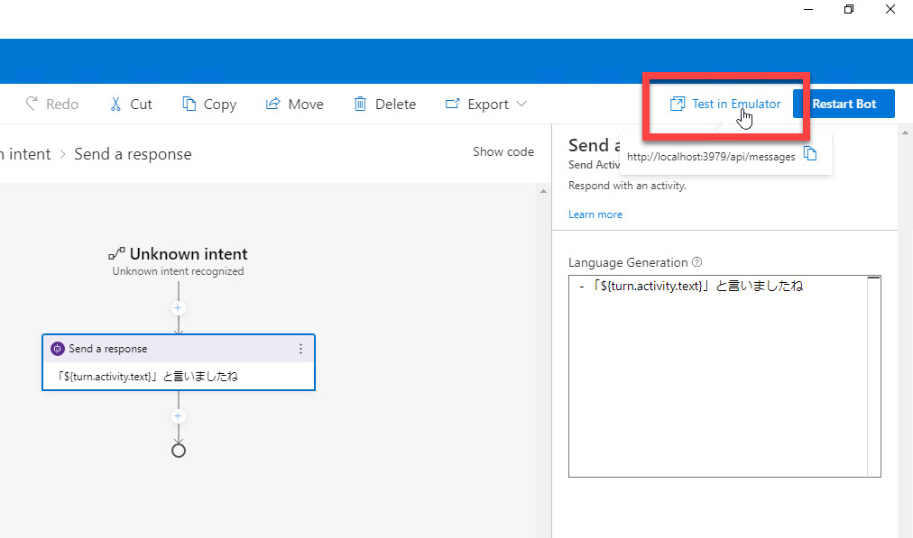
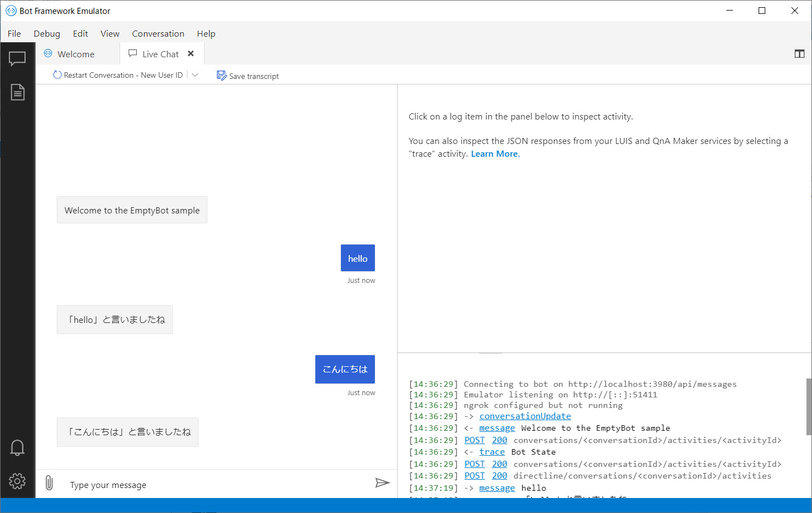

# Bot Framework Composer の基礎 - 1 (Echo Bot)

[前のステップ](01_install.md) で Bot Framework Composer と他のツールのインストールが終わりました。

このステップでは、Bot Framework Composer の "超基礎" として **Echo bot** (オウム返し Bot) を作ります。

[1. 新規プロジェクト作成](#%e6%96%b0%e8%a6%8f%e3%83%97%e3%83%ad%e3%82%b8%e3%82%a7%e3%82%af%e3%83%88%e4%bd%9c%e6%88%90)  
[2. オウム返しの Trigger を追加](#%e3%82%aa%e3%82%a6%e3%83%a0%e8%bf%94%e3%81%97%e3%81%ae-trigger-%e3%82%92%e8%bf%bd%e5%8a%a0)  
[3. Bot Framework Emulator で実行](#bot-framework-composer-%e8%b5%b7%e5%8b%95)

---

## 新規プロジェクト作成

Bot Framework Composer をインストールしていない場合は、[前のステップ](01_install.md) で Composer のインストールインストールを済ませてください。

1. Bot Framework Composer を起動します。

   > ソースコードからビルドした場合は、Composer フォルダーで以下のコマンドを実行します。  
   >
   > ```cmd
   > yarn startall
   > ```
   >
   > 続いて、Web ブラウザーで "**http://localhost:3000**" に接続します。

2. Home 画面で [**New**] をクリックします。  

   

3. 今回は [**Create from Scratch**] を選択します。

   

4. 今回は [**Name**] を "**MyQnaBot**" とします。  
   [Location] は任意のフォルダーを選択します。

   このステップではオウム返し Bot を作りますが、以降のステップで QnA Bot 機能を追加します。  
   このためプロジェクト名は "MyQnaBot" とします。

   

   > プロジェクト作成後に [Creation Journey] が表示されます。興味がある方は Composer の使い方を覚えるために参照してください。  
   > 今回は [×] で閉じてしまってもかまいません。

---

## オウム返しの Trigger を追加

作成したばかりの Bot にオウム返しの機能を実装します。

1. [**+ Add**] - [**Add new trigger on MyQnaBot**] を選択します。

   

2. [**Create a trigger**] ダイアログで "**Unknown intent**" を選択します。

   

   > Trigger とは、ユーザーの入力に対して、処理を行い応答を返す契機になるものです。
   >
   > Unknown intent とは、他のインテント（＝意図、ユーザーから Bot への命令や質問）には分類されないユーザー入力を扱うものです。  
   > このプロジェクトでは、最初に "Greeting" トリガーが定義されていますが、これはユーザーが Bot との対話を始める時に呼び出されるものです。  
   > 今のところユーザーからの入力を受け付けるものは Unknown intent だけです。  

3. 画面中央の "**Authoring canvas**" に Unknown intent が表示されたら、[**+**] をクリックします。  
   続いて [**Send a message**] を選択します。

   ユーザーの入力に対して「メッセージを返す」アクションを追加しました。

   


4. [**Send a message**] アクションをクリックします。  
   続いて、画面右側の Property の [**Language Generation**] に以下を入力します。

   ```txt
   - 「${turn.activity.text}」と言いましたね
   ```

   先頭のハイフンおよび半角スペースは必須です。  

   

   "**${turn.activity.text}**" はユーザーの入力内容です。  
   これでオウム返しするようになりました。確認してみます。

---

## Bot Framework Emulator で実行

**Bot Framework Emulator** を起動して Bot の動作を確認します。

1. [**Start Bot**] をクリックします。  
   Bot の準備中はボタンの左隣に [**Reloading**] と表示されます。  
   Bot が起動すると [**Test in emulator**] と表示されます。初めての [Start Bot] の操作では起動までに少し時間がかかります。

   
   <br />
   

2. [**Test in Emulator**] をクリックします。  
   Bot Framework Emulator が自動的に起動します。

   

3. Bot Framewoek Emulator が起動したら何か入力します。  
   入力した内容で Bot が応答することを確認します。

   > Emulator が起動する（対話を始める）と、Bot が自動的に "Welcome to the EmptyBot sample" と応答してきます。  
   > これについては次のステップで説明、対応します。

   

Bot は期待通りに動作しました。

---

以上で、Bot Framework Composer の基礎的な操作方法をりかいするためにオウム返し Bot を作りました。  
次のステップでは、Echo Bot に二つの機能を追加することで、Bot Framework Composer の理解を深めます。

[前に戻る](01_install.md) | [次に進む](03_composer_basic2.md)  
[目次に戻る](../README.md)
