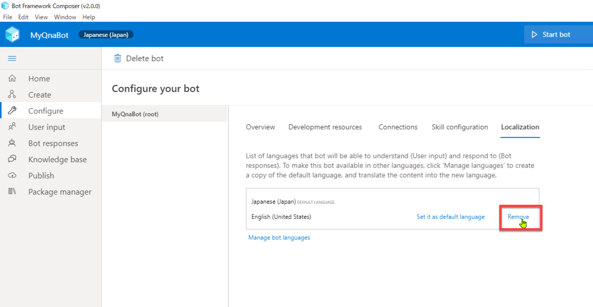
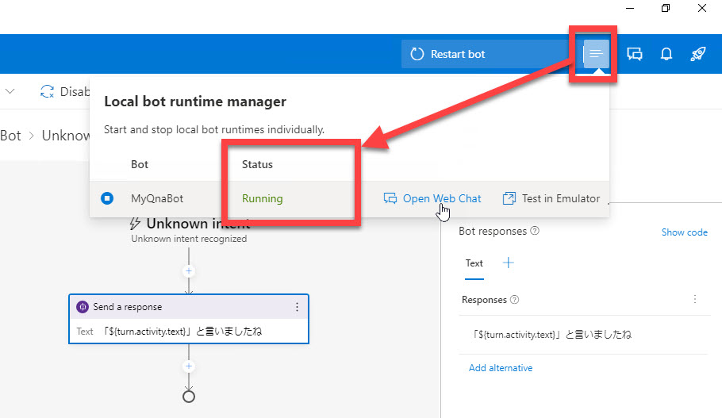

# Bot Framework Composer の基礎 - 1 (Echo Bot)

[前のステップ](./01_install.md) で Bot Framework Composer と他のツールのインストールが終わりました。

このステップでは、Bot Framework Composer の基礎として **Echo bot** (オウム返し Bot) を作ります。

[1. 新規プロジェクト作成](#%e6%96%b0%e8%a6%8f%e3%83%97%e3%83%ad%e3%82%b8%e3%82%a7%e3%82%af%e3%83%88%e4%bd%9c%e6%88%90)  
[2. Bot 言語を変更](#bot-言語を変更)  
[3. あいさつメッセージを変更](#あいさつメッセージを変更)  
[4. オウム返しアクションを追加](#オウム返しアクションを追加)  
[5. Web Chat で実行](#web-chat-で実行)

<br />

---

## 新規プロジェクト作成

Bot Framework Composer をインストールしていない場合は、[前のステップ](./01_install.md) で Composer のインストールインストールを済ませてください。

1. Bot Framework Composer を起動します。  

2. Home 画面で [**Create new**] をクリックします。  

   

<br />

3. [**C#**] - [**Empty Bot**] を選択して [Next] をクリックします。

   

<br />

4. 今回は [**Name**] を "**MyQnaBot**" とします。  
   [Location] は任意のフォルダーを選択します。  
   [**Rumtime type**] は今回は "**Azure Web App**" を選択します。

   このステップではオウム返し Bot を作りますが、以降のステップで QnA Bot 機能を追加します。  
   このためプロジェクト名は "MyQnaBot" とします。  

   

   <br />

   続いて [**Create**] をクリックします。  
   テンプレートとパッケージがダウンロードされて、プロジェクト作成とランタイムのビルドが自動的に実行されます。  
   [Get started] パネルが表示されれば完了です。

   

   <br />

   > プロジェクト作成後に [Creation Journey] が表示されるかもしれません。興味がある方は Composer の使い方を覚えるために参照してください。  
   > 不要であれば [×] で閉じてしまってもかまいません。  

<br />

---

## Bot 言語を変更

日本語を適切に処理できるように Bot の言語を日本語に変更します。

> オウム返しの範囲では言語変更をしなくても動作しますが、あとの手順のために最初に設定を変更しておきます。

<br />

1. [**Configure**] - [**MyQnaBot (Root)**] - [**Localization**] と進み、[**Manage bot languages**] をクリックします。  
   
   

<br />

2. 検索ボックスに "**japanese**" (または "**japa**" など数文字) と入力して、[**Japanese (Japan)**] を選択します。  
   さらに [**When done, ...**] をチェックして [Done] をクリックします。  
   
   

<br />

3. "**Japanese (Japan)**" をデフォルト言語にします。  
   "Japanese (Japan)" の近くにカーソルを移動すると右側に [**Set it as default language**] と表示されます。これをクリックします。

   > カーソルを近くに持っていくまでは [Set it as ...] は非表示です。

   

<br />

4. 英語を削除します。  
   "**English (United States)**" の近くにカーソルを移動すると右側に [**Remove**] と表示されます。これをクリックします。  

   

   > 英語を削除せずに残しておくことで複数言語対応の Bot を作ることができます。  
   > 今回は日本語専用の Bot にするので英語を削除します。  
   >
   > なお Composer v2.0.0 では複数言語を持つプロジェクトで、Composer で作成したナレッジベースを QnA Maker リソースに発行するとデフォルト以外の言語を正しく作成できない不具合が発生します。  
   > 今回はこれの回避のためにも言語は日本語だけにします。

<br />

5. Bot Framework Composer を一度終了して、改めて今回作成したプロジェクトを開きなおします。
   
   > 言語を変更した場合や接続するリソースを設定・変更した後などは、Composer を再起動することをお勧めします。  
   >
   > 再起動しないままで開発を続けるとローカルでのビルドに失敗することがあります。その場合は Composer を一度閉じると正常に動作するようになります。

<br />

---

## あいさつメッセージを変更

新規作成した Bot は "Greeting" トリガーがあらかじめ用意されています。 
Greeting はユーザーが対話に参加した時に自動的に呼び出されるものです。  
あらかじめ英語のあいさつが定義されているので、このメッセージを日本語に変更します。

> 一般的には、ユーザーに対して Bot が稼働していることを示すために、Greeting であいさつや Bot の機能を送信します。
> 
> Bot アプリケーションが挨拶メッセージを返すのは
?
> - Bot が稼働していることを知らせる
> - Bot の機能を知らせる
> - ユーザーが最初に何をすればいいのかを知らせる
>
> などが目的です。

<br />

1. [Create] - [Greeting] を選択して [**Send a response**] を選択します。  

   

<br />

2. [**Response**] を "**ようこそ、QnA Botへ**" に変更します。  
   
   

   <br />

   > 今のステップではまだオウム返し Bot ですが、あとでの手順に備えて "Greeting" で返すメッセージをあいさつにしておきます。

<br />

---

## オウム返しアクションを追加

オウム返しの機能を実装します。

EmptyBot テンプレートではトリガーとして "Greeting" と "Unknown intent" の二つが事前に定義されています。  
"Greeting" はユーザーが対話を開始したタイミングで一度だけ呼び出されます。  
ユーザーの入力は、今の時点ではすべて "**Unknown intent**" で処理されます。

1. [Navigation Pane] で "**Unknown intent**" を選択します。

   

<br />

2. [**Send a response**] をクリックします。

3. [**Responses**] に以下を入力します。

   ```txt
   「」と言いましたね
   ```

   

<br />

4. キャレットを "「" と "」" の間に持っていき、"**Insert a property reference in memory**" (**{x}** のアイコン) をクリックします。  
   

<br />

5. プロパティツリーで "**turn.activity.text**" を選択します。  

   またはキーボードで以下のとおり入力します。

   ```txt
   「${turn.activity.text}」と言いましたね
   ```

   
   
   

   <br />

   "**${turn.activity.text}**" はユーザーが入力した内容です。  
   これでオウム返しするようになりました。確認してみます。

<br />

---

## Web Chat で実行

Bot Framework Composer 組み込みの **Web Chat** で Bot の動作を確認します。

1. [**Start Bot**] をクリックします。 ローカルの Bot の起動が始まります。

   

<br />

2. [**Local bot runtime manager**] ([Start bot] の右にあるアイコン) で ローカル Bot の状態を確認します。[Status] が "Running" になれば動作しています。

   

<br />

3. ローカル Bot が起動したら　Web Chat を開きます。  
   [**Web Chat**] アイコンをクリックするか、[Local bot runtime manager] の [**Open Web Chat**] をクリックします。  

   

   <br />

   > Bot Framework Emulator 起動時にファイアウォールの設定画面が表示された場合は、適切に設定します。  
   >
   > 

<br />

4. Web Chat が開いたら何か入力します。  
   入力した内容で Bot が応答することを確認します。

   > Web Chat を開くと、最初に Bot が自動的に "ようこそ、QnA Botへ" と応答してきます。  

   

<br />

Bot は期待通りに動作しました。

<br />

---

以上で、Bot Framework Composer の基礎的な操作方法を理解するためにオウム返し Bot を作りました。  
次のステップでは、オウム返し Bot に機能を追加して Bot Framework Composer の理解を深めます。

[前に戻る](./01_install.md) | [次に進む](./03_composer_basic2.md)  
[目次に戻る](../README.md)
