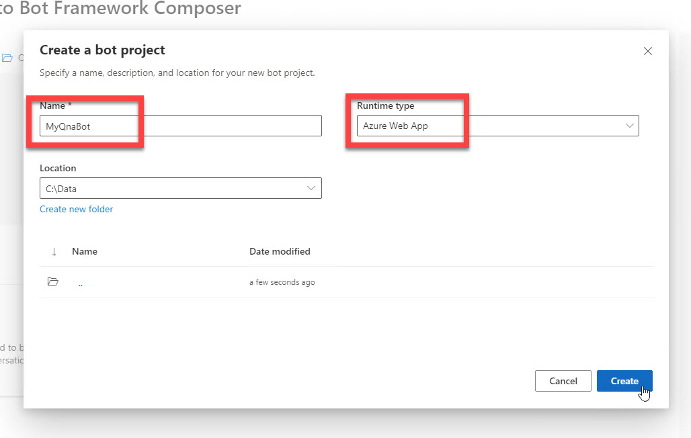
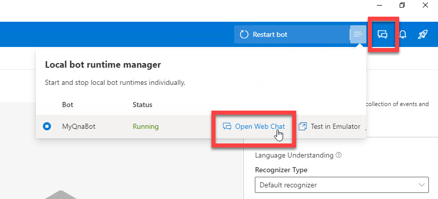

# Bot Framework Composer の基礎 - 1 (Echo Bot)

[前のステップ](01_install.md) で Bot Framework Composer と他のツールのインストールが終わりました。

このステップでは、Bot Framework Composer の "基礎" として **Echo bot** (オウム返し Bot) を作ります。

[1. 新規プロジェクト作成](#%e6%96%b0%e8%a6%8f%e3%83%97%e3%83%ad%e3%82%b8%e3%82%a7%e3%82%af%e3%83%88%e4%bd%9c%e6%88%90)  
[2. Bot 言語を変更](#bot-言語を変更)  
[3. あいさつメッセージを変更](#あいさつメッセージを変更)  
[4. オウム返しアクションを追加](#オウム返しアクションを追加)  
[5. Web Chat で実行](#web-chat-で実行)

---

## 新規プロジェクト作成

Bot Framework Composer をインストールしていない場合は、[前のステップ](01_install.md) で Composer のインストールインストールを済ませてください。

1. Bot Framework Composer を起動します。  

2. Home 画面で [**Create new**] をクリックします。  

   

3. [**C#**] - [**Empty Bot**] を選択して [Next] をクリックします。

   

4. 今回は [**Name**] を "**MyQnaBot**" とします。  
   [Location] は任意のフォルダーを選択します。  
   [**Rumtime type**] は今回は "**Azure Web App**" を選択します。

   このステップではオウム返し Bot を作りますが、以降のステップで QnA Bot 機能を追加します。  
   このためプロジェクト名は "MyQnaBot" とします。  

   

   続いて [**Create**] をクリックします。  
   テンプレートとパッケージがダウンロードされて、プロジェクト作成とランタイムのビルドが自動的に実行されます。  
   [Get started] パネルが表示されれば完了です。

   

   > プロジェクト作成後に [Creation Journey] が表示されるかもしれません。興味がある方は Composer の使い方を覚えるために参照してください。  
   > 不要であれば [×] で閉じてしまってもかまいません。  

---

## Bot 言語を変更

日本語を適切に処理できるように Bot の言語を日本語に変更します。

> オウム返しの範囲では言語変更をしなくても動作しますが、あとの手順のために最初に設定を変更しておきます。

1. [**Configure**] - [**MyQnaBot (Root)**] - [**Localization**] と進み、[**Manage bot languages**] をクリックします。  
   
   

2. 検索ボックスに "**japanese**" (または "**japa**" など数文字) と入力して、[**Japanese (Japan)**] を選択します。  
   さらに [**When done, ...**] をチェックして [Done] をクリックします。  
   
   

3. "**Japanese (Japan)**" をデフォルト言語にします。  
   "Japanese (Japan)" の近くにカーソルを移動すると右側に [**Set it as default language**] と表示されます。これをクリックします。

   > カーソルを近くに持っていくまでは [Set it as ...] は非表示です。

   

---

## あいさつメッセージを変更

新規作成した Bot は "Greeting" トリガーがあらかじめ用意されています。 
Greeting はユーザーが対話を開始した時に呼び出されるものです。  
英語のあいさつが定義されていますが、日本語 Bot を作っているので、あいさつメッセージを日本語に変更します。

> 一般的には、ユーザーに対して Bot が動作していることを示すために、Greeting であいさつや Bot の機能を送信します。

1. [Create] - [Greeting] を選択して [**Send a response**] を選択します。  

   

2. [**Response**] を "ようこそ、QnA Botへ" に変更します。  
   
   

   > 今のステップではまだオウム返し Bot ですが、あとでの手順に備えたメッセージにしておきます。

---

## オウム返しアクションを追加

オウム返しの機能を実装します。

EmptyBot テンプレートではトリガーとして "Greeting" と "Unknown intent" の二つが事前に定義されています。  
"Greeting" はユーザーが対話を開始したタイミングで一度だけ呼び出されます。  
それ以降のユーザーの入力に対しては、すべて "**Unknown intent**" で処理します。

1. [Navigation Pane] で "**Unknown intent**" を選択します。

   

2. [**Send a response**] をクリックします。

3. [**Responses**] に以下を入力します。

   ```txt
   - 「」と言いましたね
   ```

   

4. キャレットを "「" と "」" の間に持っていき、"**Insert a property reference in memory**" (**{x}** のアイコン) をクリックします。  
   

5. プロパティツリーで "**turn.activity.text**" を選択します。  

   またはキーボードで以下のとおり入力します。

   ```txt
   「${turn.activity.text}」と言いましたね
   ```

   
   

   

   "**${turn.activity.text}**" はユーザーが入力した内容です。  
   これでオウム返しするようになりました。確認してみます。

---

## Web Chat で実行

**Bot Framework Emulator** を起動して Bot の動作を確認します。

1. [**Start Bot**] をクリックします。 ローカルの Bot の起動が始まります。

   

2. ローカル Bot が起動したら、[**Open Web Chat**] をクリックします。  

   

   > Bot Framework Emulator 起動時にファイアウォールの設定画面が表示された場合は、適切に設定します。  
   >
   > 

3. Web Chat が開いたら何か入力します。  
   入力した内容で Bot が応答することを確認します。

   > Web Chat を開くと、最初に Bot が自動的に "ようこそ、QnA Botへ" と応答してきます。  

   

Bot は期待通りに動作しました。

---

以上で、Bot Framework Composer の基礎的な操作方法を理解するためにオウム返し Bot を作りました。  
次のステップでは、Echo Bot にふたつの機能を追加することで、Bot Framework Composer の理解を深めます。

[前に戻る](01_install.md) | [次に進む](03_composer_basic2.md)  
[目次に戻る](../README.md)
