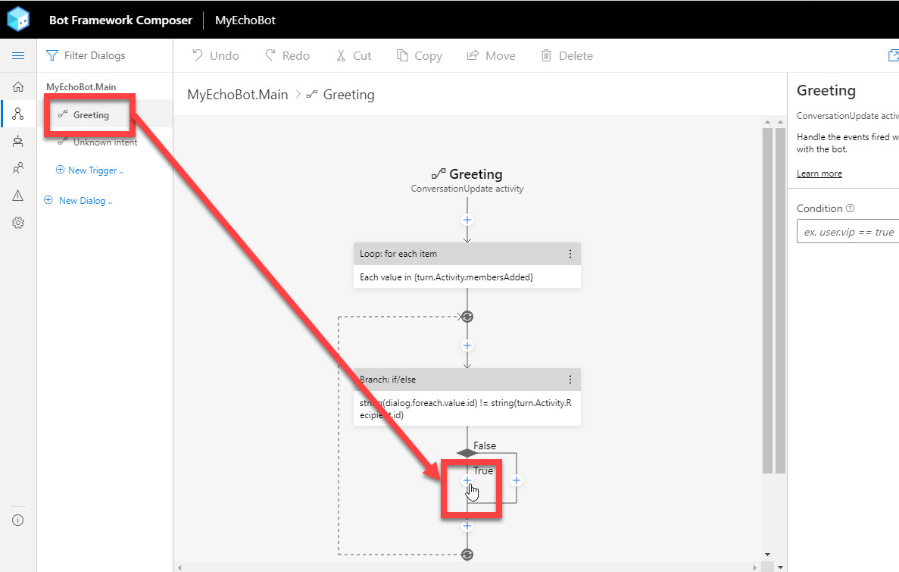
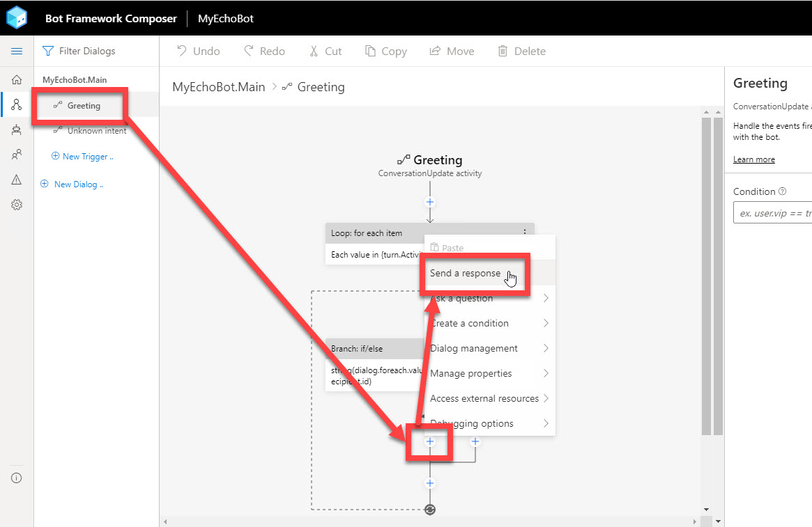
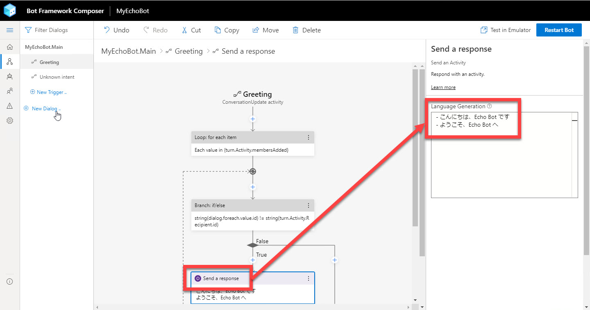
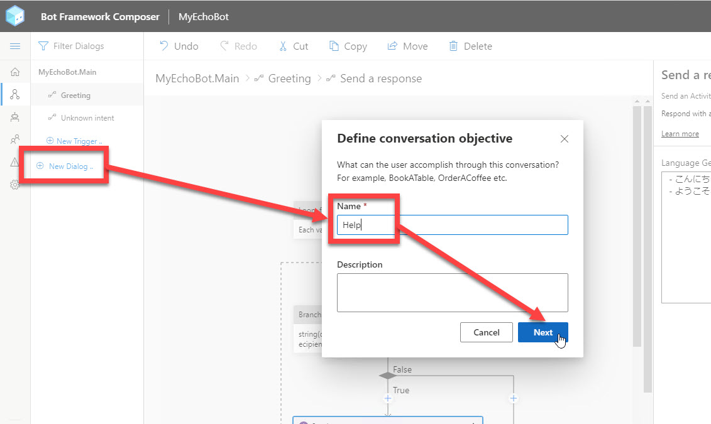
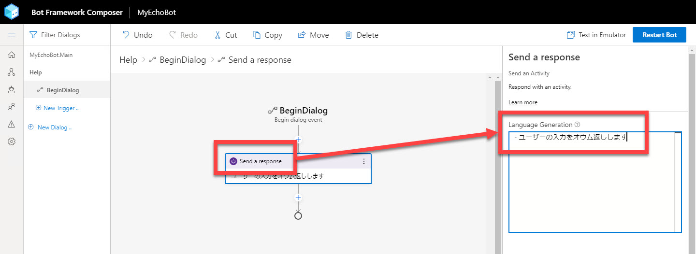
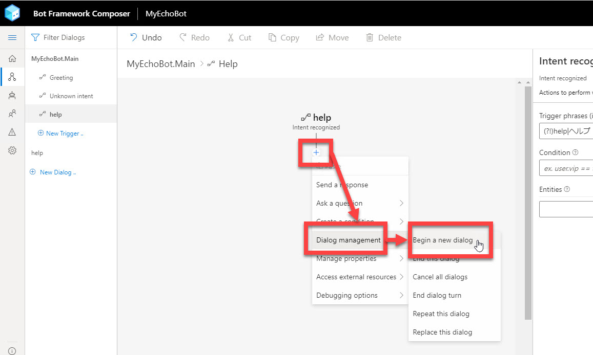

# Bot Framework Composer の基礎 - 2 (機能追加)

[前のステップ](02_composer_basic.md) では、Bot アプリケーションの最も基本的なものとして、オウム返し Bot を作成しました。

続いて、この Bot アプリケーションに二つの機能を追加してみます。

- 挨拶メッセージを返す機能
- ヘルプメッセージを返す機能

メッセージとしてはどちらもシンプルなものですが、Bot アプリケーションを拡張する重要な操作です。

[1. 挨拶メッセージ機能を追加](#%e6%8c%a8%e6%8b%b6%e3%83%a1%e3%83%83%e3%82%bb%e3%83%bc%e3%82%b8%e6%a9%9f%e8%83%bd%e3%82%92%e8%bf%bd%e5%8a%a0)  
[2. ヘルプ ダイアログの追加](#%e3%83%98%e3%83%ab%e3%83%97-%e3%83%80%e3%82%a4%e3%82%a2%e3%83%ad%e3%82%b0%e3%81%ae%e8%bf%bd%e5%8a%a0)  
[3. ヘルプ ダイアログへの切り替え](#%e3%83%98%e3%83%ab%e3%83%97-%e3%83%80%e3%82%a4%e3%82%a2%e3%83%ad%e3%82%b0%e3%81%b8%e3%81%ae%e5%88%87%e3%82%8a%e6%9b%bf%e3%81%88)  
[4. オウム返し Bot の最終形の動作確認](#%e3%82%aa%e3%82%a6%e3%83%a0%e8%bf%94%e3%81%97-bot-%e3%81%ae%e6%9c%80%e7%b5%82%e5%bd%a2%e3%81%ae%e5%8b%95%e4%bd%9c%e7%a2%ba%e8%aa%8d)

---

## 挨拶メッセージ機能を追加

ユーザーがチャットクライアントを起動した時に挨拶メッセージを返すようにします。

Bot アプリケーションが挨拶メッセージを返すのは

- Bot が動作していることを知らせる
- Bot の機能を知らせる
- ユーザーが最初に何をできるのかを知らせる

などが目的です。

> "Greetring" は "**Conversation Update** activity" に分類される Trigger です。 
> ユーザーがチャットクライアントに何かを入力した際には発生しないアクティビティです。
>  
> Conversation Update は、
>
> - Bot が対話に入る
> - ユーザーが対話に入る
>
> タイミングで発生します。
>
> 下の操作で if/else の一方でだけ応答していますが、これはユーザーが対話に入ったタイミングでだけ応答することをいみします。


1. "**MyEchoBot.Main**" の [**Greeting**] を選択します。

2. [**Branch: if/else**] アクションの中の "**True**" の下にある [**+**] をクリックします。

   

3. [Send a message] を選択します。

   

4. Property の [**Language Generation**] に以下を入力します。

   ```txt
   - こんにちは、Echo Bot です
   - ようこそ、Echo Bot へ
   ```

   

   > [Language Generation] に入力した内容を Bot が返します。  
   > 2行以上を指定すると、Bot はランダムにいずれかの項目を返します。
   >
   > いずれも行先頭には "- " が必要です。  
   > Markdown を知っていれば、リストの定義と同じ記法であることが分かると思います。

5. [Start Bot] または [Restart Bot] をクリックして、Bot を起動します。  
   Bot が起動したら Bot Framework Emulator を開きます。

   [**Restart Conversation - New User ID**] を何度かクリックして、ランダムに挨拶メッセージが変わることを確認します。

   
   <br />
   

   > [Restart Conversation] は、ユーザーと Bot との対話を再起動することを意味します。  
   > 対話が新しく始まるので、そのたびに挨拶メッセージを見ることができます。

---

## ヘルプ ダイアログの追加

Bot にヘルプメッセージを応答する機能を追加します。

まず、ヘルプ ダイアログを Bot に追加します。

> ダイアログは一般的には、他から独立した一連の対話を定義するために使用します。
> 
> ここでの手順は一つのメッセージを応答するだけなので、必ずしもダイアログにする必要はありません。  
>
> またオウム返し Bot でヘルプ機能は不要だと思いますが、今回はダイアログの定義と呼び出し方とを理解するために、シンプルな処理ですがダイアログを使うことにします。

1. [**New Dialog**] をクリックします。

2. [**Name**] にダイアログの名前を入力します。  
   今回は "help" とします。

   

3. [**+**] をクリックして、続いて [Send a message] をクリックします。

   

4. [**Send a message**] をクリックして、Property の [**Language Generation**] に以下を入力します。

   ```txt
   - ユーザーの入力をオウム返しします
   ```

   

---

## ヘルプ ダイアログへの切り替え

ユーザーの入力は "**MyEchoBot.Main**" が受け取ります。  
ヘルプメッセージを表示するには、メインからヘルプ ダイアログへの **コンテキスト切り替え** が必要です。

1. "**MyEchoBot.Main**" を選択して、Property の [**Recognizer Type**] で "**Regular Expression**" を選択します。

   

   > 今までは Intent（＝意図、ユーザーが Bot に何をさせようとしているのか）を分類するルールを持っていませんでした。  
   > この手順で、正規表現で Intent を分類することを指示しました。

2. "MyEchoBot.Main" で [**New Trigger**] を選択します。  
   [**Create a trigger**] ダイアログが開いたら、以下を入力・選択をします。

   |項目名|値|
   |---|---|
   |トリガーの種類|Intent recognized|
   |トリガー名|ここでは "**help**"|
   |正規表現のパターン|help\|ヘルプ|

   > 正規表現のパターンとして、**大文字・小文字は区別されません**。  
   > ユーザーの入力が "help", "Help", "HELP", "ヘルプ" などの時に、このトリガーにメッセージが分配されます。

   

3. [**+**] をクリックして、続いて [**Dialog Management**] - [**Begin a new dialog**] をクリックします。

   

4. [**Begin a new dialog**] アクションの Property の [**Dialog name**] で "**help**" を選択します。

   
   <br />
   

---

## オウム返し Bot の最終形の動作確認

以上でオウム返し Bot の拡張が終わりました。  
Bot Framework Emulator で動作を見てみます。

1. [Start Bot] または [Restart Bot] をクリックします。

2. Bot が起動したら Bot Framework Emulator を開きます。

3. 以下を参考に入力して、Bot が期待した応答を返すことを確認します。

   |入力|応答|
   |---|---|
   |（※対話開始時）|"こんにちは、Echo Bot です" または "ようこそ、Echo Bot へ"|
   |help|ユーザーの入力をオウム返しします|
   |Help|ユーザーの入力をオウム返しします|
   |HELP|ユーザーの入力をオウム返しします|
   |ヘルプ|ユーザーの入力をオウム返しします|
   |任意の入力|「(入力した内容)」と言いましたね|

   <br />
   

---

以上で、Bot アプリケーションの重要な機能拡張の手順を理解できたと思います。  
次のステップから Q&A Bot を作っていきます。まずは QnA Maker でナレッジベースを作るところからです。

[前に戻る](02_composer_basic.md) | [次に進む](04_create_qnamaker_knowledgebase.md)  
[目次に戻る](../README.md)