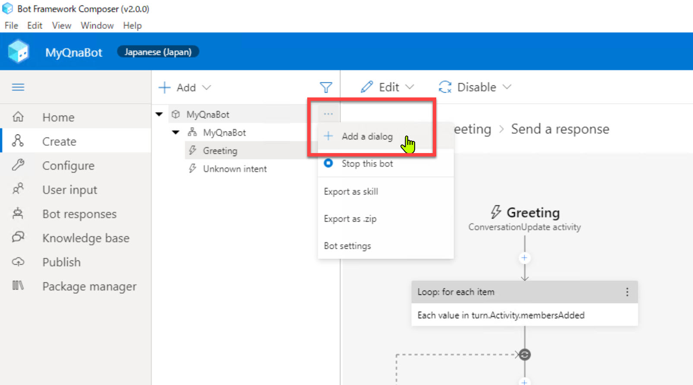
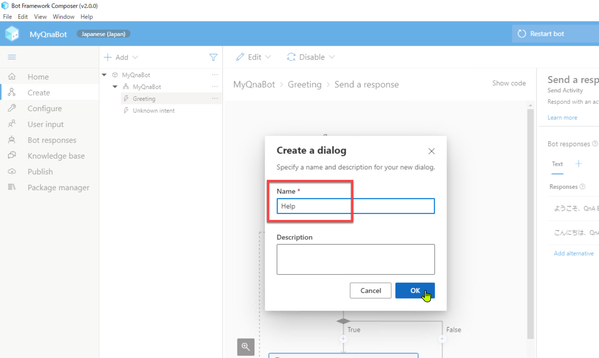
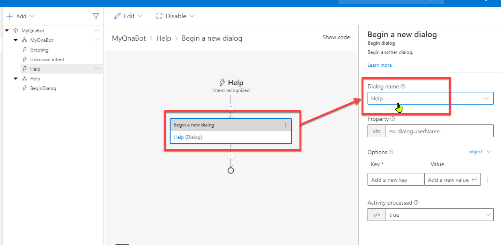

# Bot Framework Composer の基礎 - 2 (機能追加)

[前のステップ](./02_composer_basic.md) では、Bot アプリケーションの最も基本的なものとして、オウム返し Bot を作成しました。

続いて、この Bot アプリケーションにヘルプメッセージを返す機能を追加してみます。

応答するメッセージはシンプルなものですが、Bot アプリケーションを拡張する重要な操作です。

[1. あいさつメッセージの追加](#あいさつメッセージの追加)  
[2. ヘルプ ダイアログの追加](#ヘルプ-ダイアログの追加)  
[3. ヘルプ ダイアログへの切り替え](#ヘルプ-ダイアログへの切り替え)  
[4. Web Chat で動作確認](#web-chat-で動作確認)

<br />

---

## あいさつメッセージの追加

[前のステップ](./02_composer_basic.md) で Greeting トリガー（ユーザーが対話を開始した時に呼び出される）の応答メッセージを定義しました。  
応答メッセージは常に固定である必要はなく、複数個をランダムに応答させることができます。

挨拶メッセージをひとつ追加して、ランダムで応答するようにします。

<br />

1. "**Greeting**" トリガーを選択して、[**Send a response**] を選択します。さらにプロパティで [**Add alternative**] をクリックします。  
   
   

<br />

2. 新しいテキスト領域に以下を入力して Enter で確定します。  

   ```txt
   こんにちは、QnA Botです
   ```  
   
   

<br />

3. 異なるあいさつメッセージが帰ってくることを Web Chat で確認します。  
   [**Start Bot**] または [**Restart Bot**] をクリックして、Bot を起動します。  
   [**Restart Conversation - new user ID**] を何度かクリックして、ランダムで挨拶メッセージが変わることを確認します。

   
   

<br />

---

## ヘルプ ダイアログの追加

Bot にヘルプメッセージを応答する機能を追加します。

まず **ヘルプ ダイアログを Bot に追加** します。

<br />

> ダイアログは一般的には、他から独立した一連の対話を定義するために使用します。  
> ここでの手順は一つのメッセージを応答するだけなので、必ずしもダイアログにする必要はありません。  
>
> またハンズオンで扱っている Bot は簡単な機能なのでヘルプは不要なはずです。今回はダイアログの定義と呼び出し方とを理解するために、ダイアログを使ってヘルプメッセージを応答します。

1. 一番上の [**MyQnaBot**] の [**...**] をクリックして [**Add a dialog**] を選択します。  

   

   > 一番上の MyQnABot は **プロジェクト**、2行目の MyQnABot は **ダイアログ** と言います。

<br />

2. [**Name**] にダイアログの名前を入力します。  
   今回は "**Help**" とします。

   

<br />

3. [**Help**] - [**BeginDialog**] で [**+**] をクリックして、続いて [**Send a response**] をクリックします。

   

<br />

4. [**Send a response**] をクリックして [**Bot Response**] に以下を入力します。

   ```txt
   Azure についての疑問に答えます。

   質問を入力してください。
   ```

   

<br />

---

## ヘルプ ダイアログへの切り替え

ユーザーの入力は最初に "**MyQnaBot**" ダイアログが受け取ります。  
ヘルプメッセージを表示するには、メインからヘルプ ダイアログへの **コンテキスト切り替え** が必要です。

以下では **正規表現** (Regular expression) を

1. "**MyQnaBot**" ダイアログ (2行目の MyQnABot) を選択して、Property の [**Recognizer Type**] で "**Regular expression recognizer**" を選択します。

   

   <br />

   > 今までは Intent（＝意図、ユーザーが Bot に何をさせようとしているのか）を分類するルールを持っていませんでした。  
   > この手順で正規表現でユーザー入力の意図を分類するようになります。

<br />

2. ヘルプダイアログを呼び出すための Trigger を "**MyQnaBot**" に追加します。  
   "MyQnaBot" ダイアログで [**Add new trigger**] を選択します。

   

<br />

3. [**Create a trigger**] ダイアログが開いたら、以下を入力・選択をします。

   |項目名|値|
   |---|---|
   |トリガーの種類|Intent recognized|
   |トリガー名|ここでは "**Help**"|
   |正規表現のパターン|(?i)(?:help\|ヘルプ\|使い方)|

   

<br />

4. [**+**] をクリックして、続いて [**Dialog Management**] - [**Begin a new dialog**] をクリックします。

   

<br />

5. [**Begin a new dialog**] アクションの Property の [**Dialog name**] で "**Help**" を選択します。

   

<br />

---

## Web Chat で動作確認

以上でヘルプメッセージの追加が終わりました。  
Web Chat で動作を見てみます。

1. [Start Bot] または [Restart Bot] をクリックします。

2. Bot が起動したら Web Chat を開きます。

3. 以下を参考に入力して、Bot が期待した応答を返すことを確認します。

   |入力|応答|
   |---|---|
   |（※対話開始時）|"こんにちは、Q&A Bot です" または "ようこそ、Q&A Bot へ"|
   |help|Azure についての質問に答えます|
   |Help|Azure についての質問に答えます|
   |HELP|Azure についての質問に答えます|
   |ヘルプ|Azure についての質問に答えます|
   |使い方|Azure についての質問に答えます|
   |任意の入力|「(入力した内容)」と言いましたね|

   <br />

   

<br />

> ヘルプのように Intent の分類が比較的簡単なルールの場合には、[**Recognizer Type**] を "**Regular Expression**" にすることができます。  
>
> ユーザーにもっと自由な入力を認める場合は **Default recognizer** で分類する必要があります。 
> Default recognizer を選択すると、Composer は自然言語処理のエンジンとして Language Understanding (= LUIS) を利用します。
>
>この後のステップで取り上げる方法で [QnA Maker と連携する](./05_create_knowledgebase.md) 場合にも Recognizer Type を Default recognizer に変更して Language Understanding を利用する必要があります。
>
> Language Understanding については次のステップで取り上げます。

<br />

---

以上で、正規表現を利用してユーザー入力の意図を理解するようになりました。  
次のステップでは Language Understanding を利用して、より柔軟で強力な方法でユーザーの意図を予測するように変更します。

[前に戻る](./02_composer_basic.md) | [次に進む](./04_composer_luis.md)  
[目次に戻る](../README.md)