# Language Understanding でユーザーの意図を予測

[前のステップ](05_composer_qna.md) で、QnA Maker を使った Q&A 機能を Bot アプリケーションに 追加しました。

このステップでは、[**Language Understanding** (LUIS)](https://azure.microsoft.com/ja-jp/services/cognitive-services/language-understanding-intelligent-service/) を使って、ユーザーの意図を予測するように変更します。  
（[Bot Framework Composer の基礎 - 2](03_composer_basic2.md) では、**正規表現** でユーザーの意図を認識しました）

[1. Recognizer Type の変更](#recognizer-type-の変更)  
[2. Language Understanding の設定](#language-understanding-の設定)  
[3. Help トリガーのフレーズの入力](#help-トリガーのフレーズの入力)  
[4. Web Chat で動作確認](#web-chat-で動作確認)  

Language Understanding (LUIS) とは、自然言語による入力に対して、

- 全体の意味を予測
- 関連性のある詳細な情報を引き出す

サービスです。  

<br />

> "Language Understanding" はプレビューでは "LUIS" と呼ばれていました。  
> GA して Language Understanding と名称が変わりましたが、ドキュメントやライブラリにも LUIS という表記が残っていたり、GA 後も LUIS と呼ばれることが多くあります。

> このハンズオンでは、ヘルプを呼び出す範囲でのみ Language Understanding を使用するので機能が実感しづらいですが、実装手順を理解することを目的とします。

---

## Recognizer Type の変更

"MyQnaBot" の **Recognizer Type** (＝ユーザー意図の識別方法) は、[Bot Framework Composer の基礎 - 2](./03_composer_basic2.md) では "Regular expression recognizer" にしました。

ここで "Default recognizer" (= Language Understanding 利用) に変更して、もう少し自然な言語処理でユーザー意図を識別するように変更します。

<br />

1. [**MyQnaBot**] ダイアログを選択して、Property の [**Recognizer Type**] を "**Default recognizer**" に変更します。
   
   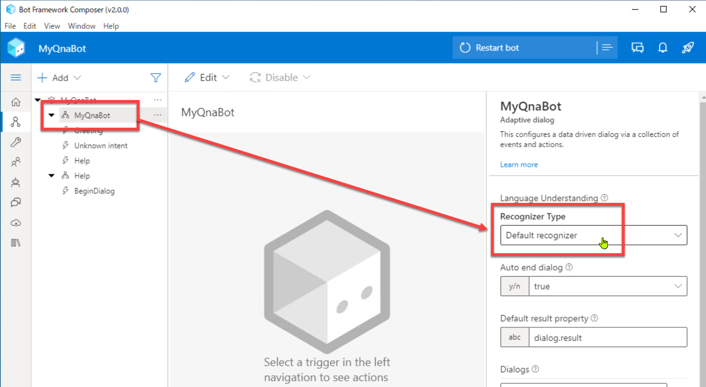  

---

## Language Understanding の設定

Bot Framework Composer の設定画面で QnA Maker のセットアップを行います。

1. [**Configure**] - [**Development resources**] を開いて [**Set up Language Understanding**] をクリックします。  
   
   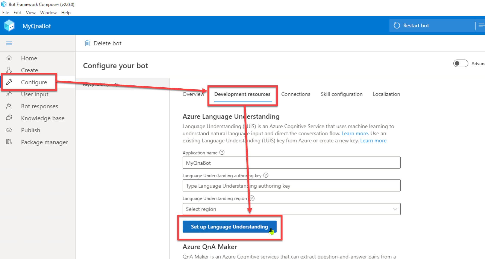

<br />

2. [**Create and configure new Azure Resources**] を選択して [Next] を選択します。  
     
   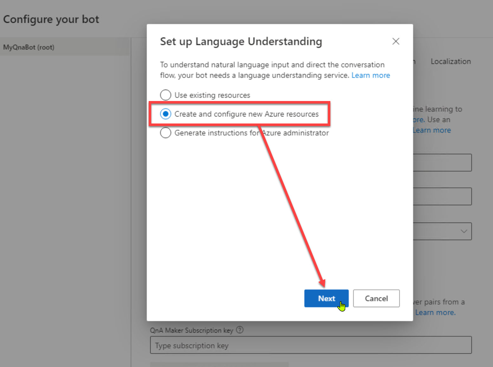

<br />

3. Azure の認証を求められたらサインインします。
4. Language Understanding のリソースを作成する Azure アカウントとサブスクリプションとを選択します。  

5. リソースグループ、リージョン、価格プランを入力・選択します。続いて [Next] をクリックします。   
   
   |項目名|値|
   |---|---|
   |Azure resource group|ドロップダウンを開いて [+ Create new] を選択|
   |Resource group name|任意の名前で新規作成 (上で "Create new" するまでは非表示)|
   |Region|West US|
   |Language Understanding resouce name|任意の名前で新規作成|
   
   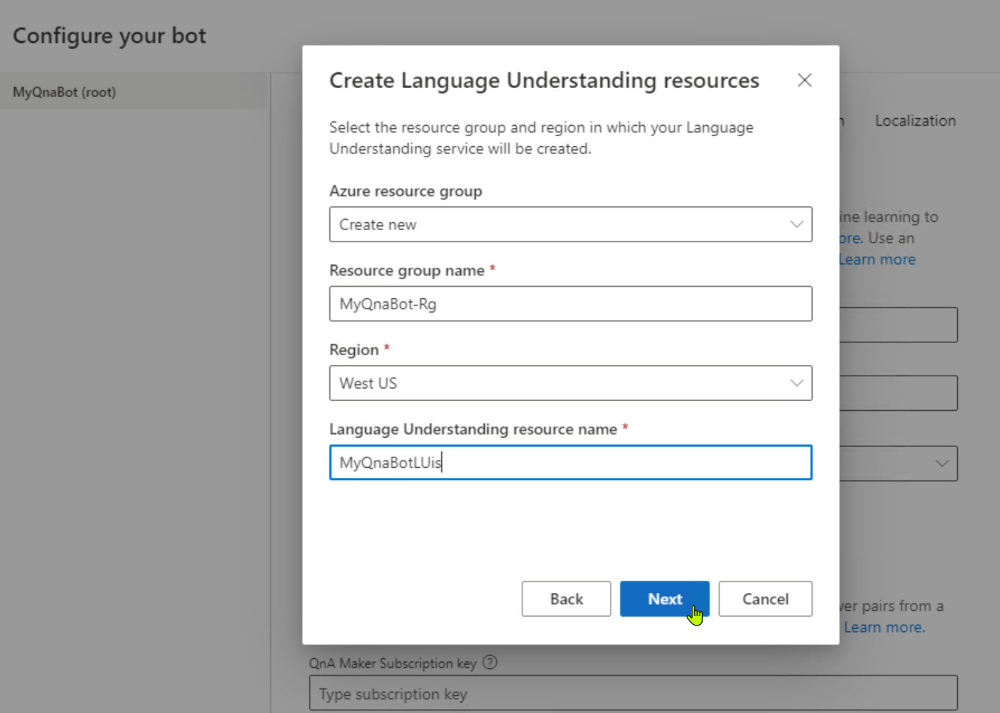

<br />

6. しばらく待つと Language Understanding のリソースが作成されます。  
   リソース作成に成功するとキーが取得されて [Create Language Understanding resources] が表示されます。  
   ポップアップは [Done] で閉じます。

   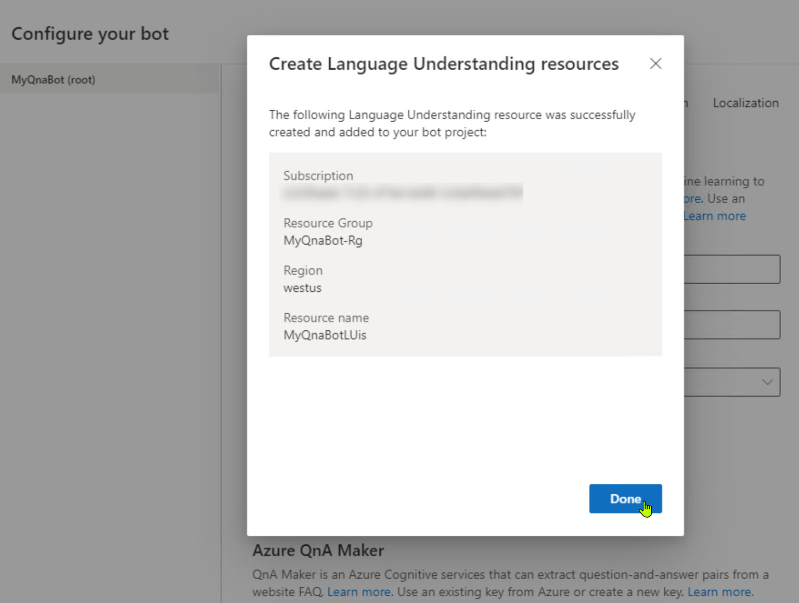
   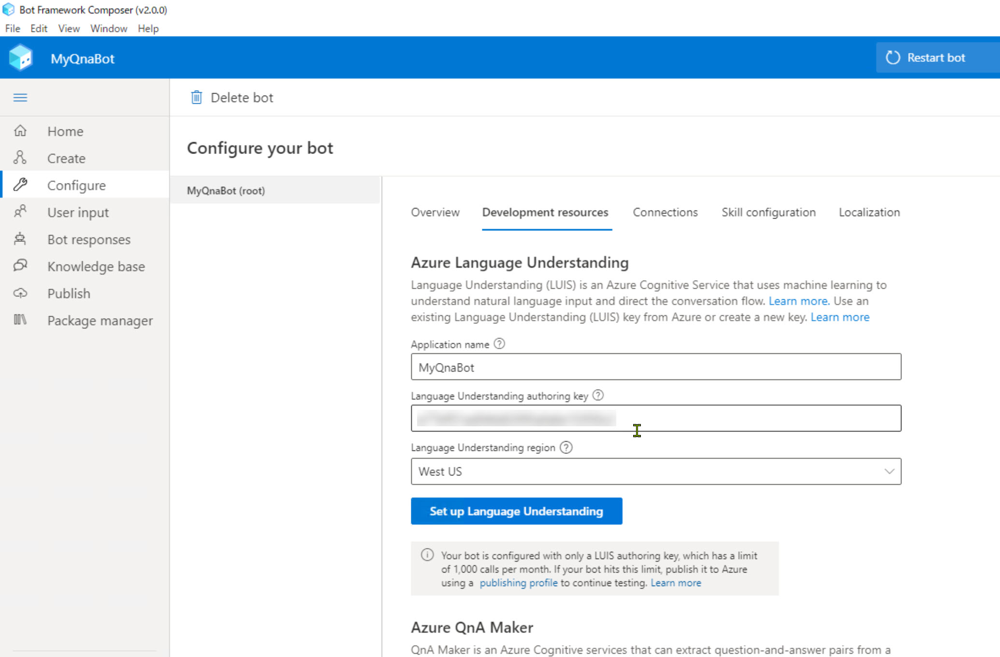

---

## Help トリガーのフレーズの入力

Help ダイアログにコンテキストを切り替える契機となるフレーズを入力します。

1. "**MyQnaBot**" の "**Help**" トリガーを選択します。

   > 選択するのは "Help" ダイアログではありません。

<br />

2. Property の [**Trigger Phrases**] に以下の入力をします。

   ```txt
   - Help
   - ヘルプ
   - ボットの使い方
   - Botの機能
   - このボットで何が出来るの
   - あなたの機能について教えて
   ```

   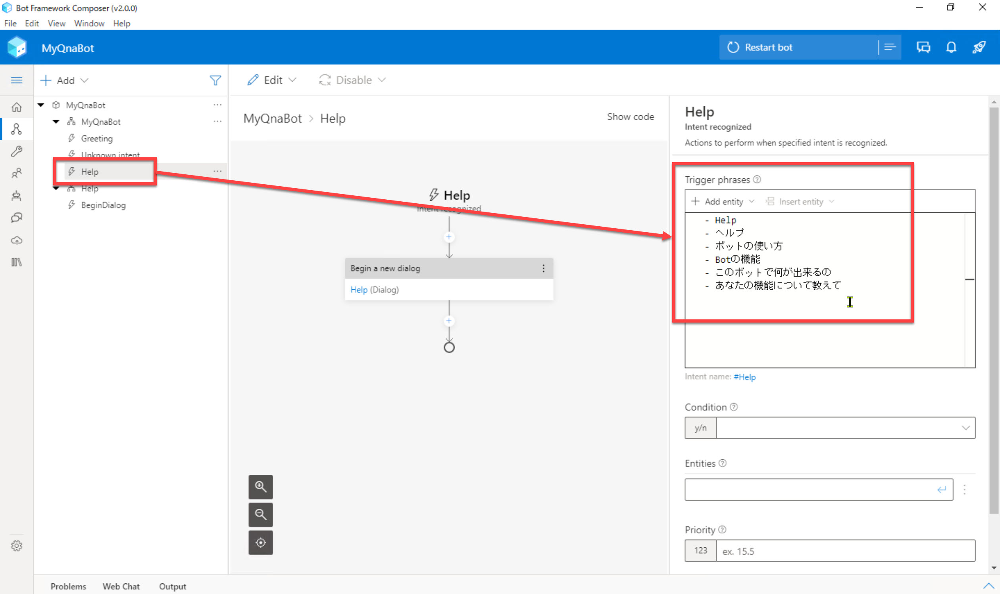

   <br />

   "Trigger Phrases" では、類義語を登録したり、英語・日本語を組み合わせると認識精度が上がることがあります。  
   例えば  

   - "使い方" と "機能"
   - "help" と "ヘルプ"
   - "Bot" と "ボット"  

   などです。  
   こうすると "このボットの使い方" や "Botの機能を教えて" などの日本語の表現の揺らぎを吸収してくれます。

<br />

3. 認識の精度をより上げるために **エンティティ** も合わせて設定します。  
   [**Trigger phrases**] の [**Add entity**] - [**Machine learning entity**] を選択します。

   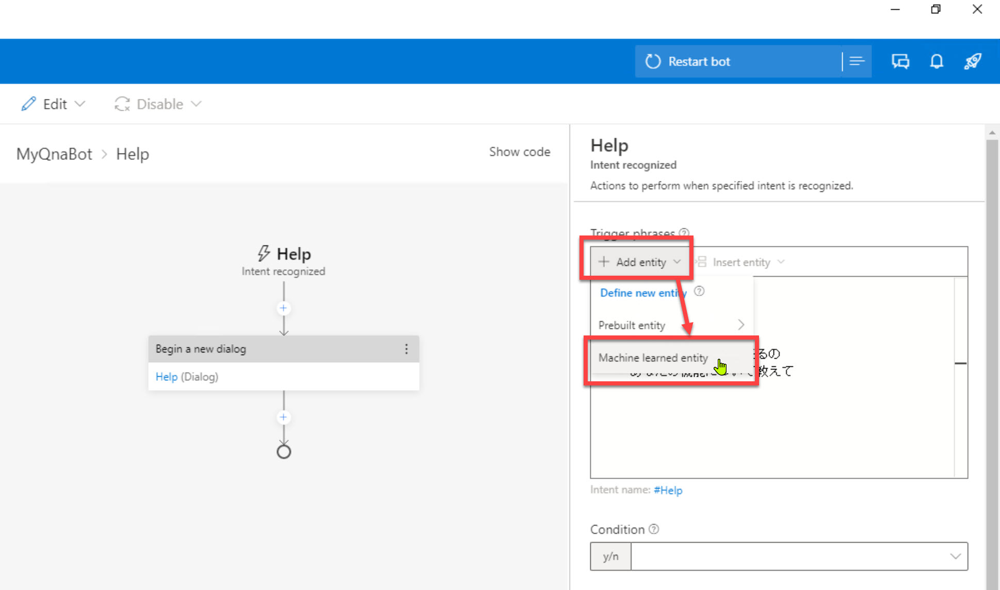

<br />

4. 追加された行を変更します。  
   さらに同様の操作でもう一つエンティティを追加・変更します。  

   > @ ml Action  
   >
   > @ ml Bot

   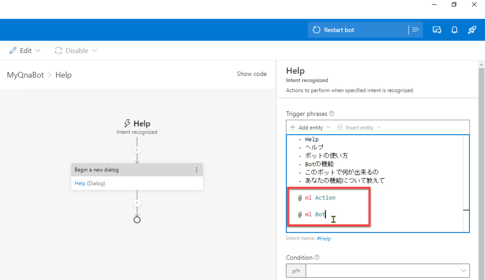

<br />

5. ヘルプの例文にエンティティを設定します。  
   1行目の "**Help**" を選択すると [labe entity] が表示されます。ここで "**Action**" を選択します。  
   この操作で 1行目が以下のように変更されます。

   > \- {Action = Help}

   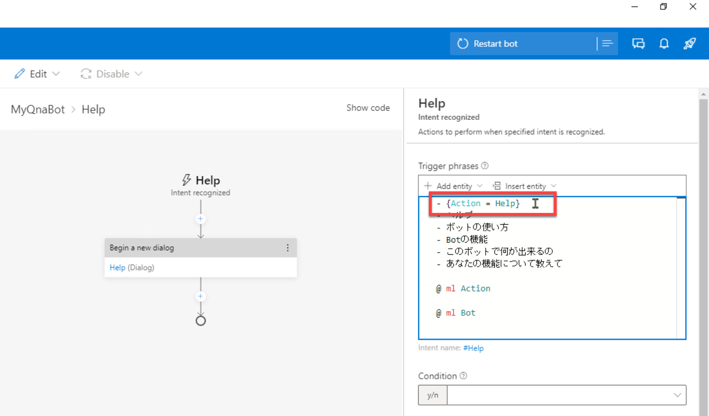

<br />

6. ほかの例文にも同様の操作でエンティティを設定します。  

   > \- {Action = Help}  
   > \- {Action = ヘルプ}  
   > \- {Bot = ボット}の{Action = 使い方}  
   > \- {Bot = Bot}の{Action = 機能}  
   > \- この{Bot = ボット}で何が{Action = 出来る}の  
   > \- {Bot = あなた}の{Action = 機能}について教えて

   
   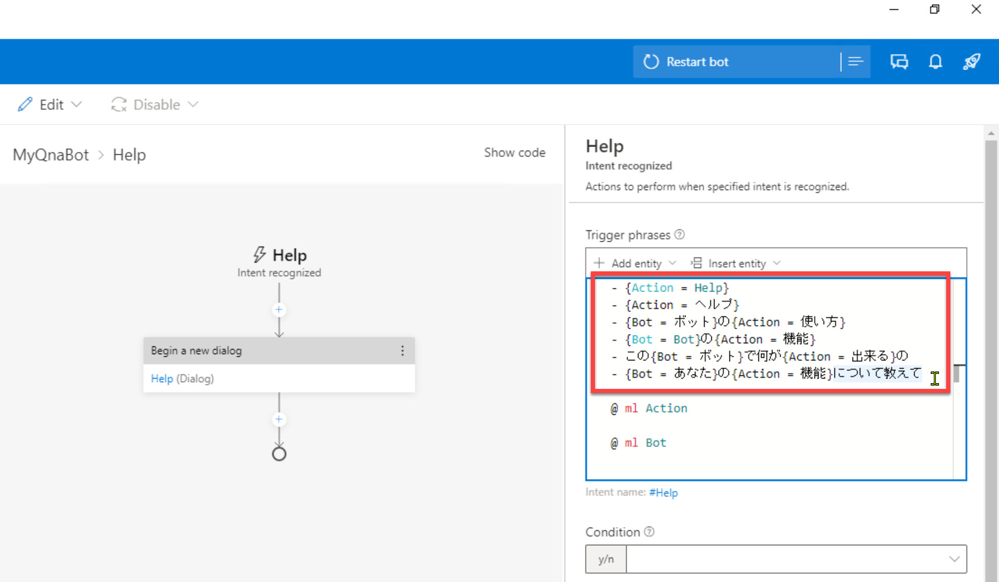

<br />

7. [**Condition**] のドロップダウンを開いて "**Write an expression**" を選択します。  

   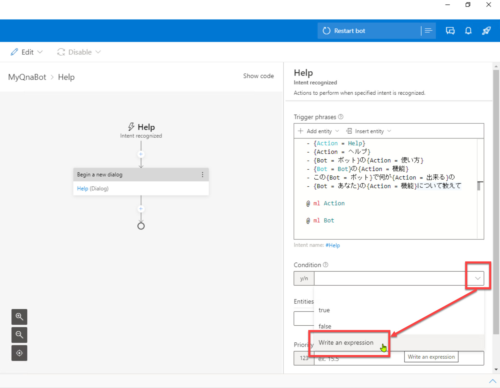

<br />

8. [**Condition**] に以下の入力をします。  
   前の操作で [Condition] には "**=**" が設定されているので、それも利用して以下のとおり指定します。

   ```txt
   =#Help.Score > 0.94
   ```

   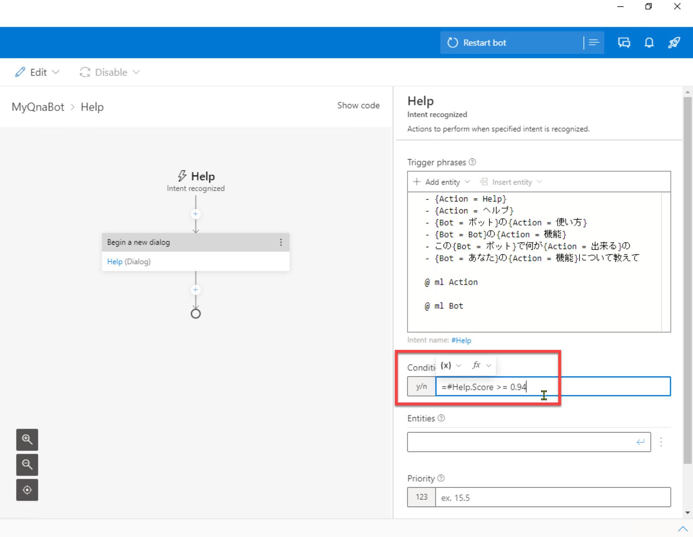

   <br />

   > Language Understanding での推論の結果、ユーザーの入力が "Help" である可能性が 94% より高い場合に Help ダイアログにコンテキストを切り替えることを意味します。  
   > それ以下の場合は、ユーザーの入力は "Help" 以外で処理されます。(現在は "Unknown intent" のみ)  
   >
   > 上で指定した 94% という数値は中途半端な値に思えるかもしれません。  
   > この後の方法で動作確認をしたところ、閾値として適切な値になったため、今回は 94% にしました。  
   > Language Understanding のスコアは随時変更される可能性があるので、その場合はより適切な予測ができる値に変更してください。

---

## Web Chat で動作確認

1. 組み込みの Web Chat で何か入力してみます。

   - ヘルプ
   - ボットの機能
   - こんにちは
   - ランチのおすすめは

   などを入力します。

   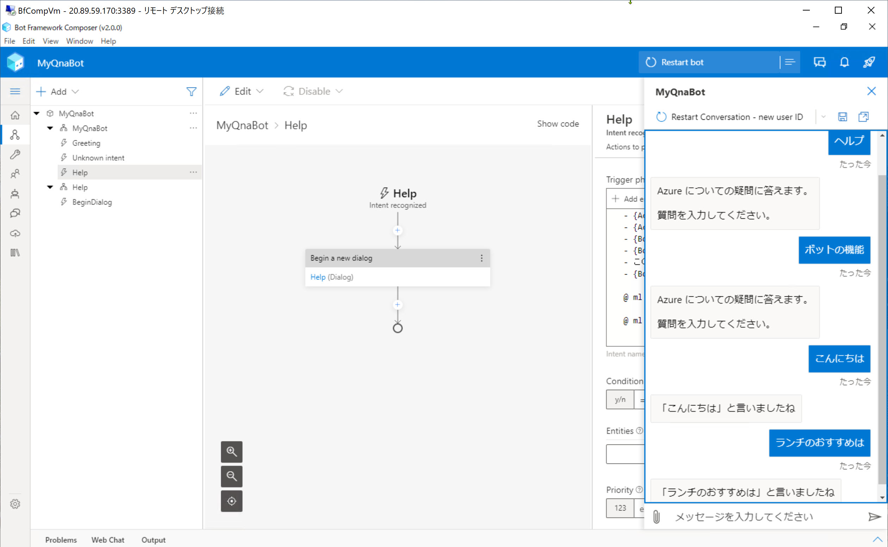

<br />

2. "ヘルプ" などと入力した際には Language Understanding で入力の意図を類推していることを確認します。  

   <br />

   > ボットの応答の内容だけ見ると、正規表現を使っていた時と同じように見えるかもしれません。  
   > Web Chat のトレースを見ると、今回は確かに "Language Understanding" への問い合わせが実行されていることがわかります。  
   >
   > 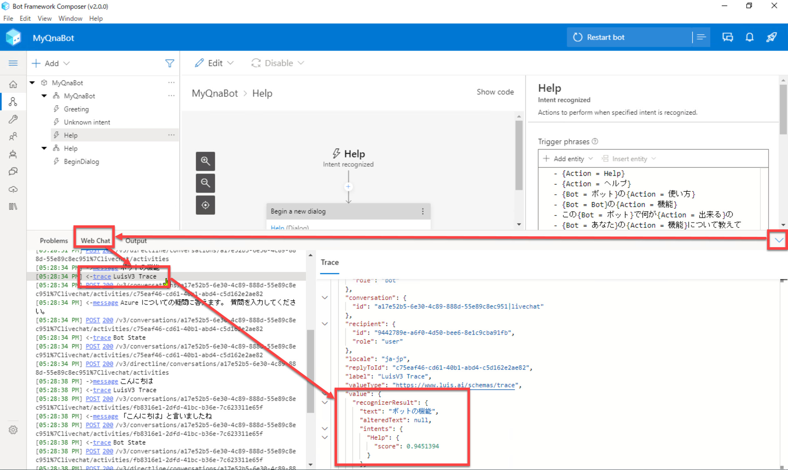

---

以上で Language Understanding と QnA Maker とを組み合わせて利用できるようになりました。  
Q&A Bot アプリケーションを開発は完了です。

次のステップでは、作成したアプリケーションを Azure に発行します。

[前に戻る](./03_composer_basic2.md) | [次に進む](./05_create_knowledgebase.md)  
[目次に戻る](../README.md)
