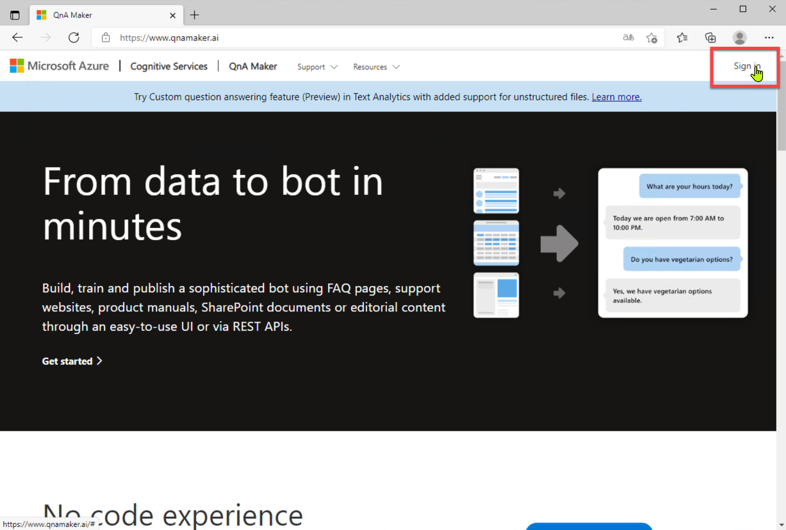
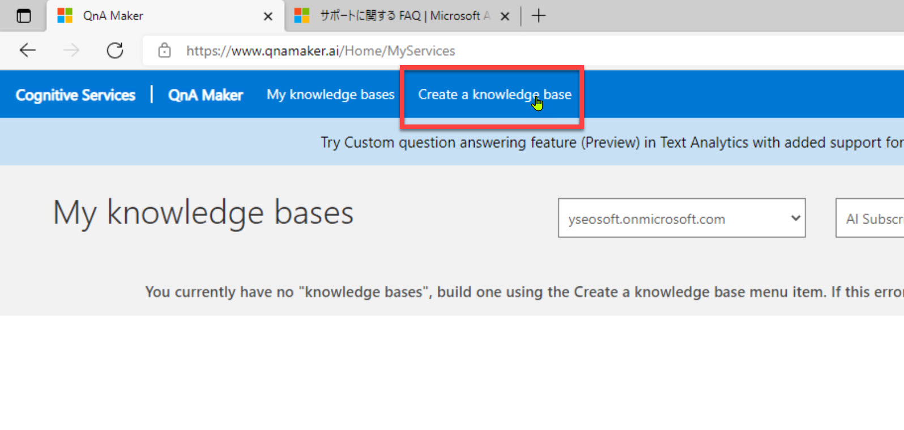
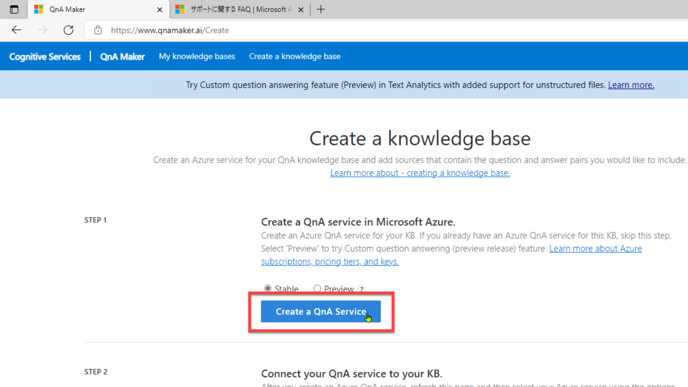
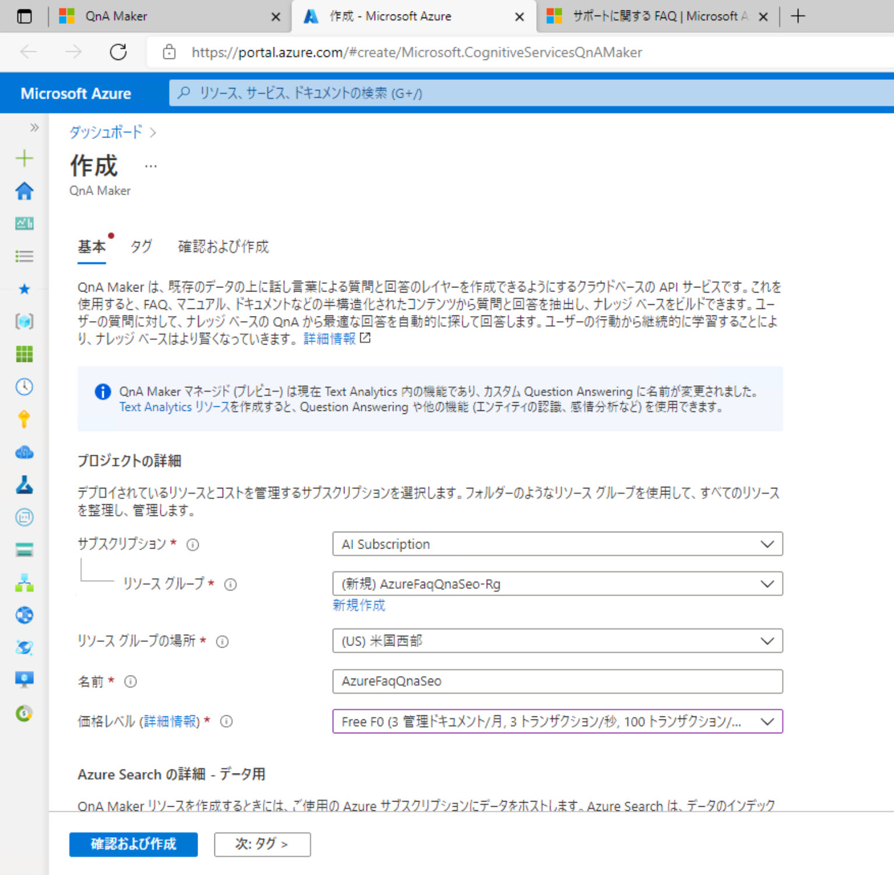
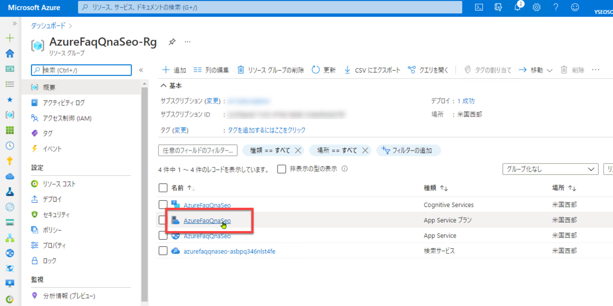
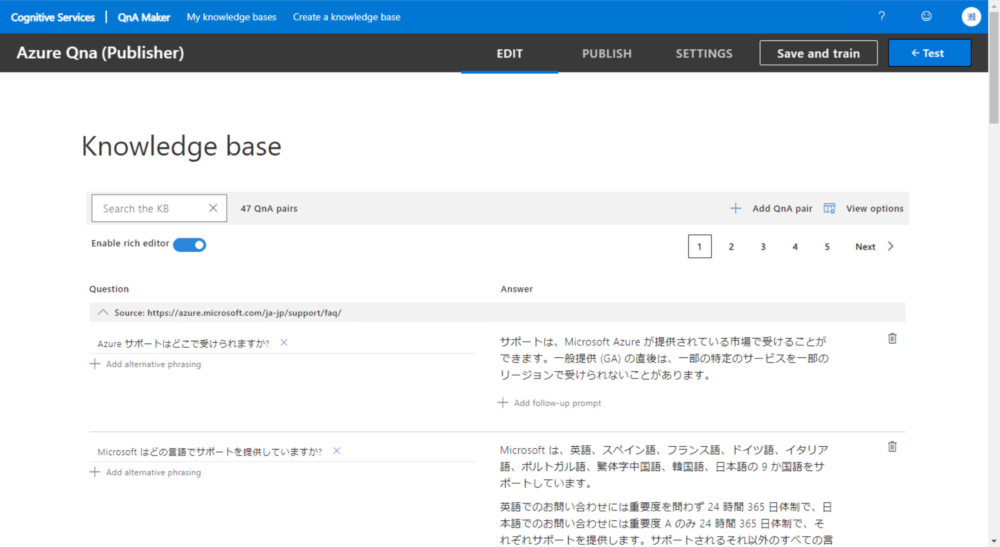
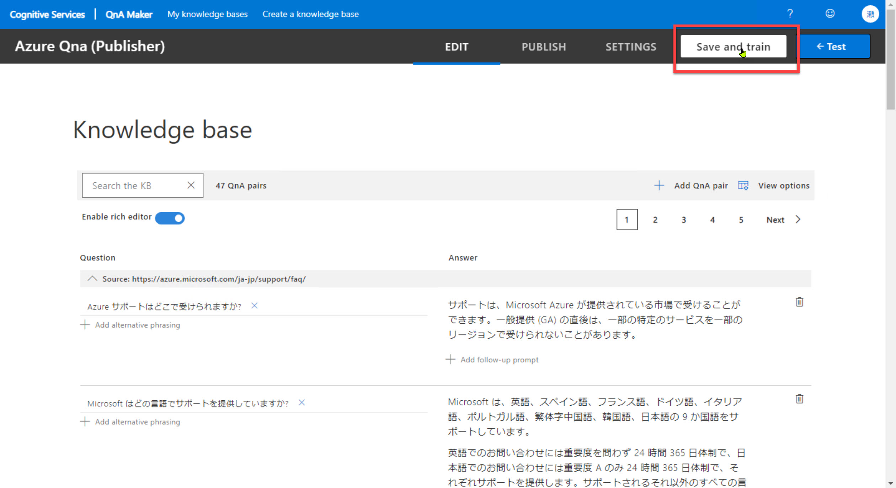
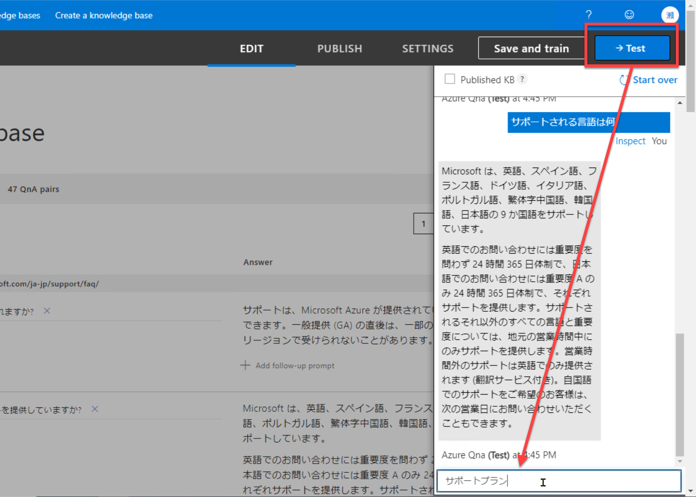
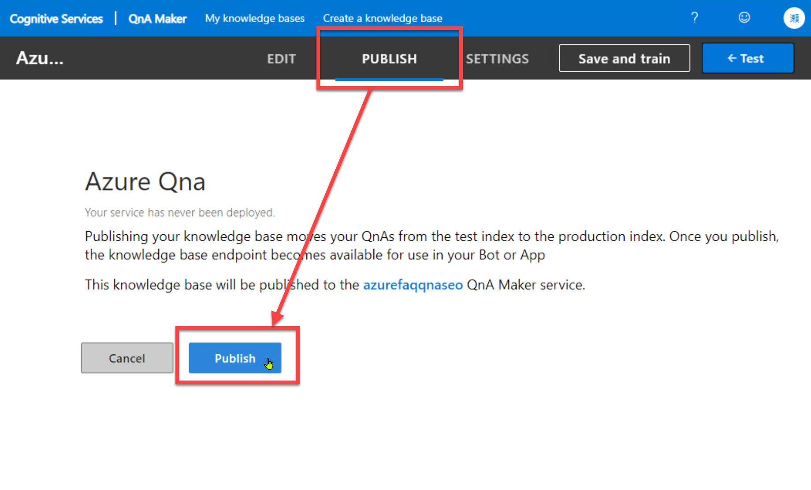
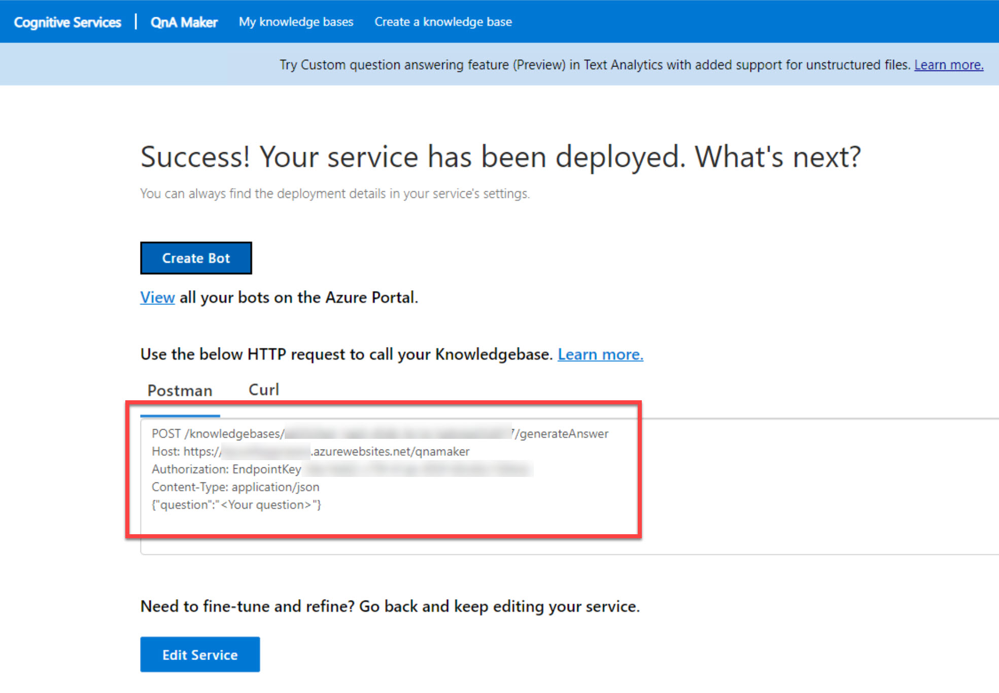

# QnA Maker でナレッジベース作成

[前のステップ](03_composer_basic2.md) までで Bot Framework Composer の基本的な操作を理解しました。

この手順では一旦 Bot Framework Composer を離れて、[**QnA Maker**](https://www.qnamaker.ai/) で Bot で使うナレッジベースを作成します。

[1. QnA Maker リソースの作成](#qna-maker-リソースの作成)  
[2. ナレッジベースの作成](#ナレッジベースの作成)  
[3. ナレッジベースのトレーニングとテスト](#ナレッジベースのトレーニングとテスト)  
[4. QnA の発行](#qna-の発行)

> ナレッジベースとしては [**Azure サポートに関する FAQ**](https://azure.microsoft.com/ja-jp/support/faq/) を利用します。  
> QnA Maker を使うと、このようなページの Q&A を取り込んでナレッジベースにすることができます。
>
> 

QnA Maker のナレッジベースは、Bot Framework Composer の [**Configure**] で新規作成することもできます。  
今回は Bot Framework Composer での操作の前に、事前に QnA Maker ポータルでナレッジベースを作成する方法で進めます。

---

## QnA Maker リソースの作成

QnA Maker のリソースを Azure ポータルで作成します。

> 

1. [**QnA Maker**](https://www.qnamaker.ai/) にサインインします。

   

2. [**Create a knowledge base**] をクリックします。

   

3. [**Create a QnA service**] をクリックします。  
   なお QnA Maker のタブは **閉じずにそのまま開いて** おきます。

   

4. 自動的に Azure ポータルが開くので、以下の入力・選択をして QnA Maker を作成します。

   |項目名|値|
   |---|---|
   |名前|任意|
   |マネージド (プレビュー)|今回はチェックなし|
   |サブスクリプション|任意|
   |リソースグループ|任意の名前で新規作成|
   |価格レベル|任意。選択可能ならハンズオンの範囲では F0|
   |Azure Search の場所|任意|
   |Azure Search 価格レベル|任意。選択可能ならハンズオンの範囲では F|
   |アプリ名|任意。固有の名前が必要なので、例えば "AzureFaq" に自分の名前や日付などを付けたもの|
   |Web サイトの場所|今回は "米国西部"|
   |App Insights|今回は "無効"|

   <br />
   

   > Bot Framework Composer では QnA Maker のデフォルトリージョンは "米国西部" になっています。  
   > [Project Configure] で変更することは可能ですが、今回は "米国西部" のままで進めます。

5. 作成したリソースグループを開いて "**App Service プラン**" を選択します。

   

6. App Service プランが表示されたら [**スケールアップ**] を選択します。  
   続いて [**開発/テスト**] - [**F1**] を選択して最後に [**適用**] をクリックします。

    Azure の利用状況によっては "F1" に変更できないことがあります。

以上で、Azure ポータルでの手順は終了です。  
続いて QnA Maker に戻ってナレッジベースを作成します。

---

## ナレッジベースの作成

Azure で作成した QnA Maker のリソースに、QnA Maker で接続してナレッジベースを作成します。

1. QnA Maker のタブに戻ります。

2. "STEP 2" の [**Refresh**] をクリックします。  
   すぐ前の手順で作った QnA Maker のリソースを選択します。  
   [**Language**] は "**Japanese**" を選択します。

   

3. "STEP 3" では任意の名前を付けます。ここでは "**Azure QnA**" とします。

4. "STEP 4" の [**URL**] には "**https://azure.microsoft.com/ja-jp/support/faq/**" と入力します。  
   [Chit-chat] は今回は "None" のままにします。

   

   > "Chit-chat" は応答にキャラクター付けするものですが、今回は何もしません。

5. このページの一番下の [**Create your KB**] をクリックして、ナレッジベースを作成します。

   

6. ナレッジベースが作成されると [EDIT] 画面に遷移します。  

   

> 一般にはここで、正しく質問と回答とが取り込めているかを確認します。  
> 今回は正しく取り込めることが分かっているサイトなので特に何もしません。
>
> 必要に応じて、内容を確認したり、質問・回答の文言を修正したりします。

---

## ナレッジベースのトレーニングとテスト

QnA Maker 内に Q&A を取り込んでナレッジベースを作成できたので、これをトレーニングします。  
さらに品質を確認するために QnA Maker ポータル内でテストします。

1. [**Save and train**] をクリックして、ナレッジベースのトレーニングを始めます。

   

2. トレーニングが終了したら、[**Test**] をクリックします。  
   テストクライアントが表示されたら何か質問（入力）して、回答を
   確認します。

   例えば、以下のような質問をしてみます。

   ```txt
   サポートされる言語は何
   サポートプラン
   ```

   

3. （オプション）回答の品質を数値でチェックしたい場合、または最適ではない回答を返してくる場合などは、[**Inspect**] をクリックすることで回答の詳細を確認・変更できます。

   

---

## QnA の発行

1. QnA Maker で [**PUBLISH**] - [**Publish**] を選択します。

   

2. 発行に成功すると Web サービスの設定値が表示されます。  
   これらの値をメモしておきます。

   |項目名|メモする値|
   |---|---|
   |Knowledge Id|1行目の "/knowledgebases/" と "/generateAnswer" の間の値
   |Host|2行目の "https://～/qnamaker"|
   |Endpoint Key|"EndpointKey " のあとの文字列|

   

---

以上でナレッジベースを学習して Web サービスとして公開しました。  

次のステップでは、ここで開発したナレッジベースを呼び出す機能を Bot アプリケーションに追加します。

[前に戻る](03_composer_basic2.md) | [次に進む](05_composer_qna.md)  
[目次に戻る](../README.md)
