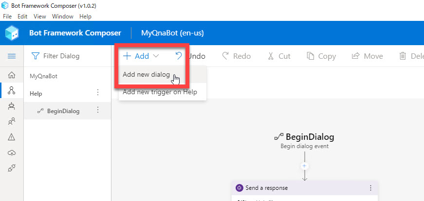
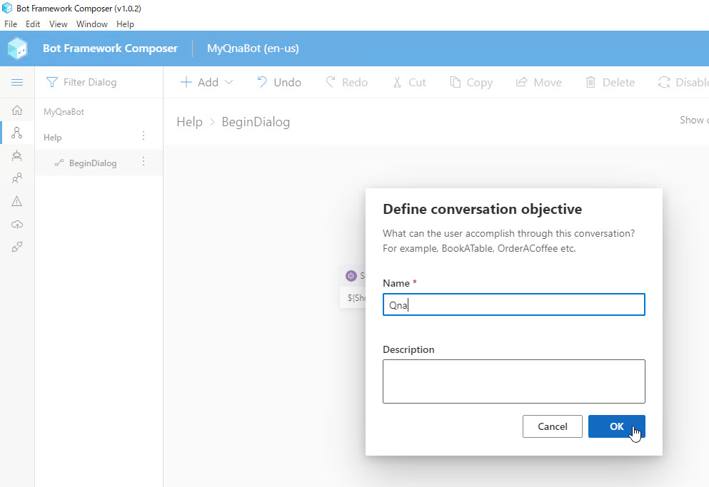
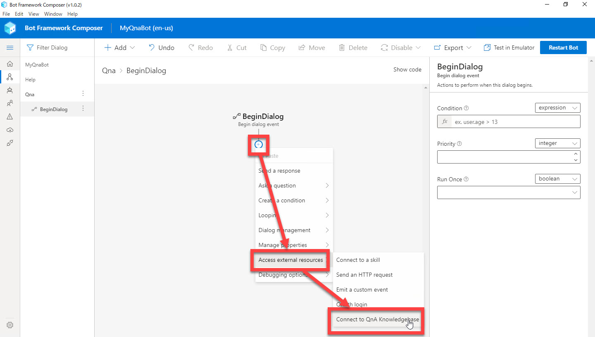
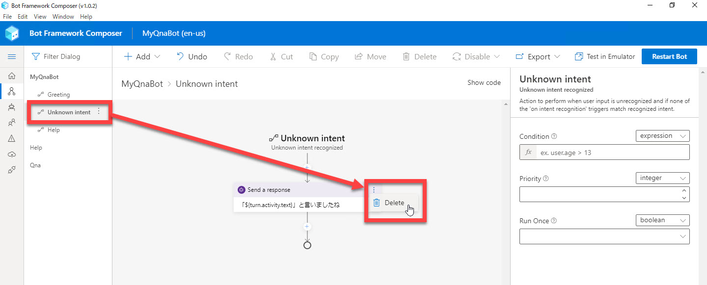
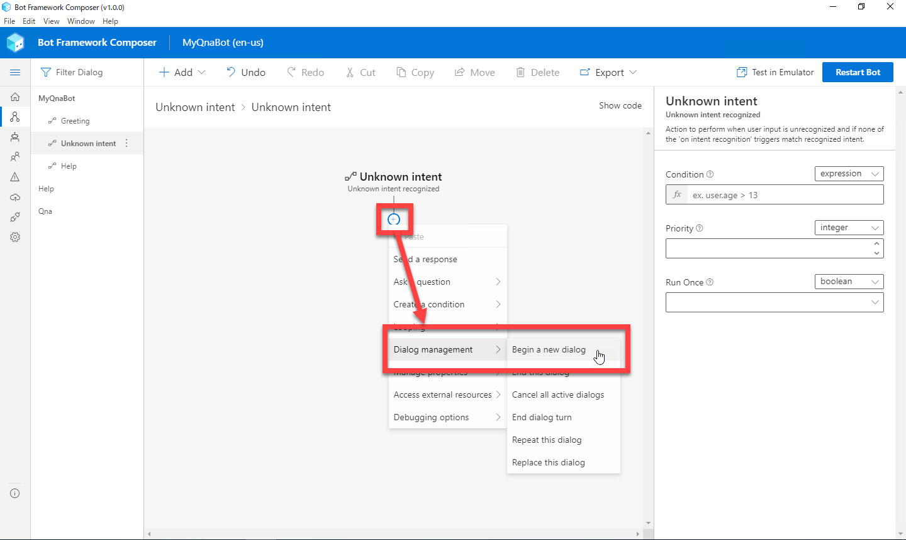
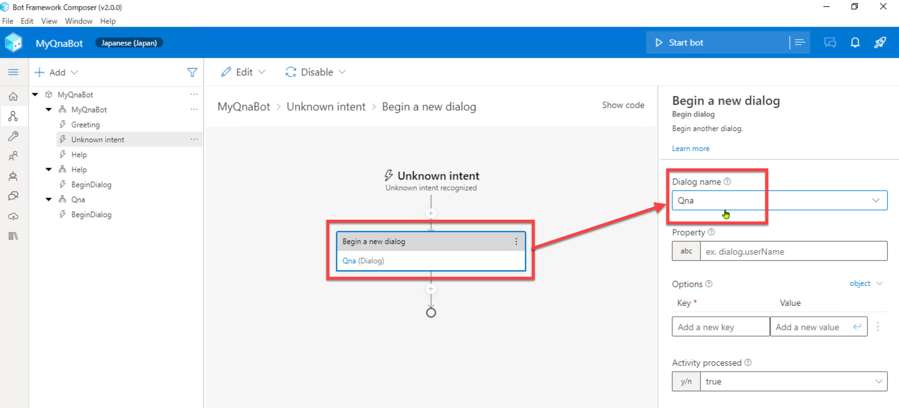
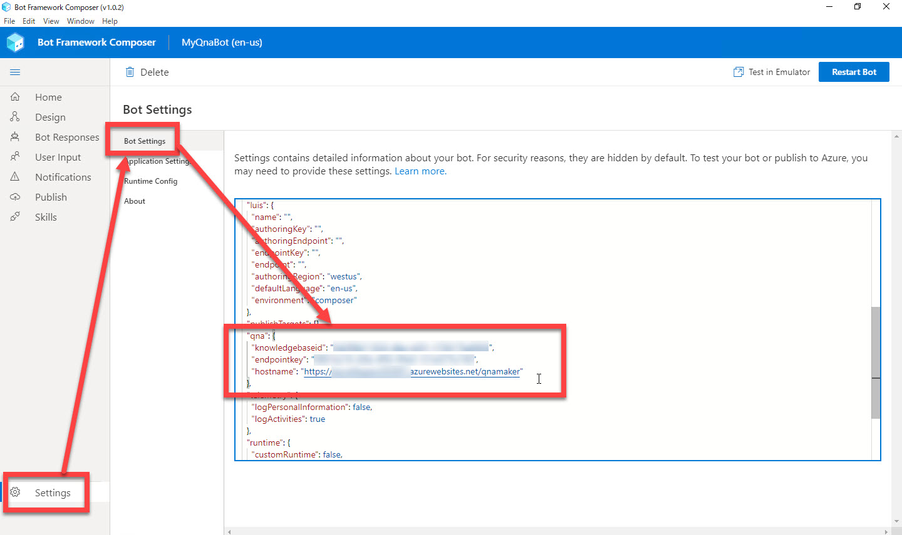
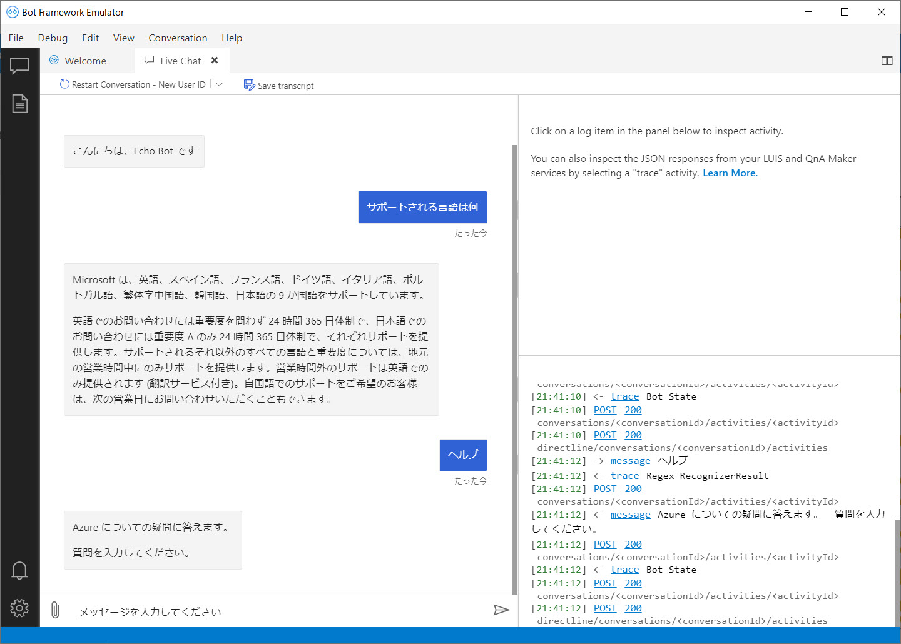

# Bot アプリケーションに Q&A 機能を実装

[前のステップ](04_create_qnamaker_knowledgebase.md) で、ナレッジベースを作成、学習して Web サービスとして公開しました。

このステップでは、Bot アプリケーションに Q&A 機能を実装します。  

[1. QnA ダイアログの作成](#qna-%e3%83%80%e3%82%a4%e3%82%a2%e3%83%ad%e3%82%b0%e3%81%ae%e4%bd%9c%e6%88%90)  
[2. QnA ダイアログへの切り替え](#qna-%e3%83%80%e3%82%a4%e3%82%a2%e3%83%ad%e3%82%b0%e3%81%b8%e3%81%ae%e5%88%87%e3%82%8a%e6%9b%bf%e3%81%88)  
[3. Settings ファイルの編集](#settings-%e3%83%95%e3%82%a1%e3%82%a4%e3%83%ab%e3%81%ae%e7%b7%a8%e9%9b%86)  
[4. Q&A ボットの動作確認](#qa-%e3%83%9c%e3%83%83%e3%83%88%e3%81%ae%e5%8b%95%e4%bd%9c%e7%a2%ba%e8%aa%8d)

---

## QnA ダイアログの作成

QnA Maker で作ったナレッジベースを呼び出すためのダイアログを作成します。

"MyQnaBot" の "Unknown intent" で QnA Maker を呼び出すこともできますが、Q&A は独立した機能と考えて、今回はダイアログを作成することにします。

1. [**+ Add**] - [**Add new dialog**] を選択して、QnA ダイアログを作成します。
   名前は "**Qna**" とします。

   
    
   

2. [**+**] - [**Access External Resources**] - [**Connect to QnA knowledgebase**] を選択します。

   

---

## QnA ダイアログへの切り替え

ユーザーの入力を最初に受け取る "MyQnaBot" から、作成した QnA ダイアログにコンテキスト切り替えをします。

オウム返し Bot では "**Unknown intent**" でユーザー入力をオウム返ししました。  
これを QnA Maker のナレッジベースを呼び出すように変更します。

1. "**MyQnaBot**" の "**Unknown intent**" を選択します。

2. [**Send a message**] アクションを削除します。

   

3. [**+**] - [**Dialog management**] - [**Begin a new dialog**] を選択します。

   

4. [**Begin a new dialog**] アクションを選択して、Property の [**Dialog name**] で "**Qna**" を選択します。

   

---

## Settings ファイルの編集

QnA Maker への接続情報は **Bot Settings ファイル** に記述します。

1. Bot Framework Composer の [**Settings**] - [**Bot Settings**] を選択します。

2. "**qna**" セクションに [**QnA Maker を 発行した時の設定値**](04_create_qnamaker_knowledgebase.md) を設定します。

   

> Settings ファイルから分かる通り、Bot Framework Compmoser では "Connect to QnA Knowledgebase" を利用した QnA Maker 利用は一つのナレッジベースのみ接続可能です。  
> 複数のナレッジベースを呼び出したい場合は "Send an HTTP Request" アクションを使うなどの工夫が必要です。

---

## Q&A ボットの動作確認

Bot アプリケーションから QnA Maker のナレッジベースを呼び出せるようになりました。

Bot Framework Emulator を使って動作確認します。

1. Bot Framework Composer の [**Build Bot**] または [**Rebuild Bot]** をクリックしてビルドします。

2. [**Test in Emulator**] で Emulator を起動します。

3. Bot Framework Emulator で動作確認します。  
   例えば "**サポートされる言語は何**" と入力して、ナレッジベースから適切な Answer が返ってくることを確認します。

   

4. "**ヘルプ**" と入力すると「Azure についての質問に答えます。質問を入力してください。」と応答することを確認します。  
   "ヘルプ" や "Help" を入力すると、すでに作成済みの "Help" ダイアログが応答していることが分かります。

---

以上で Bot アプリケーションに Q&A 機能を実装しました。

[Bot Framework Composer の基礎 - 2](03_composer_basic2.md) では、正規表現でユーザーの意図を認識しました。  
次のステップでは Bot アプリケーションで **LUIS** (Language UnderstandingLanguage Understanding) を利用して、ユーザーの意図を予測します。  

[前に戻る](04_create_qnamaker_knowledgebase.md) | [次に進む](06_composer_luis.md)  
[目次に戻る](../README.md)
