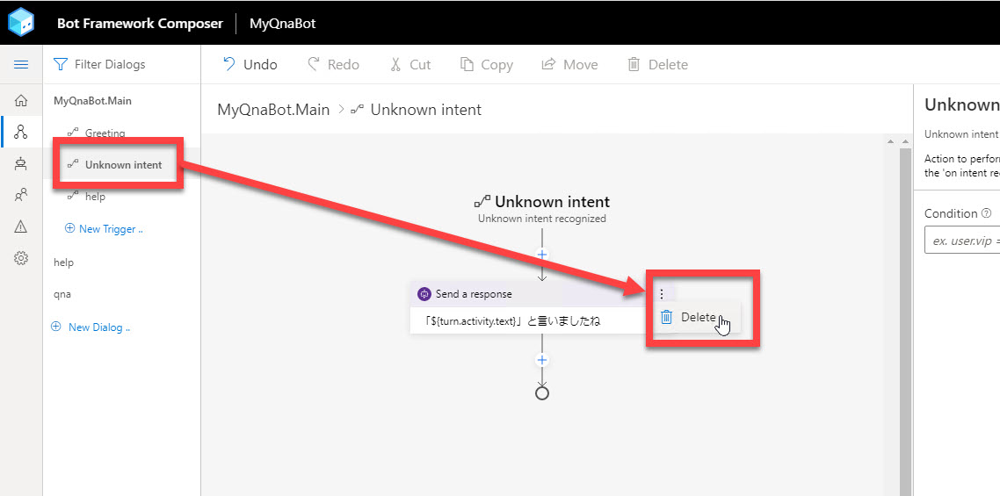
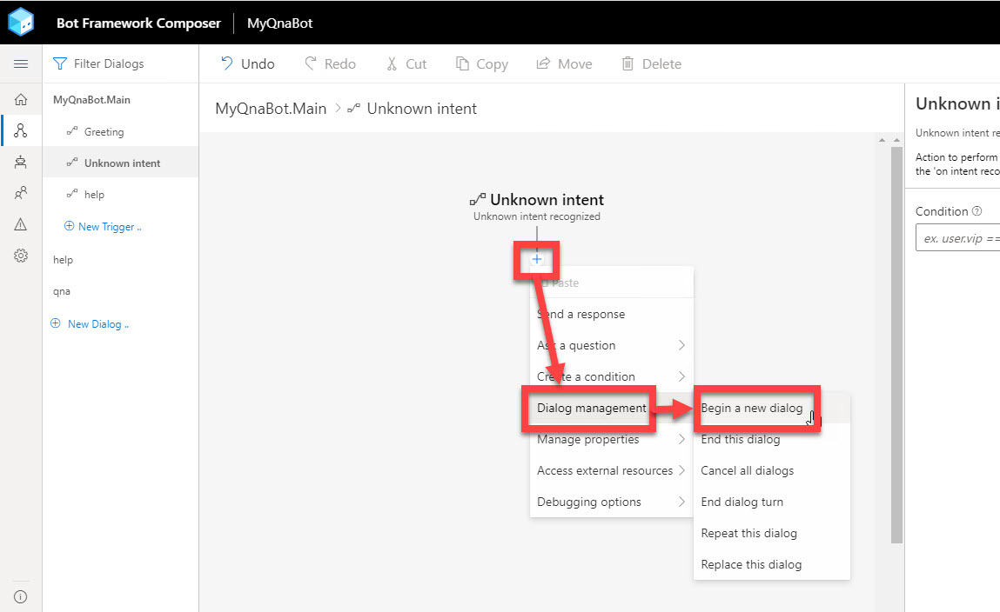
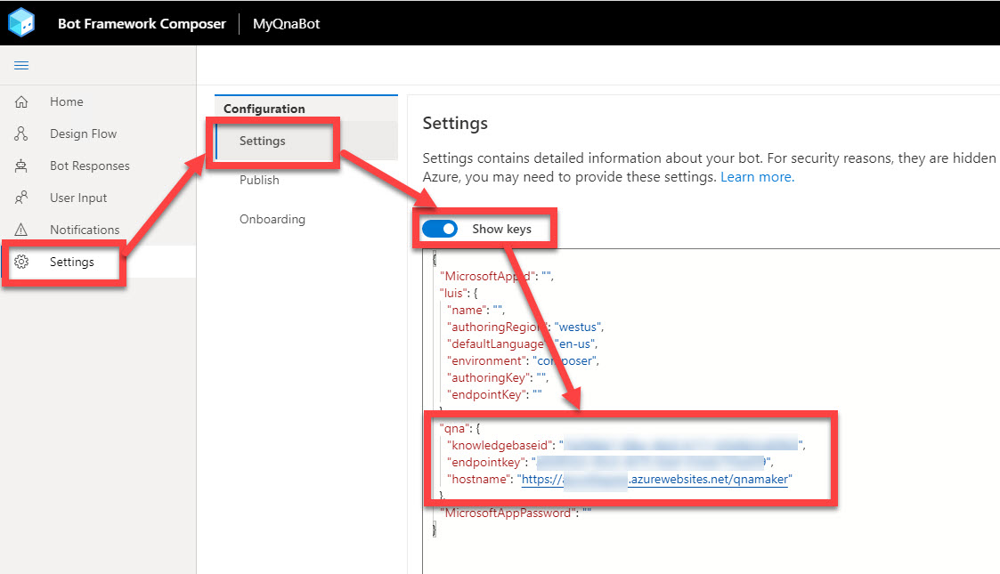
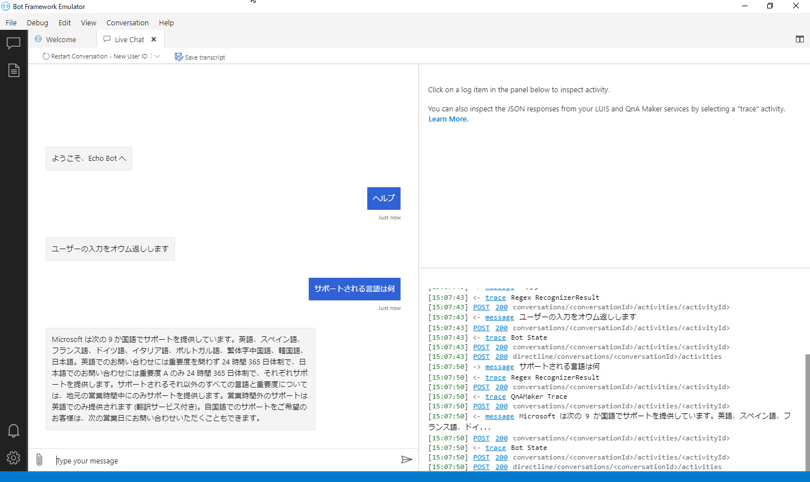

# Bot アプリケーションに Q&A 機能を実装

[前のステップ](04_create_qnamaker_knowledgebase.md) で、ナレッジベースを作成、学習して Web サービスとして公開しました。

このステップでは、Bot アプリケーションに Q&A 機能を実装します。  

[1. (オプション) プロジェクト名の変更](#%e3%82%aa%e3%83%97%e3%82%b7%e3%83%a7%e3%83%b3-%e3%83%97%e3%83%ad%e3%82%b8%e3%82%a7%e3%82%af%e3%83%88%e5%90%8d%e3%81%ae%e5%a4%89%e6%9b%b4)  
[2. QnA ダイアログの作成](#qna-%e3%83%80%e3%82%a4%e3%82%a2%e3%83%ad%e3%82%b0%e3%81%ae%e4%bd%9c%e6%88%90)  
[3. QnA ダイアログへの切り替え](#qna-%e3%83%80%e3%82%a4%e3%82%a2%e3%83%ad%e3%82%b0%e3%81%b8%e3%81%ae%e5%88%87%e3%82%8a%e6%9b%bf%e3%81%88)  
[4. Settings ファイルの編集](#settings-%e3%83%95%e3%82%a1%e3%82%a4%e3%83%ab%e3%81%ae%e7%b7%a8%e9%9b%86)  
[5. Q&A ボットの動作確認](#qa-%e3%83%9c%e3%83%83%e3%83%88%e3%81%ae%e5%8b%95%e4%bd%9c%e7%a2%ba%e8%aa%8d)

---

## (オプション) プロジェクト名の変更

ここまでの手順では "MyEchoBot" として オウム返し Bot を作成しました。  
ここからは Q&A Bot の機能を追加するのでプロジェクト名を変更します。

> この手順は必須ではありません。  
> "MyEchoBot" のままで Q&A Botを作りたくない場合に実施してください。  
> 公式ドキュメントに記載されている操作ではないので注意してください。  

1. Bot Framework Composer を開いていれば、念のためブラウザーを閉じておきます。

2. Explorer でプロジェクトが保存されているフォルダーを開きます。  
   プロジェクトはデフォルトでは "**C:\Users\<アカウント名>\Documents\Composer**" です。

3. "**MyEchoBot**" を "**MyQnaBot**" にリネームします。

   

4. Web ブラウザーで Bot Framework Composer を開きます。

5. [**Open**] をクリックして、続いて "**MyQnaBot**" を選択します。

   

6. "Main" Trigger の Property で、名前を "**MyQnaBot.Main**" に変更します。

   

---

## QnA ダイアログの作成

QnA Maker で作ったナレッジベースを呼び出すためのダイアログを作成します。

> "Main" の "Unknown intent" で QnA Maker を呼び出すこともできますが、Q&A は独立した機能と考えて、今回はダイアログを作成することにします。

1. [**New Dialog**] で新しいダイアログを作成します。  
   名前は "**qna**" とします。

   

2. [**qna**] トリガーの [**BeginDialog**] をクリックします。  
   続いて [**+**] - [**Access External Resources**] - [**Connect to QnA knowledgebase**] を選択します。

   

3. "**Connect to QnA knowledgebase**" アクションを選択して、Property で以下の入力をします。

   |項目名|値|備考|
   |---|---|---|
   |KnowledgeBase Id|=settings.qna.knowledgebaseid|初期値では動作しません。**先頭に "="** を入れます|
   |Endpoint Key|=settings.qna.endpointkey|初期値では動作しません。**先頭に "="** を入れます|
   |Hostname|=settings.qna.hostname|初期値では動作しません。**先頭に "="** を入れます|
   |Fallback answer|すみません、分かりませんでした。|ナレッジベースで適切な Answer が見つからない場合の Bot の応答|
   |Active learning card title|今回は "Did you mean:"|今回の範囲では本来は不要な設定です|
   |Card no match text |今回は "None of the above"|今回の範囲では本来は不要な設定です|
   |Card no match response|今回は "Thanks for the feedback"|今回の範囲では本来は不要な設定です|

   > "KnowledgeBase Id", "Endpoint Key", "Hostname" は先頭に "=" が必要です。  
   > 2020年4月末時点では、Composer が生成する値は間違っています。
   >
   > また "Active learning card title", "Card no match text", "Card no match response" は [公式ドキュメント](https://docs.microsoft.com/en-us/composer/how-to-add-qna-to-bot) ではオプション値のはずですが、2020年4月末時点では空にすると Bot 実行時にエラーメッセージが出力されます。
   > 今回のハンズオンではこれらの値は使用しませんが、ひとまず何か値を入れておきます。

   
    
   

   "Connect to QnA Knowledgebase" は、このアクションだけでユーザーへの応答まで行います。

---

## QnA ダイアログへの切り替え

ユーザーの入力を最初に受け取る Main から、作成した QnA ダイアログにコンテキスト切り替えをします。

オウム返し Bot では "Main" の "Unknown intent" でユーザー入力をオウム返ししているのを、QnA Maker のナレッジベースを呼び出すように変更します。

1. "**MyQnaBot.Main**" の "**Unknown intent**" を選択します。

2. [**Send a message**] アクションを削除します。

   

3. [**+**] - [**Dialog management**] - [**Begin a new dialog**] を選択します。

   

4. [**Begin a new dialog**] アクションを選択して、Property の [**Dialog name**] で "qna" を選択します。

   

---

## Settings ファイルの編集

QnA Maker への接続情報は **Settings ファイル** に記述します。

1. Bot Framework Composer の [**Settings**] - [**Settings**] を選択します。

2. [**Show keys**] を "**有効**" にします。

3. "**qna**" セクションに [**QnA Maker を 発行した時の設定値**](04_create_qnamaker_knowledgebase.md) を設定します。

   

---

## Q&A ボットの動作確認

Bot アプリケーションから QnA Maker のナレッジベースを呼び出せるようになりました。

Bot Framework Emulator を使って動作確認します。

1. Bot Framework Composer の [**Build Bot**] または [**Rebuild Bot]** をクリックしてビルドします。

2. [**Test in Emulator**] で Emulator を起動します。

3. Bot Framework Emulator で動作確認します。  
   例えば "**サポートされる言語は何**" と入力して、ナレッジベースから適切な Answer が返ってくることを確認します。

   

   > "**ヘルプ**" と入力すると「ユーザーの入力をオウム返しします」と応答することを確認します。  
   > 今の Q&A Bot の機能からは異なっていますが、すでに作成済みの "help" ダイアログが応答していることが分かります。
   >
   > 次のステップで "help" ダイアログの応答を変更します。

---

以上で Bot アプリケーションに Q&A 機能を実装しました。

次のステップでは Bot アプリケーションで LUIS (LUIS) を利用して、自然言語への対応を

[前に戻る](04_create_qnamaker_knowledgebase.md) | 次に進む  
[目次に戻る](../README.md)
