# ナレッジベース作成

[前のステップ](03_composer_basic2.md) までで Bot Framework Composer の基本的な操作を理解しました。

この手順では Bot Framework Composer 組み込み機能でナレッジベースを作成します。

[1. QnA Maker の設定](#qna-maker-の設定)  
[2. ナレッジベースの作成](#ナレッジベースの作成)  
[3. ナレッジベースの編集](#ナレッジベースの編集)  

 

> ナレッジベースとして [**Surface の保証: よくある質問**](https://support.microsoft.com/ja-jp/surface/surface-%E3%81%AE%E4%BF%9D%E8%A8%BC-%E3%82%88%E3%81%8F%E3%81%82%E3%82%8B%E3%81%94%E8%B3%AA%E5%95%8F-1217913a-2692-424e-a5c4-0eb0de84f05a) を利用します。  
>
> 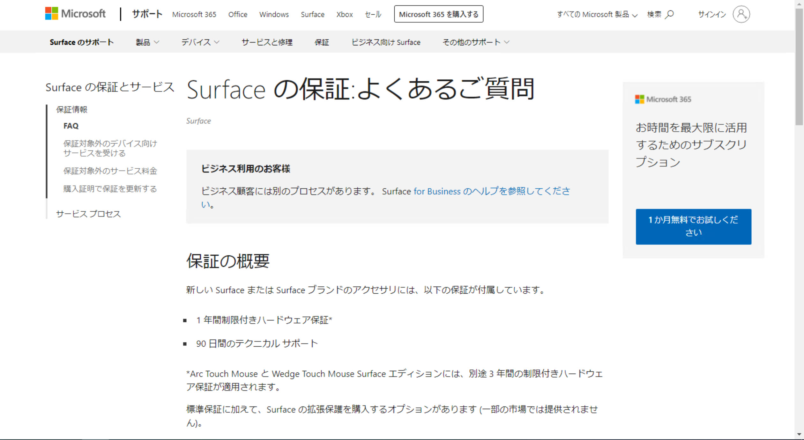

 

QnA Maker のナレッジベースは、QnA Maker ポータルで作成して Composer から接続する方法もあります。  
これについては [付録](./ap01_create_qnamaker_kb.md) で手順を紹介します。

 

---

## QnA Maker の設定

Bot Framework Composer の設定画面で QnA Maker のセットアップを行います。

1. [**Configure**] - [**Development resources**] を開いて [**Set up QnA Maker**] をクリックします。  
   
   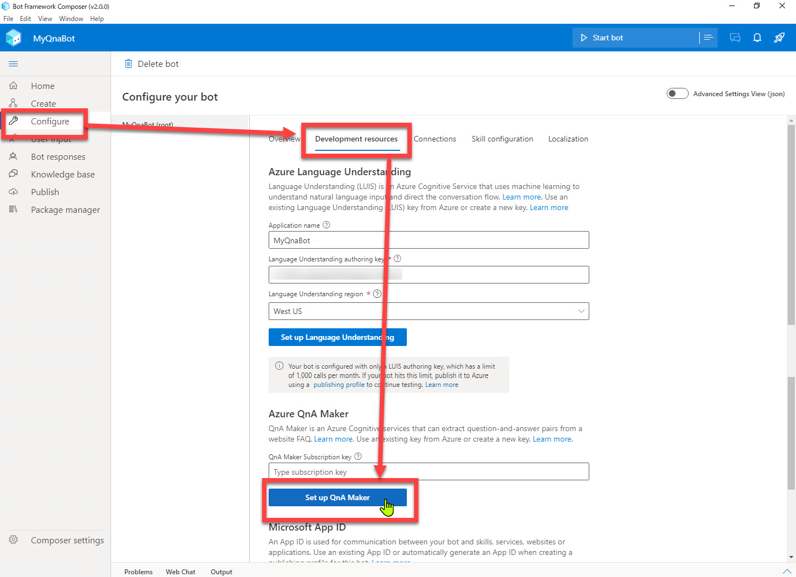

 

2. [**Create and configure new Azure Resources**] を選択して [Next] を選択します。  
     
   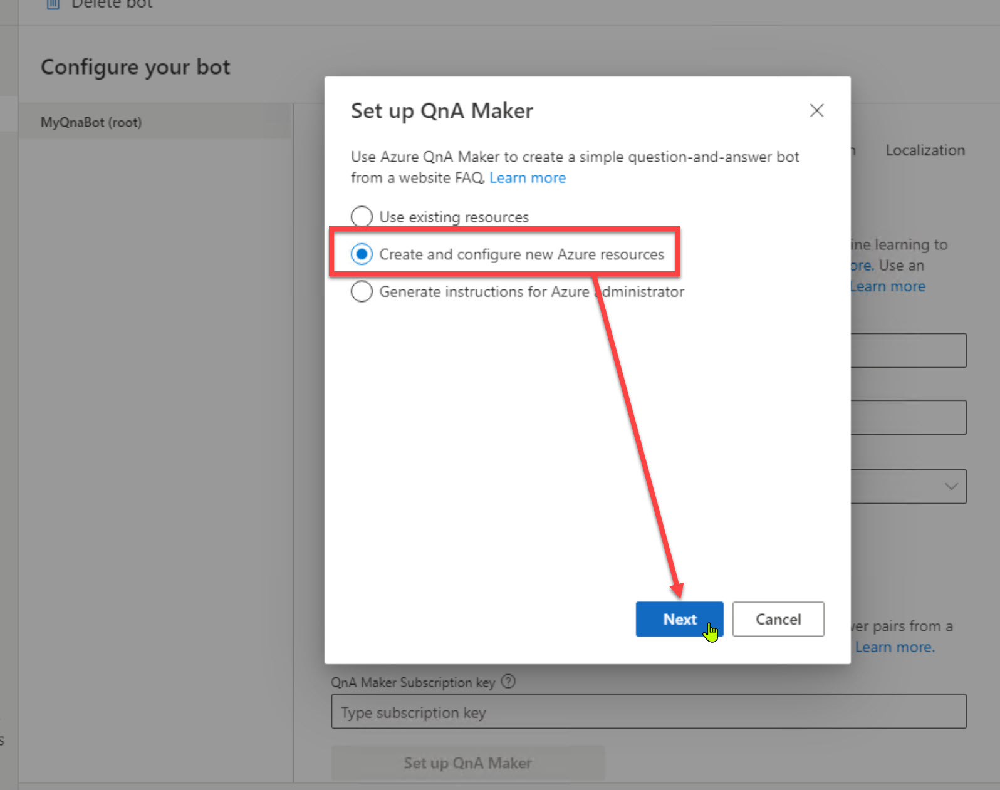

 

3. Azure の認証を求められたらサインインします。
4. QnA Maker のリソースを作成する Azure アカウントとサブスクリプションとを選択します。  
   
   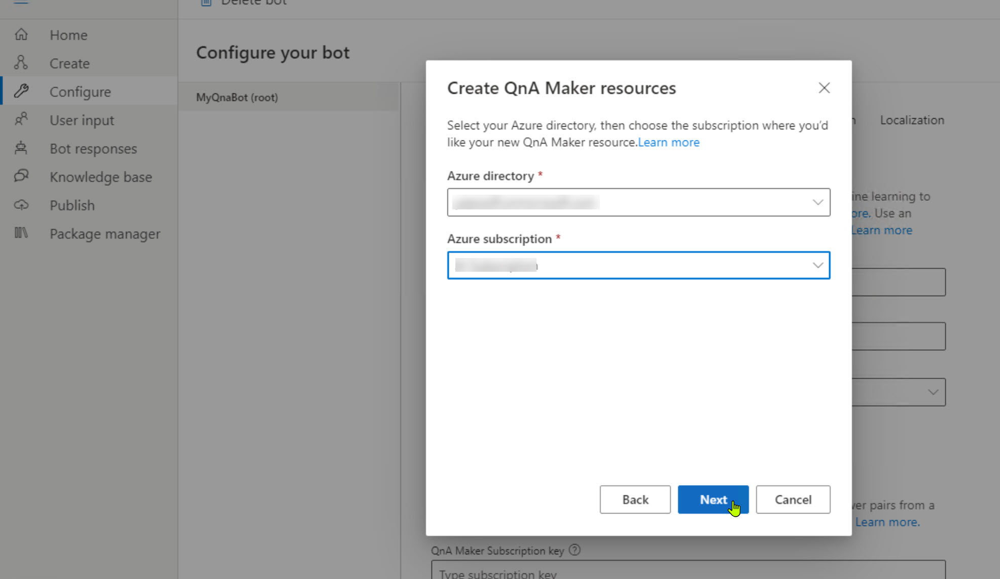

 

5. リソースグループ、リージョン、価格プランを入力・選択します。続いて [Next] をクリックします。   
   
   |項目名|値|
   |---|---|
   |Azure resource group|Language Understanding のリソースを作成したリソースグループ|
   |Region|West US|
   |QnA Maker resouce name|任意の名前で新規作成|
   |Pricing tier|任意|
   
   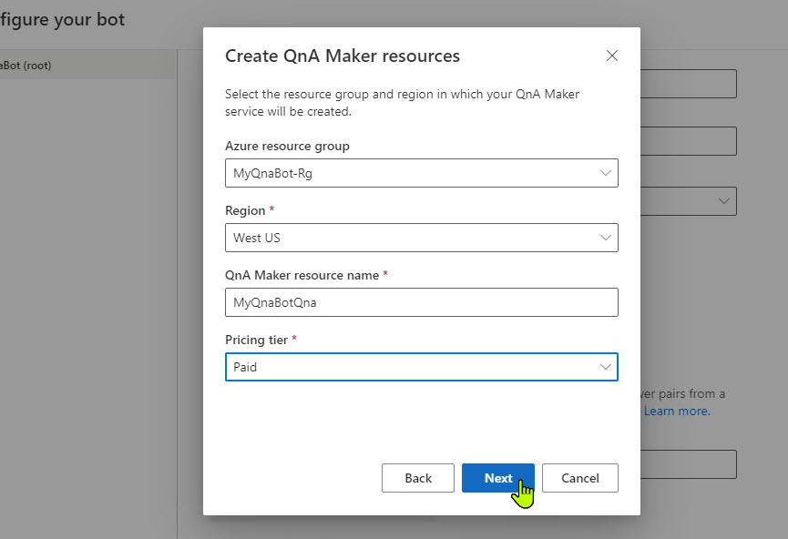

 

6. しばらく待つと QnA Maker のリソースが作成されます。  
   リソース作成に成功するとキーが取得されて [QnA Maker Subscription key] に自動的に表示されます。  

   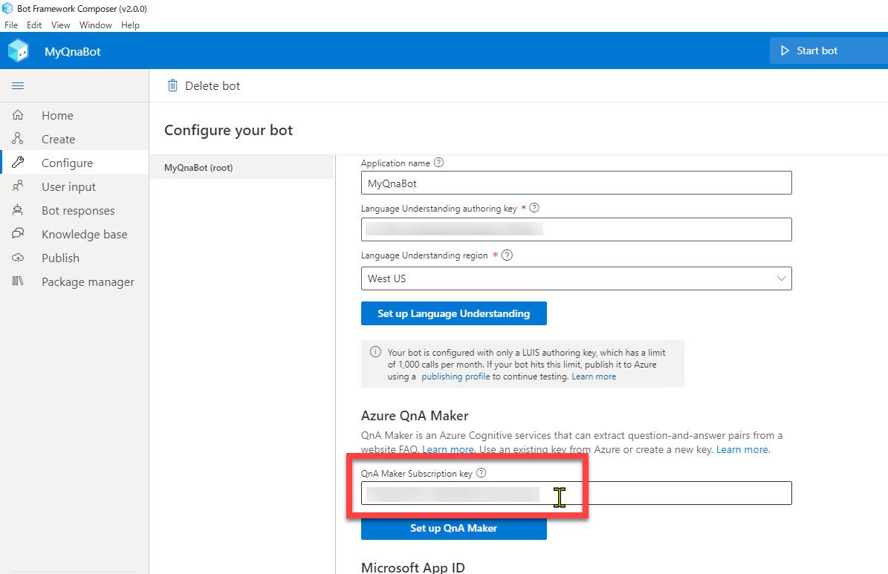

 

---

## ナレッジベースの作成

Web ページをインポートしてナレッジベースを作成します。

1. Composer のナビゲーションで [**Knowledge base**] を選択して [**Create new KB**] をクリックします。  

   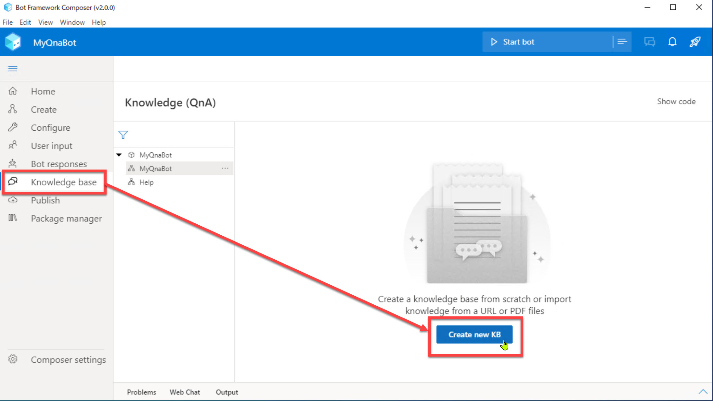

 

2. [**Add Qna Maker knowledge base**] でナレッジベースの名前（任意）を入力して、[**FAQ website (source)**] に FAQ ページのアドレスを入力します。  
   今回は "https://support.microsoft.com/ja-jp/surface/surface-%E3%81%AE%E4%BF%9D%E8%A8%BC-%E3%82%88%E3%81%8F%E3%81%82%E3%82%8B%E3%81%94%E8%B3%AA%E5%95%8F-1217913a-2692-424e-a5c4-0eb0de84f05a" と入力します。

    

   > [Surface の保証: よくあるご質問](https://support.microsoft.com/ja-jp/surface/surface-%E3%81%AE%E4%BF%9D%E8%A8%BC-%E3%82%88%E3%81%8F%E3%81%82%E3%82%8B%E3%81%94%E8%B3%AA%E5%95%8F-1217913a-2692-424e-a5c4-0eb0de84f05a)
   
    

   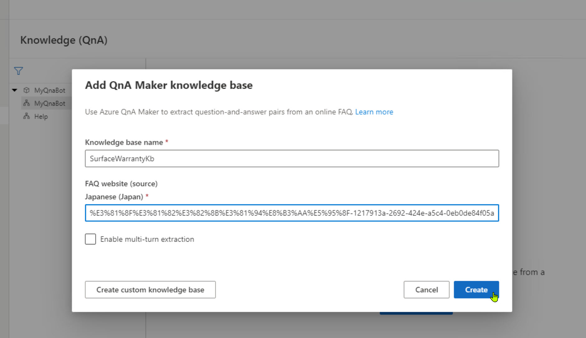

 

3. 少し待つとナレッジベースが作成されます。  
   
   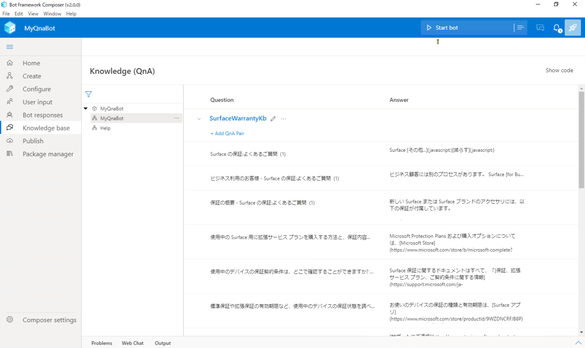

    

   > ナレッジベース作成時に先頭の数個だけ表示されて全体の作成には失敗することがあります。  
   > この場合は [**Delete knowledge base**] でナレッジベースを削除してから改めて作り直すか、[**Import new URL and overwrite**] でナレッジベースを取り込み直しします。  
   >
   > 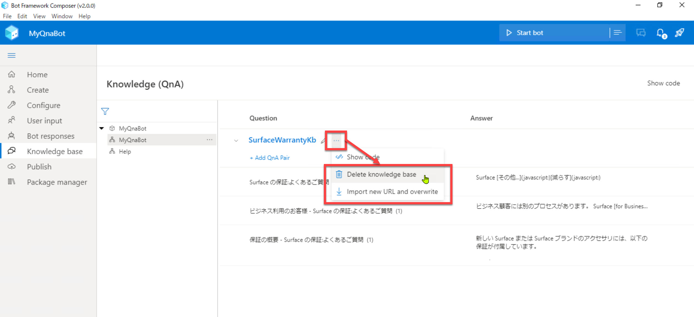

 

---

## ナレッジベースの編集

Q&A の内容を確認して、必要に応じて質問や回答の文言を修正・追加・削除します。  
実際に次の操作でナレッジベースを編集してみます。

> ここで使用する FAQ ページの内容は随時更新されます。Q&A の内容が以下とは異なるかもしれません。  
> その場合は以下の操作を参考に適宜適切な編集をしてください。

1. 不要な Q&A ペアを [ごみ箱] アイコンで削除します。  
   ここでは先頭の Q&A ペアが適切ではないので削除します。 (ページ表示コントロールのスクリプト部分を回答として認識しています)

   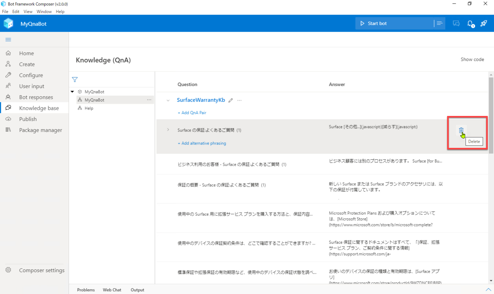

2. この後のステップで利用する質問を追加します。  
   ひとつの回答に対して複数の質問を定義する形にします。

   > ここで追加する質問は Help メッセージの追加の応答として **Suggested Action** で利用します。

    

   |追加箇所|追加の質問|
   |---|---|
   |使用中のデバイスの保証契約条件は、どこで確認することができますか? - 保証に関してよく寄せられる質問|保証内容を確認|
   |サポートに連絡する方法を教えてください。 - サービスに関してよく寄せられる質問|サポートに連絡|

    

   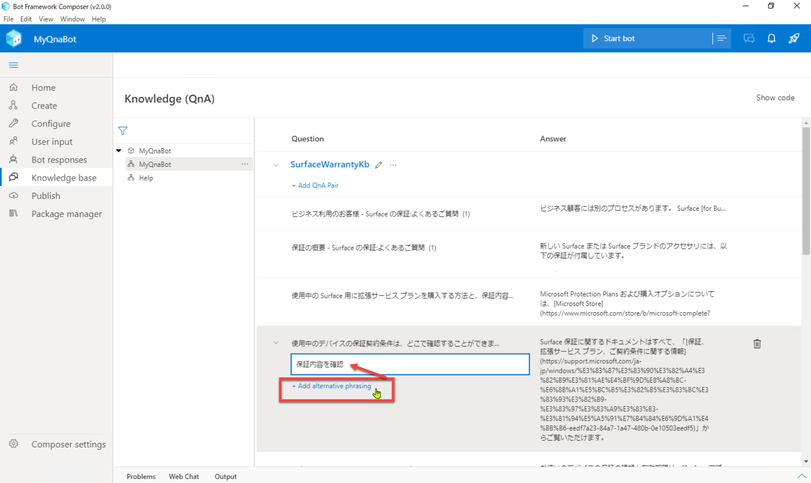
   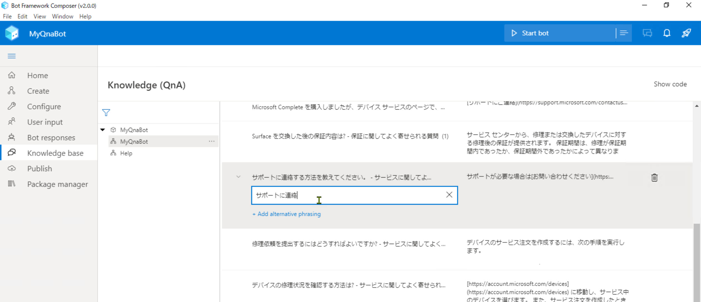

 

---

ここでは Composer に組み込まれたナレッジベース管理機能でナレッジベースの新規作成、編集を行いました。

次のステップでは、ここで作成したナレッジベースを Bot アプリケーションから呼び出してみます。  

[前に戻る](03_composer_basic2.md) | [次に進む](06_test_qnatrigger.md)  
[目次に戻る](../README.md)
