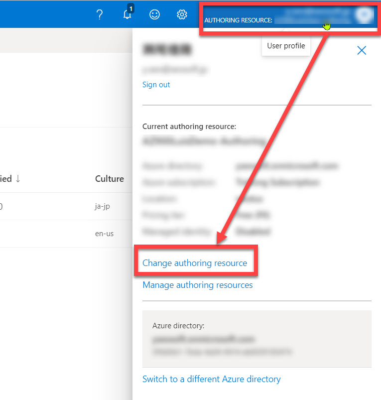
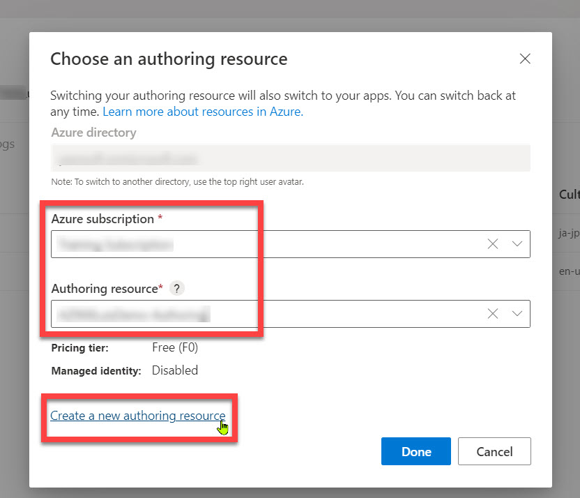
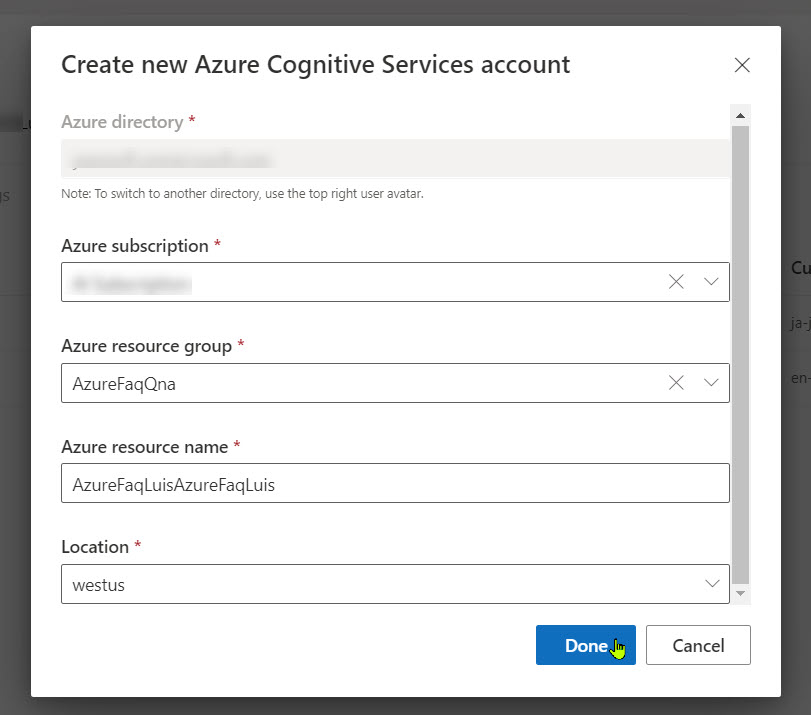
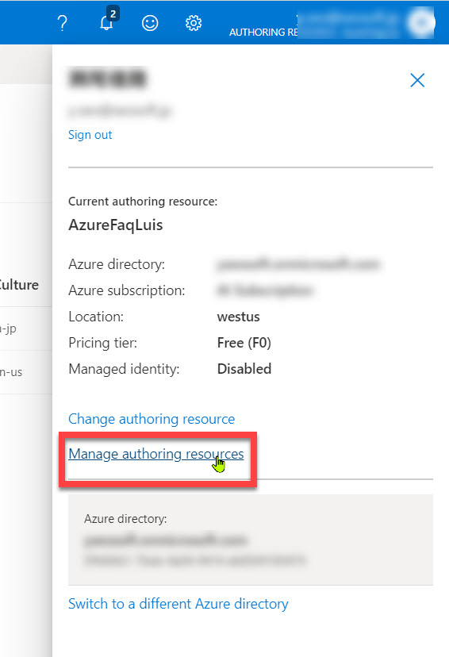
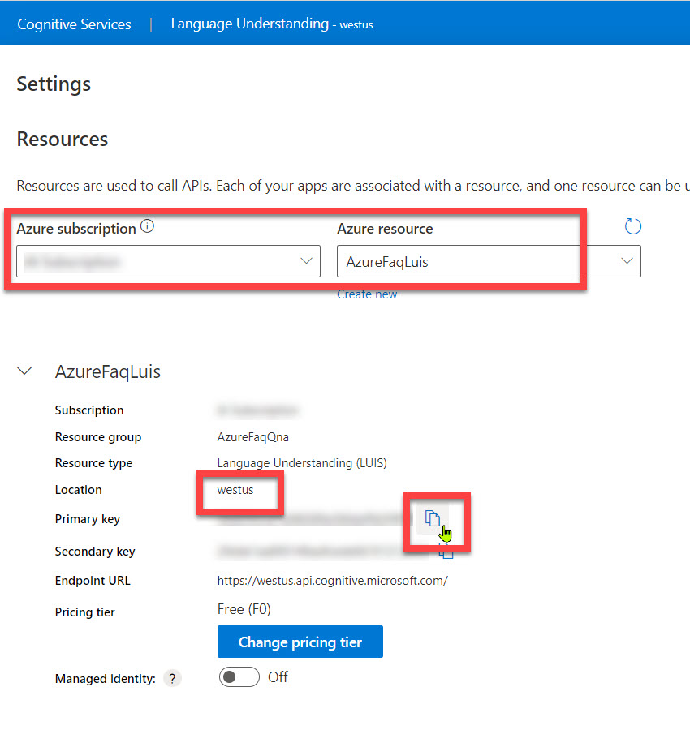
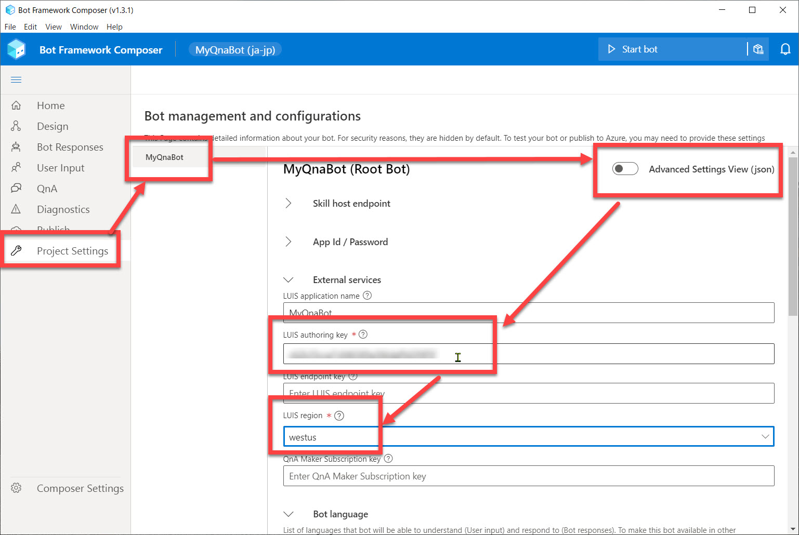

# Language Understanding でユーザーの意図を予測

[前のステップ](05_composer_qna.md) で、QnA Maker を使った Q&A 機能を Bot アプリケーションに 追加しました。

このステップでは、[**Language Understanding** (LUIS)](https://azure.microsoft.com/ja-jp/services/cognitive-services/language-understanding-intelligent-service/) を使って、ユーザーの意図を予測するように変更します。  
（[Bot Framework Composer の基礎 - 2](03_composer_basic2.md) では、**正規表現** でユーザーの意図を認識しました）

[1. Recognizer Type の変更](#recognizer-type-の変更)  
[2. help Trigger のフレーズの入力](#help-trigger-のフレーズの入力)  
[3. Language Understanding アプリケーションの作成](#language-understanding-アプリケーションの作成)  
[4. Language Understanding への接続](#language-understanding-への接続)  
[5. Bot Framework Emulator で動作確認](#help-trigger-のフレーズの入力)  

Language Understanding (LUIS) とは、自然言語による入力に対して、

- 全体の意味を予測
- 関連性のある詳細な情報を引き出す

サービスです。  

> "Language Understanding" はプレビューでは "LUIS" と呼ばれていました。  
> GA して Language Understanding と名称が変わりましたが、ドキュメントやライブラリにも LUIS という表記が残っていたり、GA 後も LUIS と呼ばれることが多くあります。

> このハンズオンでは、ヘルプを呼び出す範囲でのみ Language Understanding を使用するので機能が実感しづらいですが、実装手順を理解することを目的とします。

---

## Recognizer Type の変更

"MyQnaBot" の **Recognizer Type** (＝ユーザー意図の識別方法) は、[Bot Framework Composer の基礎 - 2](03_composer_basic2.md) では "Regular expression recognizer" にしました。

ここで Language Understanding に変更して、もう少し自然な言語処理でユーザー意図を識別するように変更します。

1. [**MyQnaBot**] ダイアログを選択して、Property の [**Recognizer Type**] を "**Default recognizer**" に変更します。
   
     
   
   > この変更により、[MyQnaBot] ダイアログにエラーが表示されるようになります。  
   > これはまだ [Project Settings] で Language Understanding の設定を行っていないためです。  
   > あとの手順でエラーを解消するので、ここではエラー表示が残ったままでかまいません。
   >
   > 

---

## help Trigger のフレーズの入力

help ダイアログにコンテキストを切り替える契機となるフレーズを入力します。

1. "**MyQnaBot**" の "**Help**" Trigger を選択します。

2. Property の [**Trigger Phrases**] に以下の入力をします。

   ```txt
   - help
   - ヘルプ
   - このBotの使い方
   - ボットの機能
   ```

   

   "Trigger Phrases" では、類義語を登録したり、英語・日本語を組み合わせると認識精度が上がることがあります。  
   例えば  

   - "使い方" と "機能"
   - "help" と "ヘルプ"
   - "Bot" と "ボット"  

   などです。  
   こうすると、"このボットの使い方" や "Botの機能を教えて" などの日本語の表現の揺らぎを吸収してくれます。

3. [**Condition**] のドロップダウンを開いて "**Write an expression**" を選択します。  
   

4. [**Condition**] に以下の入力をします。  
   前の操作で [Condition] には "=" が設定されている場合は、**"=" を削除してから** 以下の入力をします。

   ```txt
   #Help.Score > 0.8
   ```

   

   > Language Understanding での推論の結果、ユーザーの入力が "Help" インテントである可能性が 80% より高い場合に Help ダイアログにコンテキストを切り替えることを意味します。  
   > それ以下の場合は、ユーザーの入力は "Unknown intent" で処理されるので、Qna ダイアログに切り替えられます。

---

## Language Understanding アプリケーションの作成

Language Understanding アプリケーションを作成して、接続に必要な情報を取得します。

1. ブラウザーで [**LUIS**](https://www.luis.ai/) に接続してログイン（またはサインイン）します。

2. [**User Profile**] を選択して開きます。  

3. "**Authoring Resource**" がすでに設定済みであり、このハンズオンでも同じリソースをそのまま使用してよい場合は、以下の Authoring Resource の選択・新規作成の手順は不要です。  
   > 以下では新規の Authoring Resource を作成する手順です。  
   > ハンズオンでは既存のリソースを使用せずに、新規にリソースを作成することをお勧めします。

4. リソースを選択、または新規作成する場合は、[**Change authoring resouce**] を選択します。  
   

5. 既存の "Authoring Resource" を使用する場合は、適切な subscription および resouce をリストから選択して [Done] をクリックします。
   Authoring Resource を新規作成する場合は [**Create a new authoring resource**] を選択します。  
   

6. Authoring Resource を新規作成する場合は、[**Create new Azure Cognitive Services account**] で適切な選択・入力をして [Done] をクリックします。  
   

7. 使用する Language Understanding が決まったら、[User Profile] で [**Manage authoring resources**] を選択します。  
   

8. 使用する Azure subscripition およびリソースを指定して [**Primary key**] の値をクリップボードにコピーします。  
   また [**Location**] を確認しておきます。  
   

---

## Language Understanding への接続

Bot アプリケーションを Language Understanding に接続して Bot を起動します。

1. Bot Framework Composer に戻って、[**Project Settings**] - [MyQnaBot] を選択します。  
   表示形式は [**Advanced Settings View**] を **オフ** にします。

2. [**LUIS authoring key**] に Language Understanding の手順の最後でコピーした **Authoring key** を貼り付けます。  
   また、そこで確認した **Location** を [**LUIS region**] で選択します。  
   

3. Bot Framework Composer に戻って、[**Start Bot**] または [**Restart Bot**] をクリックします。


5. [**Test in Emulator**] が表示されれば、Language Understanding への発行と Bot の再起動が完了しています。

   > "ja-jp" の Language Understanding アプリケーションに接続すると、例えば「このボットの使い方」のような日本語入力でも Help Intent で処理されるようになります。  


---

## Bot Framework Emulator で動作確認

1. Bot Framework Emulator で何か入力してみます。

   - ヘルプ
   - サポートされる言語は何

   などを入力します。

   

2. "ヘルプ" などと入力した際には Language Understanding で入力の意図を類推していることを確認します。
 
   Bot Framework Emulator での見た目は正規表現を使っていた時と同じに見えるかもしれません。  
   Emulator の右下のトレースを見ると、今回は確かに "Language Understanding" への問い合わせが実行されていることがわかります。

---

以上で Language Understanding と QnA Maker とを組み合わせて利用できるようになりました。  
Q&A Bot アプリケーションを開発は完了です。

~~次のステップでは、作成したアプリケーションを Azure に発行します。~~

> Bot Framework Composer v.1.3.0 以降では、マイクロソフトアカウントで Azure に発行する操作はエラーとなるようです。  
> 今後のバージョンアップで改善されたところで、次のステップを改訂します。

[前に戻る](05_composer_qna.md) | 次に進む  
[目次に戻る](../README.md)
