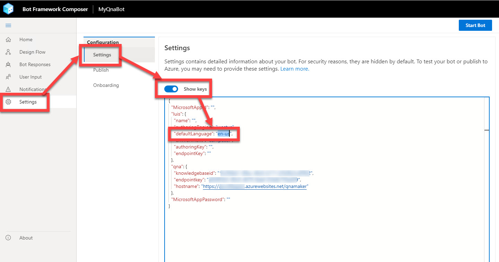
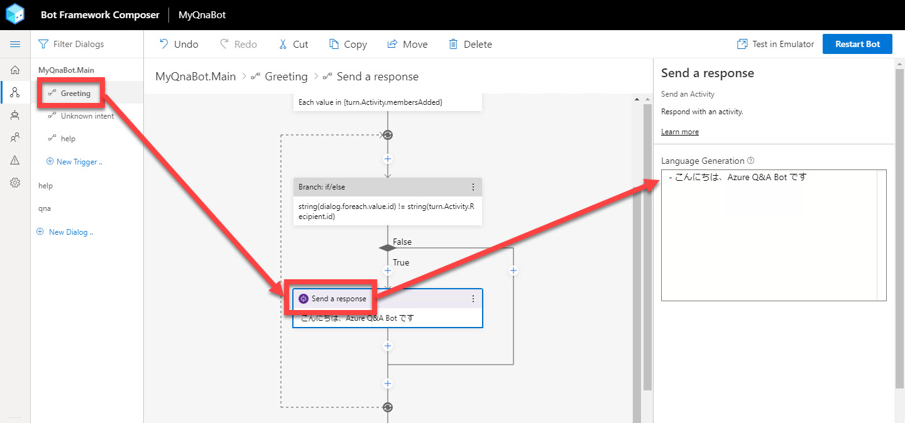
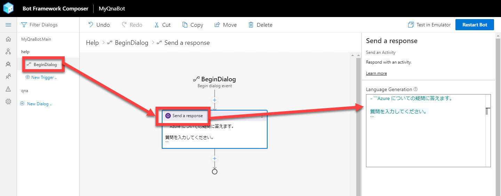
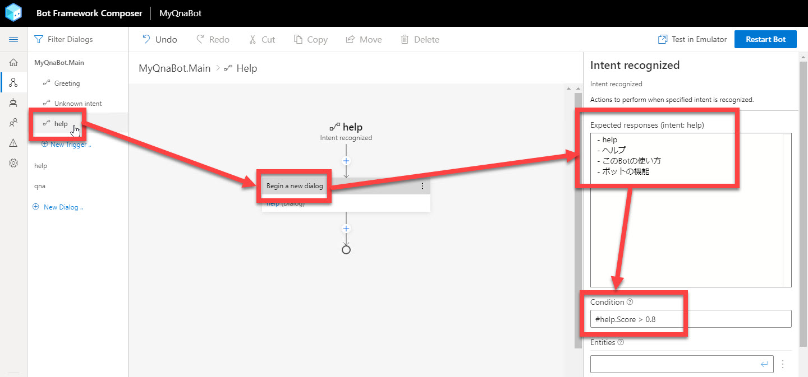
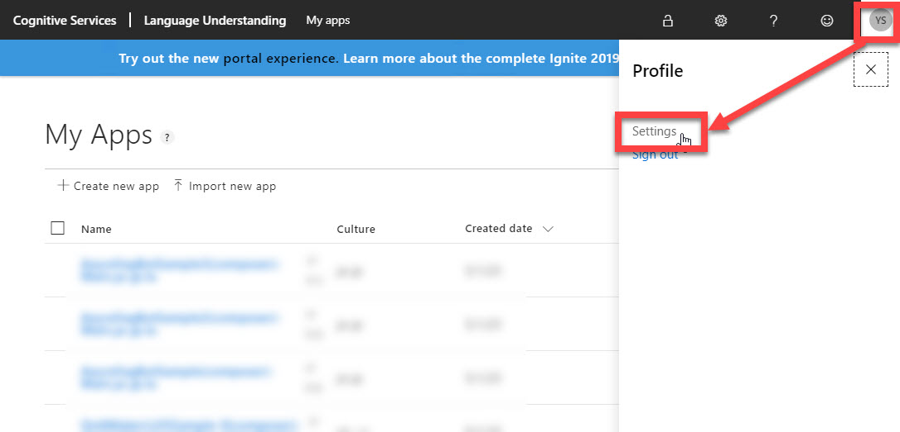
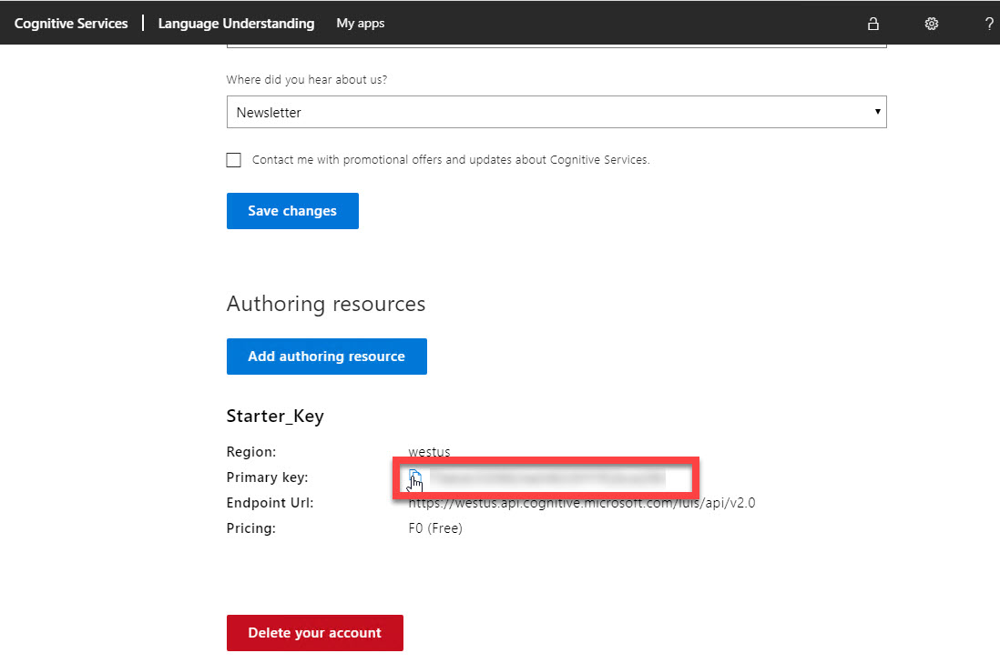

# LUIS でユーザーの意図を予測する

[前のステップ](05_composer_qna.md) で、QnA Maker を使った Q&A 機能を Bot アプリケーションに 追加しました。

このステップでは、[LUIS (Language Understanding)](https://azure.microsoft.com/ja-jp/services/cognitive-services/language-understanding-intelligent-service/) を使って、ユーザーの意図を予測するように変更します。  
（[Bot Framework Composer の基礎 - 2](03_composer_basic2.md) では、正規表現でユーザーの意図を認識しました）

[1. LUIS 利用の準備 (Settings ファイルの変更)](#luis-%e5%88%a9%e7%94%a8%e3%81%ae%e6%ba%96%e5%82%99-settings-%e3%83%95%e3%82%a1%e3%82%a4%e3%83%ab%e3%81%ae%e5%a4%89%e6%9b%b4)  
[2. 挨拶メッセージおよびヘルプメッセージの変更](#%e6%8c%a8%e6%8b%b6%e3%83%a1%e3%83%83%e3%82%bb%e3%83%bc%e3%82%b8%e3%81%8a%e3%82%88%e3%81%b3%e3%83%98%e3%83%ab%e3%83%97%e3%83%a1%e3%83%83%e3%82%bb%e3%83%bc%e3%82%b8%e3%81%ae%e5%a4%89%e6%9b%b4)  
[3. Recognizer Type の変更](#recognizer-type-%e3%81%ae%e5%a4%89%e6%9b%b4)  
[4. help Trigger のフレーズの入力](#help-trigger-%e3%81%ae%e3%83%95%e3%83%ac%e3%83%bc%e3%82%ba%e3%81%ae%e5%85%a5%e5%8a%9b)  
[5. LUIS への接続と Bot の再起動](#luis-%e3%81%b8%e3%81%ae%e6%8e%a5%e7%b6%9a%e3%81%a8-bot-%e3%81%ae%e5%86%8d%e8%b5%b7%e5%8b%95)  
[6. Bot Framework Emulator で動作確認](#bot-framework-emulator-%e3%81%a7%e5%8b%95%e4%bd%9c%e7%a2%ba%e8%aa%8d)  

LUIS (Language Understanding) とは、自然言語の入力に対して、全体の意味を予測して、関連性のある詳細な情報を引き出すサービスです。  
このハンズオンでは、ヘルプを呼び出す範囲で LUIS を使用するので効果が実感しづらいですが、実装手順を理解することを目的とします。

> "Language Understanding" はプレビューの頃に "LUIS" と呼ばれていました。  
> GA して Language Understanding と名称が変わりましたが、ドキュメントやライブラリにも LUIS という表記が残っていたり、サービスが GA した後も LUIS と呼ばれることが多くあります。

---

## LUIS 利用の準備 (Settings ファイルの変更)

Bot Framework Composer は、デフォルトの言語が "**en-us**" です。  
すでに確認したように、このままでも日本語を問題なく利用できますが、LUIS を利用するにはまず言語の変更しておく必要があります。  
手順を忘れることがないように最初に行っておきます。

1. Bot Framework Composer で [**Settings**] - [**Settings**] を選択して、[**Show keys**] を "**有効**" にします。

2. "**luis**" セクションの "**defaultLanguage**" を "**ja-jp**" に変更します。

   

---

## 挨拶メッセージおよびヘルプメッセージの変更

[Bot Framework Composer の基礎 - 2](03_composer_basic2.md) で実装した挨拶メッセージおよびヘルプメッセージはオウム返し Bot のものでした。

これらを Azure についての Q&A Bot である説明に変更します。  
ここでのメッセージ変更は機能的には必要な変更ではありませんが、手順として紹介します。

1. "MyQnaBot.Main" の "**Greeting**" を選択して [**Send a message**] アクションをクリックします。

2. Property の [**Language Genaration**] を以下の内容で置き換えます。

   ```txt
   - こんにちは、Azure Q&A Bot です
   ```

   

3. "MyQnaBot.Main" の "**help**" を選択して [**Send a message**] アクションをクリックします。

4. Property の [**Language Genaration**] を以下の内容で置き換えます。  
以下のように、メッセージの前後を **```** (バッククォート 3個) で括ることで **複数行の応答** も可能です。

   ````txt
   - ```Azure についての疑問に答えます。

   質問を入力してください。
   ```
   ````

   

---

## Main ダイアログの Recognizer Type の変更

"MyQnaBot.Main" の **Recognizer Type** (＝ユーザー意図の識別方法) は、[Bot Framework Composer の基礎 - 2](03_composer_basic2.md) では "Regular Expression" にしました。

ここで "**LUIS**" に変更して、もう少し自然な言語処理でユーザー意図を識別するように変更します。

> LUIS は、このハンズオンで利用するよりもさらに高度な言語処理が可能です。  
> このハンズオンでは LUIS 利用方法を理解するために手順に組み込んでいます。

1. "**MyQnaBot.Main**" を選択して、Property の [**Recognizer Type**] を "**LUIS**" に変更します。

   

---

## help Trigger のフレーズの入力

help ダイアログにコンテキストを切り替える契機となるフレーズを入力します。

1. "**MyQnaBot.Main**" の "**help**" を選択します。

2. Property の [**Expected responses**] に以下の入力をします。

   ```txt
   - help
   - ヘルプ
   - このBotの使い方
   - ボットの機能
   ```

   

   > "Expected responses" では、別の言い方を登録したり、英語・日本語を組み合わせると認識精度が上がることがあります。  
   > 例えば  
   >
   > - "使い方" と "機能"
   > - "help" と "ヘルプ"
   > - "Bot" と "ボット"  
   >
   > などです。  
   > こうすると、"このボットの使い方" や "Botの機能を教えて" などの表現の揺らぎを吸収してくれます。  

3. [**Condition**] に以下の入力をします。

   ```txt
   #help.Score > 0.8
   ```

   ユーザーの入力が "help" インテントである可能性が 80% より高い場合に help ダイアログに切り替えることを意味します。  
   それ以下の場合は、ユーザーの入力は "Unknown intent" で処理されます。  
   つまり qna ダイアログで処理されることになります。

---

## LUIS への接続と Bot の再起動

Bot アプリケーションを LUIS に接続して Bot 再起動します。

1. ブラウザーで [**LUIS**](https://www.luis.ai/) に接続してログイン（またはサインイン）します。

2. [**アカウント**] - [**Settings**] を選択します。

   

3. [**Starter_Key**] セクションの [**Primary Key**] をクリップボードにコピーします。  
   この後すぐに使います。

   

4. Bot Framework Composer に戻って、[**Start Bot**] または [**Restart Bot**] をクリックします。

5. [**Publish LUIS models**] ダイアログが開いたら、**LUIS の Primary Key** を貼り付けて、[**OK**] をクリックします。

   

6. [**Test in Emulator**] が表示されれば、LUIS への発行と Bot の再起動が完了しています。

---

## Bot Framework Emulator で動作確認

1. Bot Framework Emulator で何か入力してみます。

   - このボットの使い方
   - サポートされる言語は何

   など、LUIS または QnA Maker で処理されます。

   

---

以上で LUIS と QnA Maker とを組み合わせて利用できるようになりました。  
Q&A Bot アプリケーションの開発はここで終わりです。

次のステップでは開発した Bot アプリケーションを Azure に配置します。

[前に戻る](05_composer_qna.md) | [次に進む](07_deploy_to_azure.md)  
[目次に戻る](../README.md)
