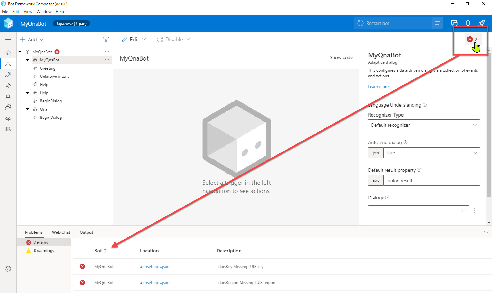
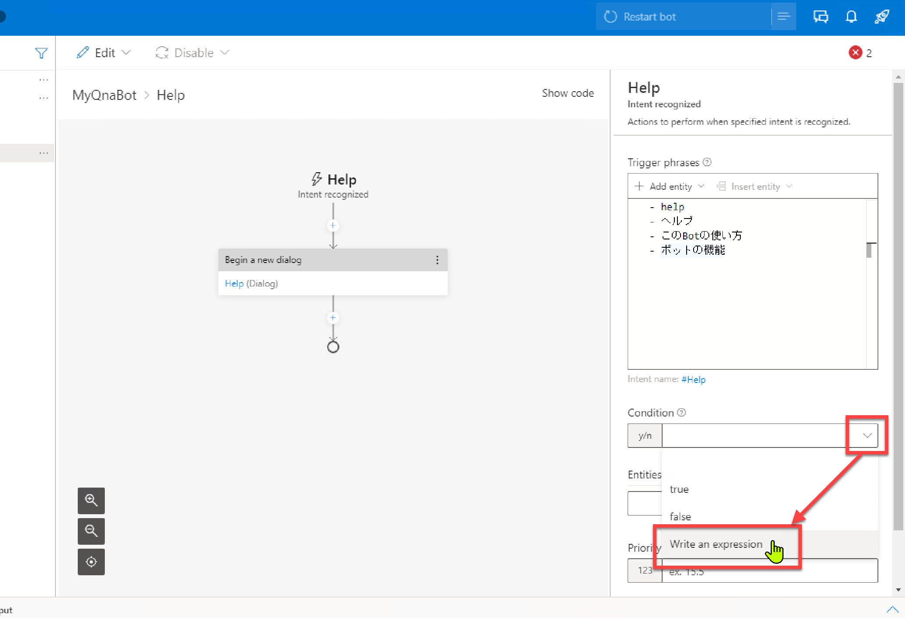
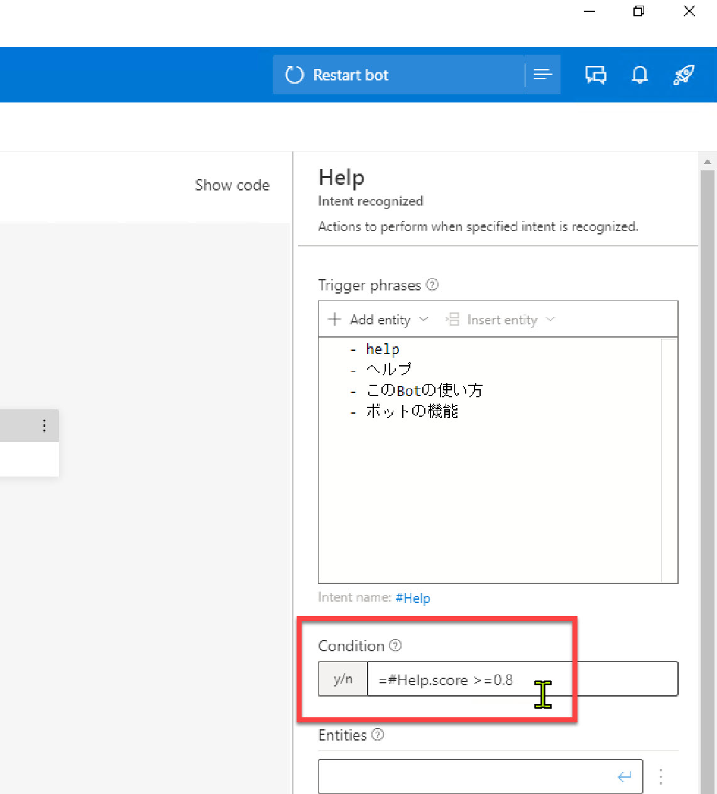
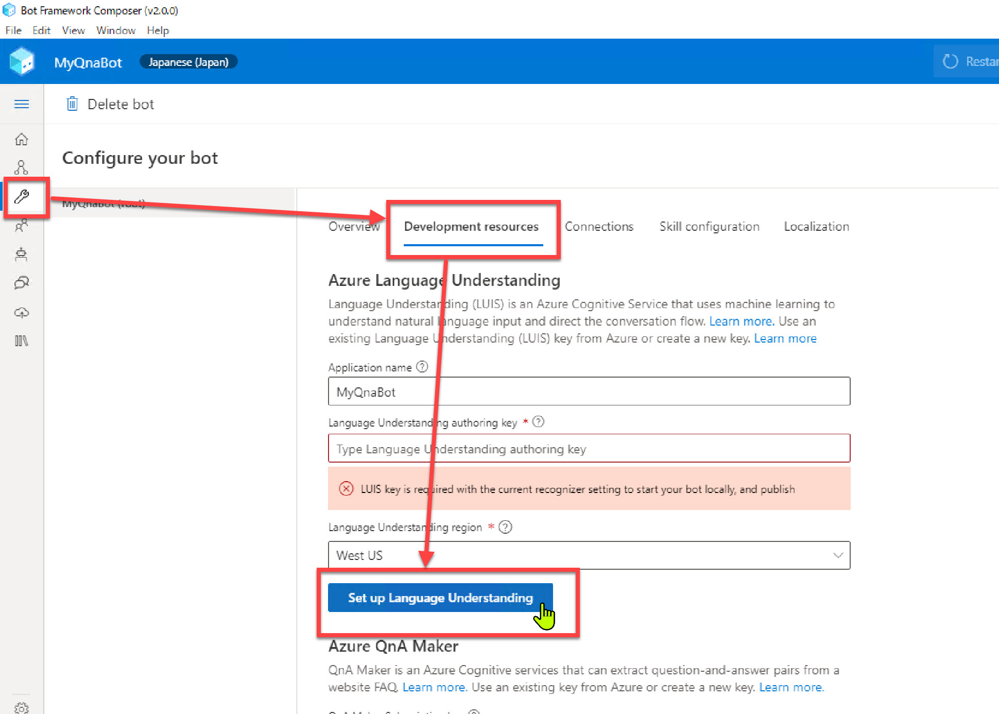
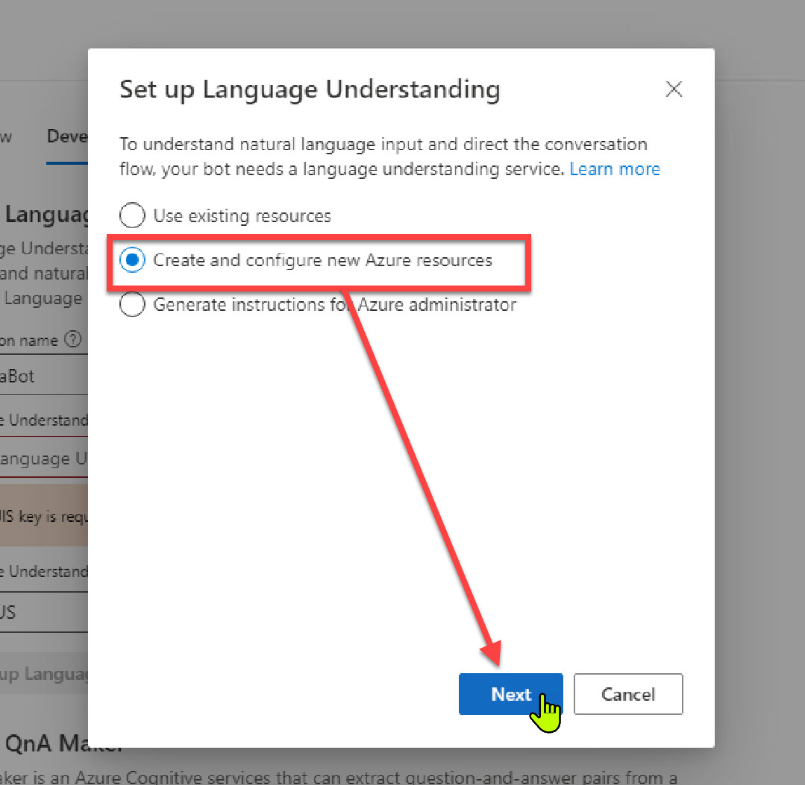
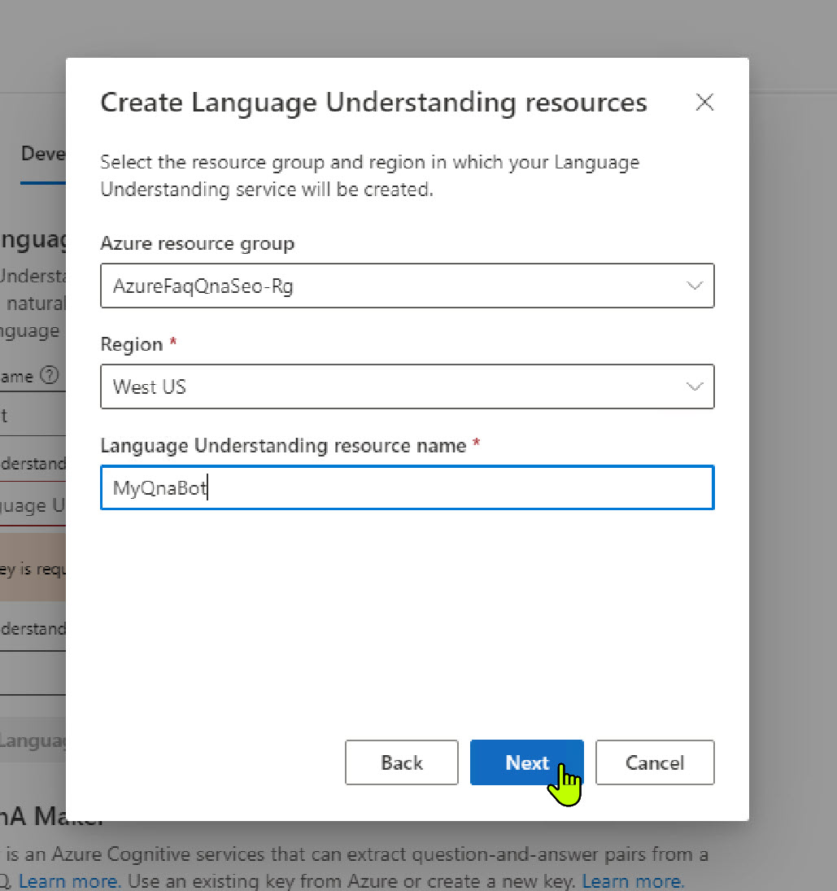
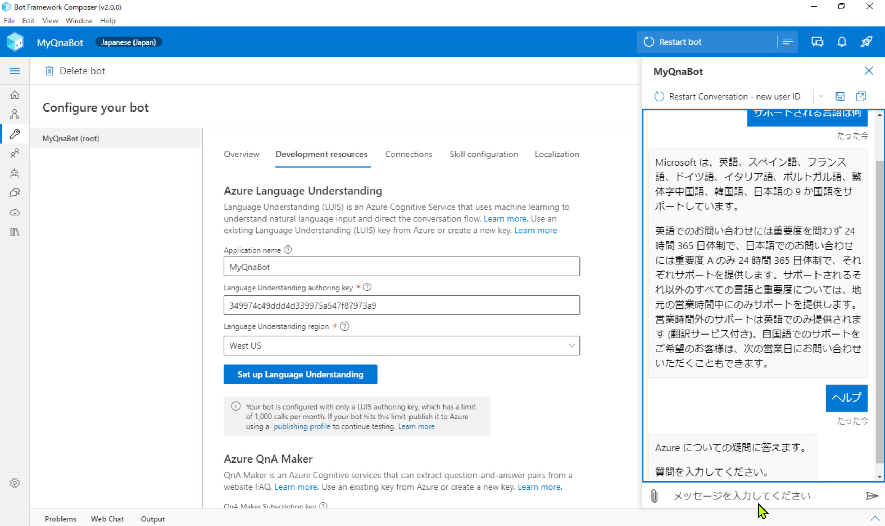
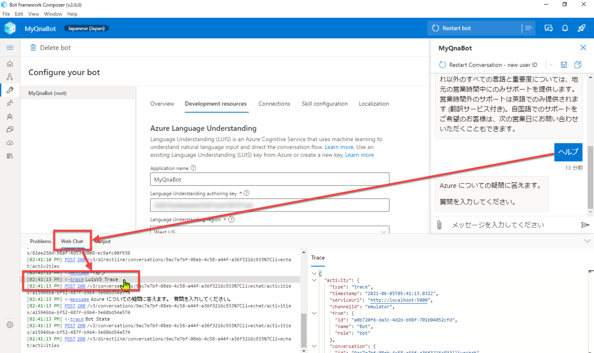

# Language Understanding でユーザーの意図を予測

[前のステップ](05_composer_qna.md) で、QnA Maker を使った Q&A 機能を Bot アプリケーションに 追加しました。

このステップでは、[**Language Understanding** (LUIS)](https://azure.microsoft.com/ja-jp/services/cognitive-services/language-understanding-intelligent-service/) を使って、ユーザーの意図を予測するように変更します。  
（[Bot Framework Composer の基礎 - 2](03_composer_basic2.md) では、**正規表現** でユーザーの意図を認識しました）

[1. Recognizer Type の変更](#recognizer-type-の変更)  
[2. Help トリガーのフレーズの入力](#help-トリガーのフレーズの入力)  
[3. Language Understanding のセットアップ](#language-understanding-のセットアップ)  
[4. Web Chat で動作確認](#web-chat-で動作確認)  

Language Understanding (LUIS) とは、自然言語による入力に対して、

- 全体の意味を予測
- 関連性のある詳細な情報を引き出す

サービスです。  

> "Language Understanding" はプレビューでは "LUIS" と呼ばれていました。  
> GA して Language Understanding と名称が変わりましたが、ドキュメントやライブラリにも LUIS という表記が残っていたり、GA 後も LUIS と呼ばれることが多くあります。

> このハンズオンでは、ヘルプを呼び出す範囲でのみ Language Understanding を使用するので機能が実感しづらいですが、実装手順を理解することを目的とします。

---

## Recognizer Type の変更

"MyQnaBot" の **Recognizer Type** (＝ユーザー意図の識別方法) は、[Bot Framework Composer の基礎 - 2](03_composer_basic2.md) では "Regular expression recognizer" にしました。

ここで Language Understanding に変更して、もう少し自然な言語処理でユーザー意図を識別するように変更します。

1. [**MyQnaBot**] ダイアログを選択して、Property の [**Recognizer Type**] を "**Default recognizer**" に変更します。
   
     
   
   > この変更により、[MyQnaBot] ダイアログにエラーが表示されるようになります。  
   > これはまだ [Configure] で Language Understanding の設定を行っていないためです。  
   > あとの手順でエラーを解消するので、ここではエラー表示が残ったままでかまいません。
   >
   > 

---

## Help トリガーのフレーズの入力

Help ダイアログにコンテキストを切り替える契機となるフレーズを入力します。

1. "**MyQnaBot**" の "**Help**" トリガーを選択します。

   > 選択するのは "Help" ダイアログではありません。

2. Property の [**Trigger Phrases**] に以下の入力をします。

   ```txt
   - help
   - ヘルプ
   - このBotの使い方
   - ボットの機能
   ```

   

   "Trigger Phrases" では、類義語を登録したり、英語・日本語を組み合わせると認識精度が上がることがあります。  
   例えば  

   - "使い方" と "機能"
   - "help" と "ヘルプ"
   - "Bot" と "ボット"  

   などです。  
   こうすると、"このボットの使い方" や "Botの機能を教えて" などの日本語の表現の揺らぎを吸収してくれます。

3. [**Condition**] のドロップダウンを開いて "**Write an expression**" を選択します。  
   

4. [**Condition**] に以下の入力をします。  
   前の操作で [Condition] には "=" が設定されているので、それも利用して以下のとおり指定します。

   ```txt
   =#Help.Score > 0.8
   ```

   

   > Language Understanding での推論の結果、ユーザーの入力が "Help" インテントである可能性が 80% より高い場合に Help ダイアログにコンテキストを切り替えることを意味します。  
   > それ以下の場合は、ユーザーの入力は "Unknown intent" で処理されるので、Qna ダイアログに切り替えられます。
   >
   > ヘルプは表現のバリエーションが限られているので 80% は低すぎるスレッショルドです。実際にはテストをしながら数値を調整する必要があります。  
   > 今回はBot Framework Composer の使い方を理解することがテーマなので、スコアのチューニングについては気にしないことにします。

---

## Language Understanding のセットアップ

Bot Framework Composer の環境から Language Understanding のセットアップを行います。

1. [**Configure**] - [**Development resources**] を開いて [**Set up Language Understanding**] をクリックします。

   

2. [**Create and configure new Azure resources**] を選択して [Next] をクリックします。

   

3. Language Understanding のリソースを作成する Azure アカウントとサブスクリプションを選択します。

   

4. リソースグループ、リージョンを選択して、Language Understanding リソース名を入力します。続いて [Next] をクリックします。

   |項目名|値|
   |---|---|
   |Azure resources group|任意 (Qna Maker を作成したリソースグループ)|
   |Region|今回は "westus"|
   |Language Understanding resource name|任意|

   

5. Language Understanding のリソースが作成されて、Authoring Key が取得されます。  
   キーは自動的に Configure に設定されているので、このまま [Done] で閉じてかまいません。
 
   

   > v2.0.0 では [Authoring Key] ではなく [Subscription] と表示されていますが、ラベルの間違いのようです。

---

## Web Chat で動作確認

1. Bot Framework Emulator で何か入力してみます。

   - ヘルプ
   - サポートされる言語は何

   などを入力します。

   

2. "ヘルプ" などと入力した際には Language Understanding で入力の意図を類推していることを確認します。
 
   > ヘルプの応答の内容だけ見ると、正規表現を使っていた時と同じに見えるかもしれません。  
   > Web Chat のトレースを見ると、今回は確かに "Language Understanding" への問い合わせが実行されていることがわかります。  
   >
   > 

---

以上で Language Understanding と QnA Maker とを組み合わせて利用できるようになりました。  
Q&A Bot アプリケーションを開発は完了です。

次のステップでは、作成したアプリケーションを Azure に発行します。

[前に戻る](05_composer_qna.md) | [次に進む](07_deploy_bot.md)  
[目次に戻る](../README.md)
