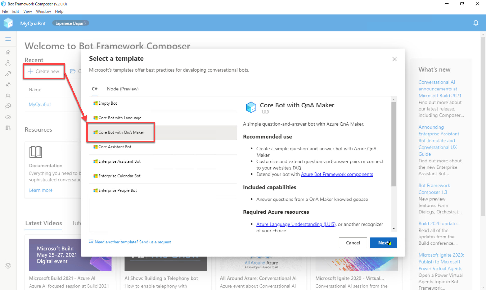
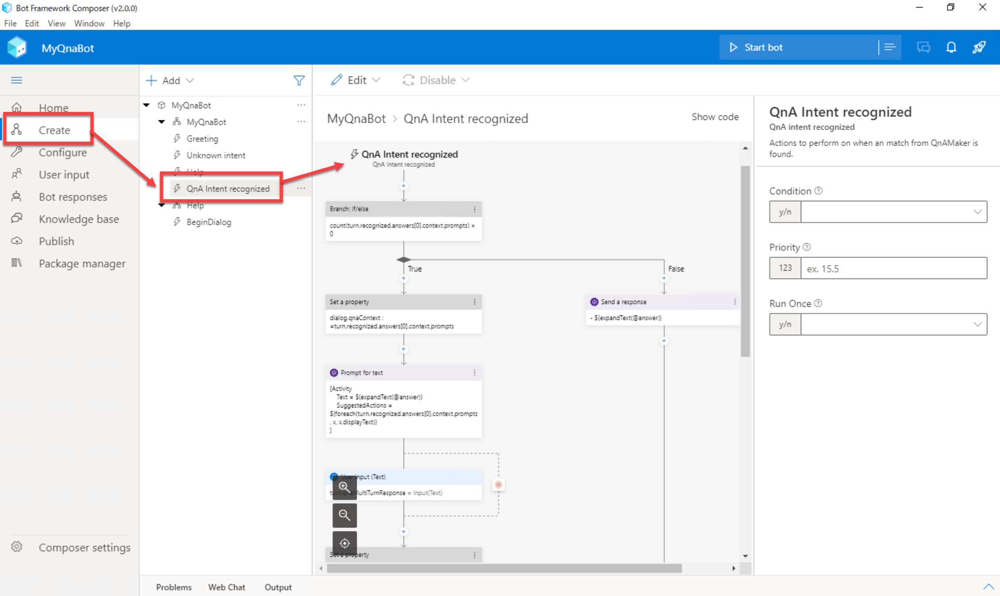
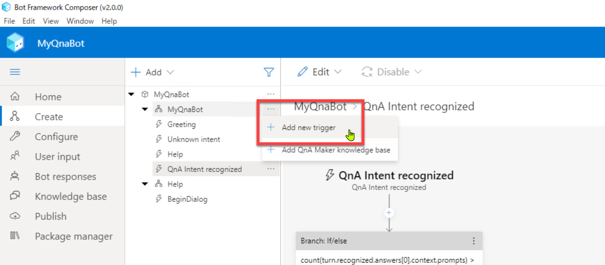
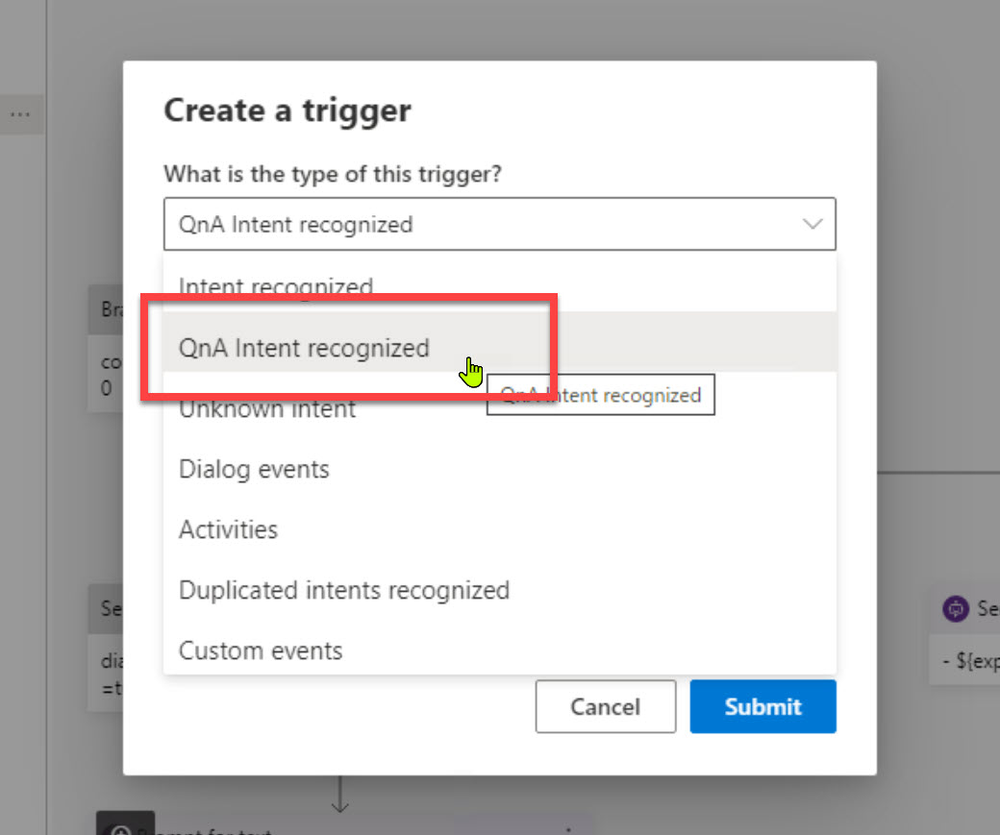
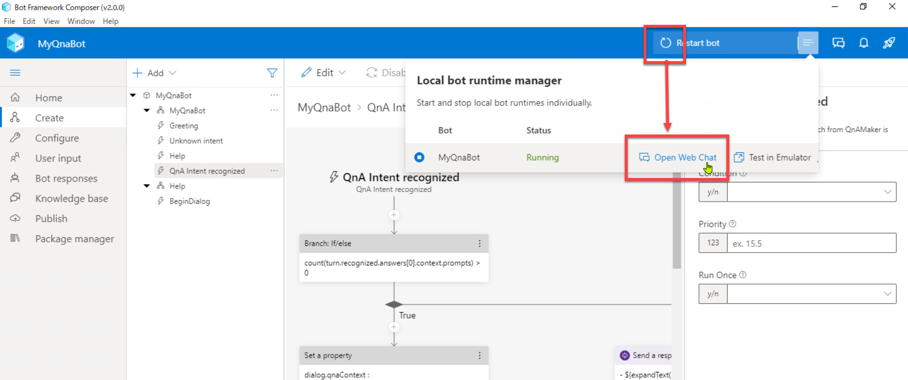
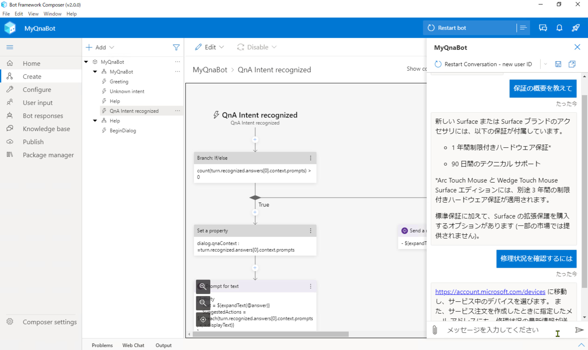
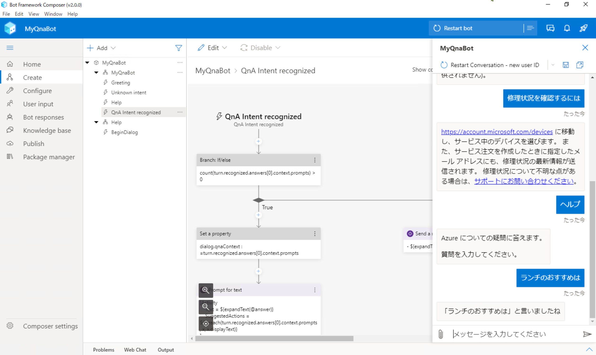

# QnA Maker のナレッジベースの呼び出し

[前のステップ](04_create_knowledgebase.md) で、Composer 組み込みの機能でナレッジベースを作成しました。

このステップでは、Bot アプリケーションからナレッジベースに接続して応答を得られることを確認してみます。  

[1. QnA Intent recognized トリガーの実装確認](#qna-intent-recognized-トリガーの実装確認)  
[2. ナレッジベースの呼び出しの動作確認](#ナレッジベースの呼び出しの動作確認)

 

> アプリケーションの新規作成時に [**Create new**] - [**Core Bot with QnA Maker**] テンプレートを選択してQ&A ボットを作成することもできます。
> 
> このハンズオンでは、Composer の主な機能や操作を体験するために Empty Bot テンプレートを使っています。
>
> 

 

---

## QnA Intent recognized トリガーの実装確認

[前のステップ](./04_create_knowledgebase.md) で Composer 組み込みの管理機能でナレッジベースを作成しました。

この機能を使うと、QnA Maker から応答を得るトリガーが自動的に生成されます。  
このトリガーを確認してみます。

1. [**Create**] - [**Qna Intent recognized**] を選択します。  
   ナレッジベースから回答を取得する処理がトリガーで定義されています。適切な回答が得られなかった場合の処理も含んでいます。
   
   

    

   > 作成済みの "Qna Intent recognizer" を削除してしまった場合でも再作成できます。  
   >
   > [**MyQnaBot**] ダイアログで [**Add new trigger**] を選択して、[**QnA Intent recognizer**] を選択します。  
   > これで同じトリガーが作成できます。  
   >
   >   
   > 

    

---

## ナレッジベースの呼び出しの動作確認

1. Web Chat を使って動作確認します。  
   Bot Framework Composer の [**Start Bot**] または [**Resatrt Bot]** をクリックします。

2. [**Open Web Chat**] で Web Chat を起動します。  
   初回はナレッジベースの発行が行われるので少し時間がかかります。  

   

 

3. Web Chat に質問を入力します。ナレッジベースから適切な応答が返ってくることを確認します。  
   ただしナレッジベースにない内容（Surface の保証に関係しない内容）を入力した場合にはヘルプメッセージまたは入力のオウム返しが表示されます。  

   例えば以下の内容を入力します。  

   - 保証の概要を教えて
   - 修理状況を確認するには
   - ヘルプ
   - ランチのおすすめは

    

   
   

 

---

ここでは QnA Maker のナレッジベースから適切な回答を得られることを確認しました。
以上で Language Understanding および QnA Maker と連携できるようになりました。  

次のステップでは、ユーザーの操作性を向上する機能を追加してみます。

[前に戻る](./05_create_knowledgebase.md) | [次に進む](./07_help_and_suggestion.md)  
[目次に戻る](../README.md)
