# Bot アプリケーションをクラウドに発行

[前のステップ](06_composer_luis.md) までで Q&A Bot アプリケーションの開発は完了しました。

このステップでは、作成したアプリケーションを Azure に発行します。

[1. Node.js インストール](#nodejs-インストール)  
[3. 発行先のリソースを作成](#発行先のリソースを作成)  
[4. Bot Framework Composer でアプリケーションを発行](#bot-framework-composer-でアプリケーションを発行)  
[5. Azure ポータルで Bot のテスト](#azure-ポータルで-bot-のテスト)  
[6. Bot Framework Emulator でテスト](#bot-framework-emulator-でテスト)
[7. Azure 上のリソースの削除](#azure-上のリソースの削除)

---

## Node.js インストール

Bot Framework Composer では、発行先の Azure のリソースを作成するために JavaScript (Node.js) のスクリプトが用意されています。  
このため、ローカル PC に Node.js が必要です。

1. [Node.js](https://nodejs.org/ja/download/) をダウンロードしてインストールします。  
   最新の機能を利用する必要はないので LTS (安定版) をダウンロードします。

2. 任意のターミナルクライアントを開いて、Node.js のインストールを確認します。

   Windows では、コマンドプロンプト、PowerShell、Git Bash または [Windows Terminal](https://www.microsoft.com/ja-jp/p/windows-terminal/9n0dx20hk701) などから好みのターミナルを開きます。  
   その他の OS ではターミナルクライアントを開きます。  

   ```txt
   node -v
   ```

   この場合、Node.js のバージョンが返ってくればインストールは成功しています。

---

## 発行先のサブスクリプション ID を確認

Azure に Bot アプリケーションを発行するには、**サブスクリプション ID** が必要です。

まず、サブスクリプション ID を確認します。

1. [Azure ポータル](htps://portal.azure.com/) で "**サブスクリプション ID**" を確認します。  
   [**検索ボックス**] に "**サブスクリプション**" と入力して、[**サブスクリプション**] を選択します。  
   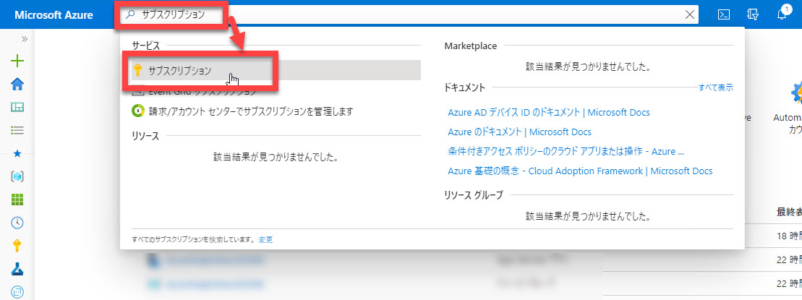

2. リソースを作成するサブスクリプションの [サブスクリプション ID] をメモ帳などに貼り付けておきます。  
   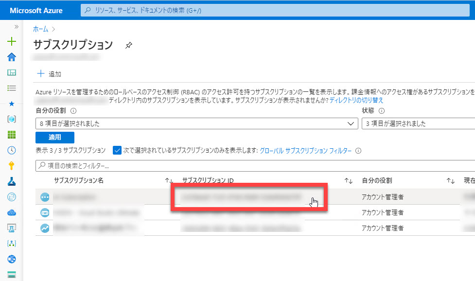

---

## 発行先のリソースを作成

Bot Framework Composer でアプリケーションを発行するには、事前に発行先のリソースを作成する必要があります。

Bot Framework Composer では、必要な **リソースを一括して作成するスクリプト** が用意されているのでそれを利用します。  
このスクリプトは、プロジェクトごとに一度だけ実行します。

1. PC のターミナルクライアントで、Bot アプリケーションのプロジェクトを作成したフォルダーに移動して、さらに "scripts" フォルダーに移動します。

   ```txt
   cd scripts
   ```

2. 必要な Node のパッケージをインストールします。

   ```txt
   npm install
   ```

   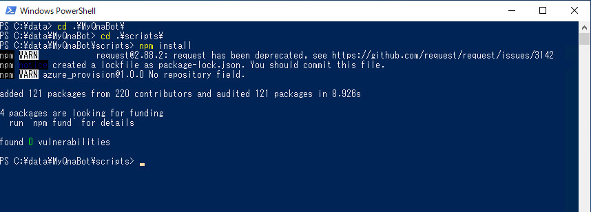

3. 以下の通り、リソース作成スクリプトを実行します。  

   ```javascript
   node provisionComposer.js --subscriptionId=<Subscription ID> --name=<リソースグループ名> --appPassword=<パスワード> --environment=<環境名>
   ```

   |パラメーター|値|説明|
   |---|---|---|
   |subscriptionId|Azure サブスクリプション ID|前の手順で確認したもの|
   |name|任意|発行先のリソースグループ名。作成するリソースの名前としても使用されるので、"name"-"dev" で一意の名前になるようにします|
   |appPassword|任意のパスワード|Azure Web Apps のパスワード|
   |environment|任意の環境名、例えば "**dev**"|作成するリソースの接尾辞として使用されます|

   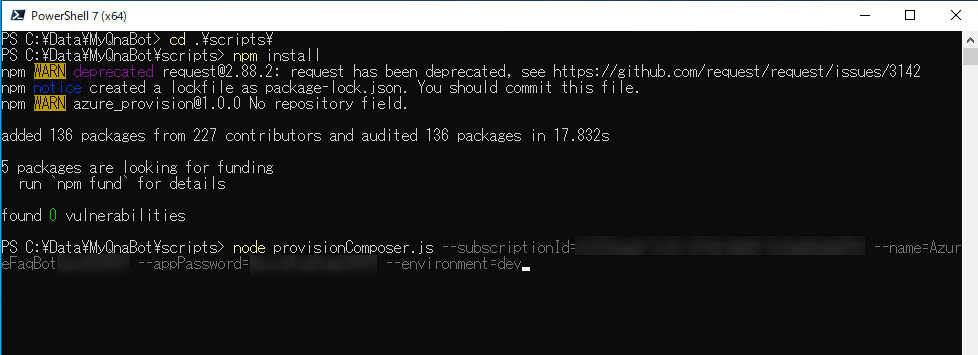

4. Azure にログインします。  
   ブラウザーで [https://microsoft.com/devicelogin](https://microsoft.com/devicelogin) に接続して、指定された **コード** でログインします。  

   認証が通るとリソース生成が始まります。  
   リソース生成には時間がかかるので完了するまで待ちます。  
   ドキュメントには最大 10分程度とありますが、実際にはもう少しかかるかもしれません。

   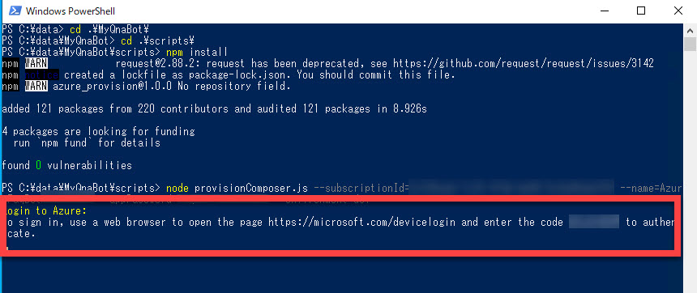

   > v1.0.1 では "User was not found." と表示されてリソースの作成ができないことがあります。  
   > これは **Microsoft アカウント** に紐づいた Azure サブスクリプションの場合に発生するようです。
   >
   > 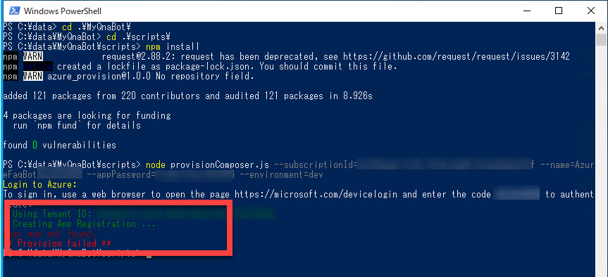
   >
   > 回避するには、provisionComposer.js 実行のパラメーターとして Azure の "**テナント ID**" を追加で指定する必要があります。  
   >
   > ```javascript
   >node provisionComposer.js --tenantId=<Tenant ID> --subscriptionId=<Subscription ID> --name=<リソースグループ名> --appPassword=<パスワード> --environment=<環境名>  
   > ```
   >
   > テナント ID は Azure ポータルで "**azure active directory**" で検索して [**Azure Active Directory**] に移動すると確認できます。
   >
   > 
   > 

5. リソース作成が完了すると、JSON フォーマットの発行用 Configuration が表示されます。  
   "**{**" から "**}**" までの全体が Configuration です。これをクリップボードにコピーします。  

   > Configuration はメモ帳などに記録しておくことをお勧めします。
   > このステップの最後（Bot Framework Emulator でのテスト）でも、Configuration の一部の値が必要になります

   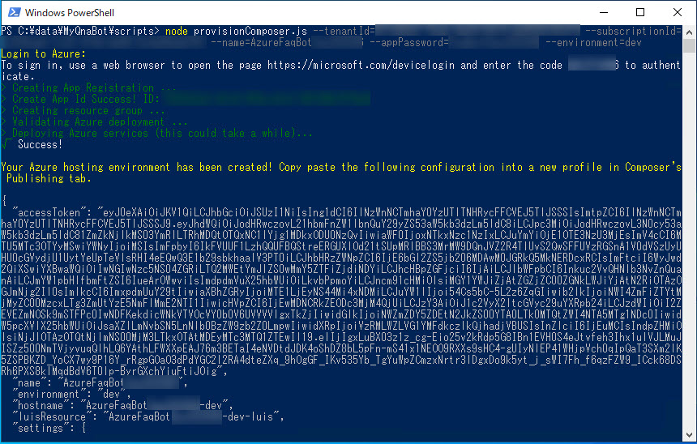

以上で Azure 上に発行先となるリソースが作成されました。

> 必要に応じて、作成された **App Service プラン** を **F1** (無償) に変更します。
>
> Azure ポータルで [**App Service プラン**] を選択して、[**開発 / テスト**] - [**F1**] を選択します。
>
> 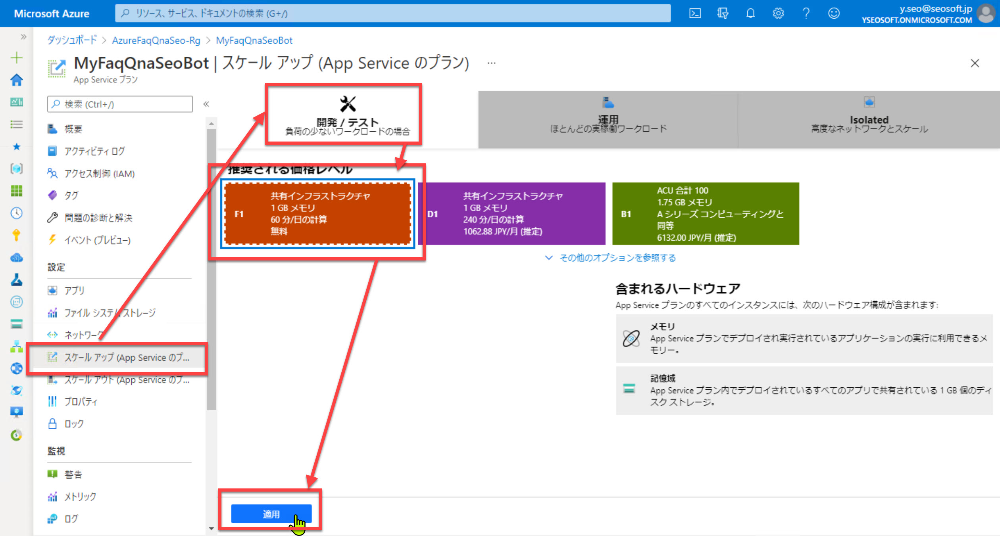

---

## Bot Framework Composer でアプリケーションを発行

Bot Framework Composer に戻って、作成したapplicationを Azure に発行します。

1. Bot Framework Composer で [**Settings**] - [**+ Add new profile**] を選択して、 発行用のプロファイルを作成します。  
   入力したら [**Save**] をクリックします。

   |項目|内容|
   |---|---|
   |Name|任意の値、Composer での管理用の名前|
   |Publish Distination Type|"**Web App**" を選択 |
   |Publish Configuration|前の手順で生成された Config|

   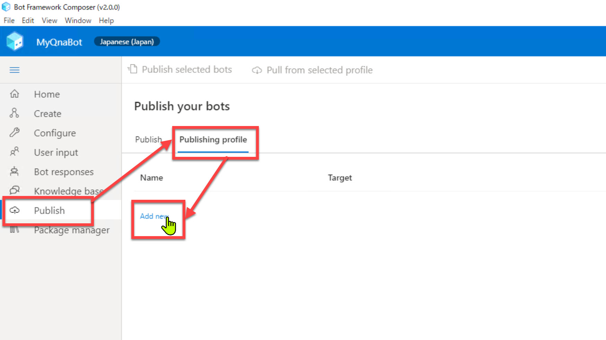

2. 保存したプロファイルを選択して [**Publish to selected profile**] を選択します。  
   発行するプロファイルで間違いなければ [**Okay**] をクリックします。  

   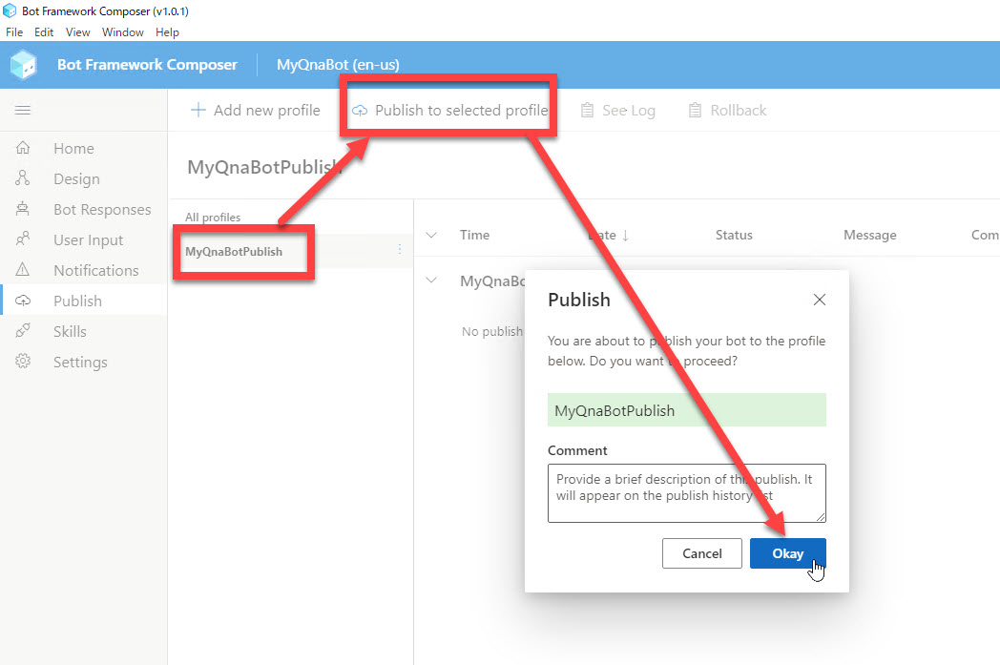

3. 少し待って "**Success**" が表示されれば、Azure への発行は成功です。  

   

   > config に含まれる "**accessToken**" には有効期限があります。  
   > Config 取得から発効までに間が空くと、"Publish to selected profile" 実行エラーになります。  
   > この場合は **トークンを再取得** して作成済みのプロファイルを更新してから "Publish to selected profile" します。
   >
   > 以下の方法で再取得できます。（ただし [**Azure CLI**](https://docs.microsoft.com/ja-jp/cli/azure/install-azure-cli?view=azure-cli-latest) のダウンロード、インストールが必要です）
   >
   > ```txt
   > az login
   > az account get-access-token
   > ```
   >
   > トークン再取得はすぐに結果が返ってきます。

---

## Azure ポータルで Bot のテスト

発行に成功したので動作確認してみます。  
最初に Azure ポータル上の Web チャットでテストします。

1. Azure ポータルで作成したリソースグループを開き、 [**Web チャットでテスト**] を選択します。  

   

2. チャット画面が開いたら、任意の入力をして Q&A Bot の動作を確認します。  

   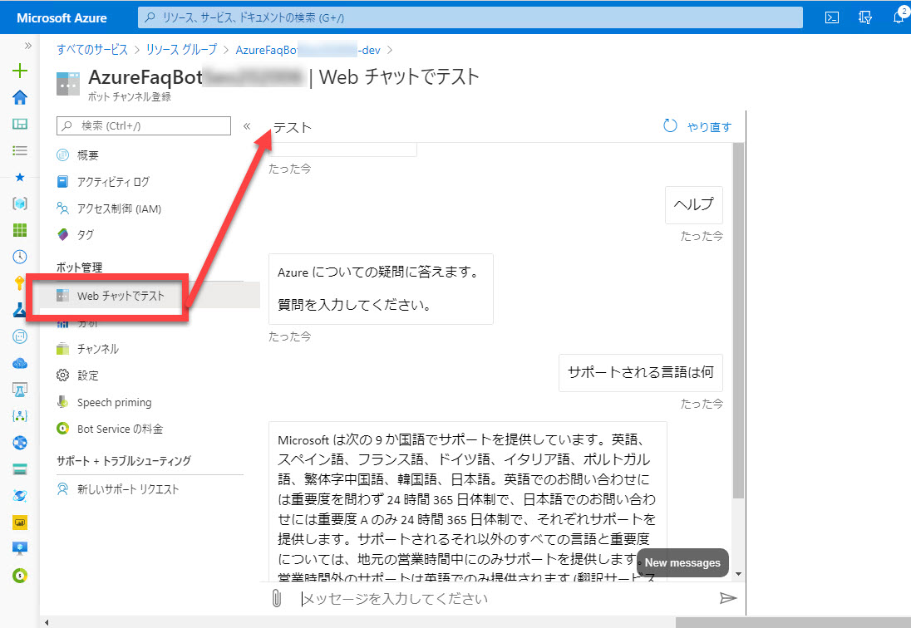

---

## Bot Framework Emulator でテスト

Azure ポータル上の Web チャットでは動作したので、もう一つ、Bot Framework Emulator でも確認してみます。

1. 発行された Web App の URL を確認します。  
   Azure ポータルで [**App Service**] ブレードを開き、[**URL**] をコピーします。

   
   <br />
   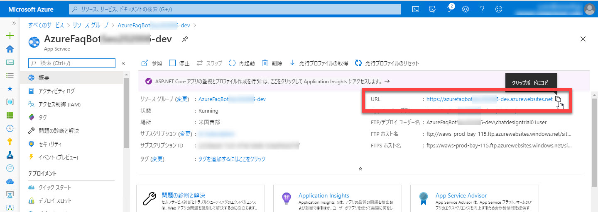

2. ngrok の設定  
   Bot Framework Emulator を起動して [設定] を開き、以下の設定をします。

   ngrok はハンズオンの最初に [開発環境の構築](01_install.md) でインストール（ファイル配置）しているはずです。

   |項目|値|
   |---|---|
   |Path to ngrok|ngrok のパス|
   |Bypass ngrok for local addresses|チェック|
   |Run ngrok when the Emulator starts up|チェック

   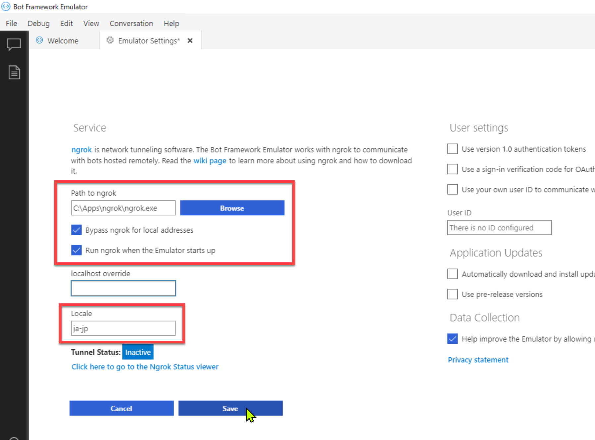

3. Bot Framework Emulator で [**File**] -[**New Bot Configuration**] を選択して、以下の通り、入力・選択して [Save and connect] をクリックします。

   |項目|値|
   |---|---|
   |Bot name|任意の値|
   |Endpoint URL|<App Service の URL> + "**/api/messages**" |
   |Microsoft App ID|リソース作成時に出力された Configuration の "**MicrosoftAppId**" の値 |
   |Microsoft App password|リソース作成時に出力された Configuration の "**MicrosoftAppPassword**" の値 |
   |Encrypt keys ...|チェック|
   |Secret|自動生成されるものをそのまま|

   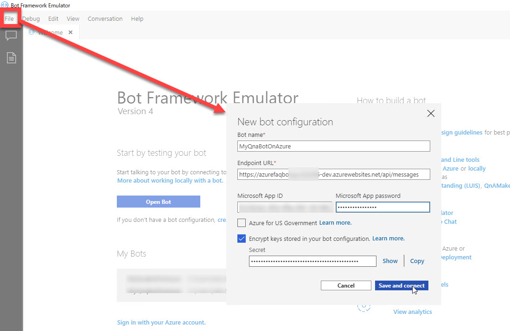

4. 任意の入力をして Bot から適切な応答があることを確認します。  
   
   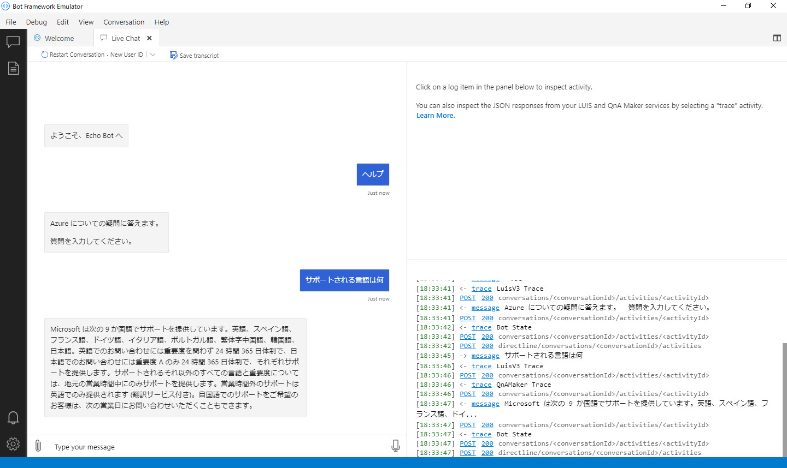

---

## Azure 上のリソースの削除

Azure に作成したリソースはコストがかかります。  

作成したアプリケーションを続けて使用するなどの場合（例えば、同僚に見せる、説明する）を覗いて、作成したリソースを削除してください。

1. [Azure ポータル](https://portal.azure.com/) に接続します。

2. リソースを作成した時の名前 ("name") を検索ボックスに入力して、リソースボックスを選択します。

   > QnA Maker で作成したリソースについては、このハンズオンの手順通りに進めていれば無償の範囲です。

   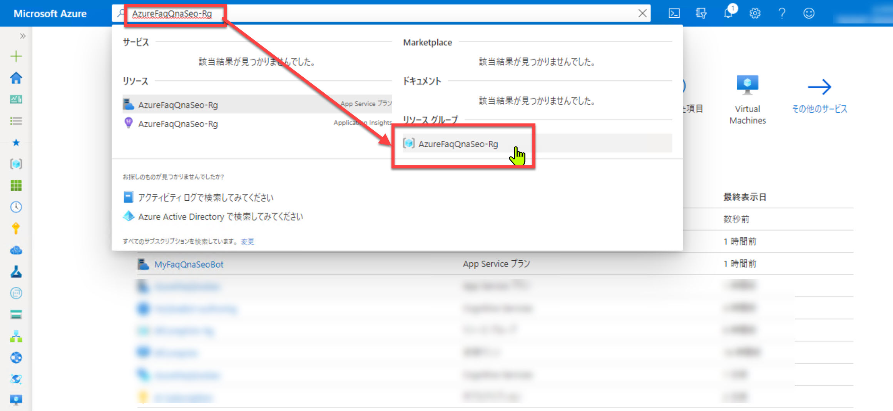

3. [**リソースグループの削除**] をクリックします。

   

4. リソースグループの名前を入力して [削除] をクリックします。  
   しばらく待つと、リソースグループに含まれるすべてのリソースが削除されます。

   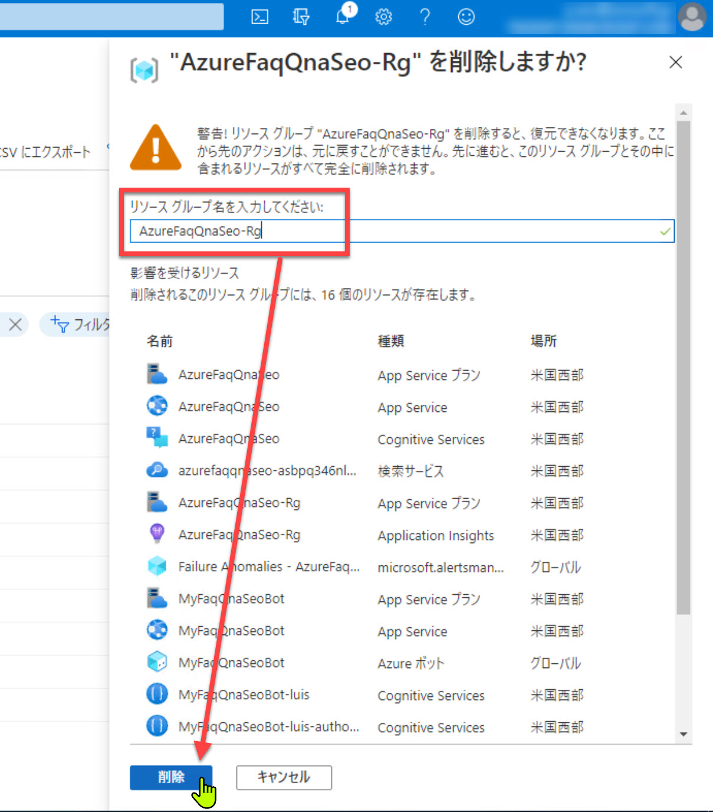

---

以上で Bot Framework Composer を使った Q&A Bot アプリケーションの開発、および Web サービス化のすべての手順は完了です。

おつかれさまでした。

[前に戻る](06_composer_luis.md)  
[目次に戻る](../README.md)
