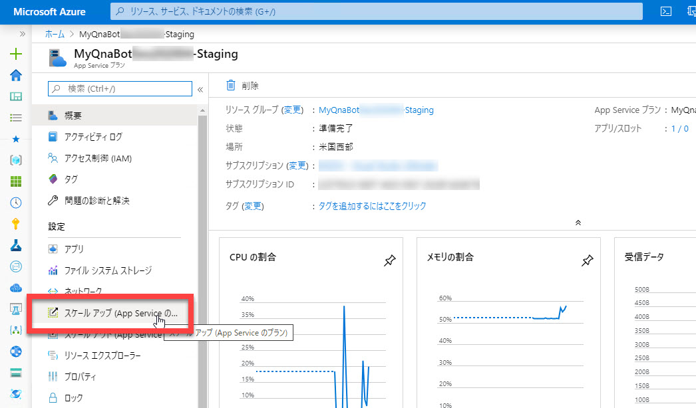
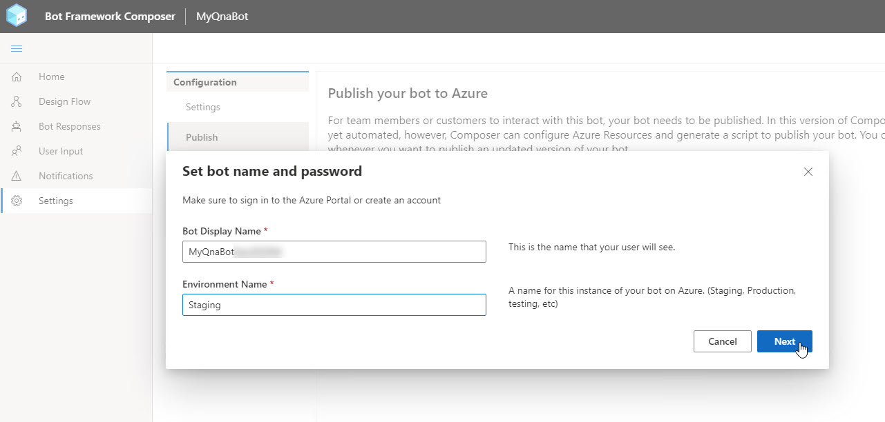
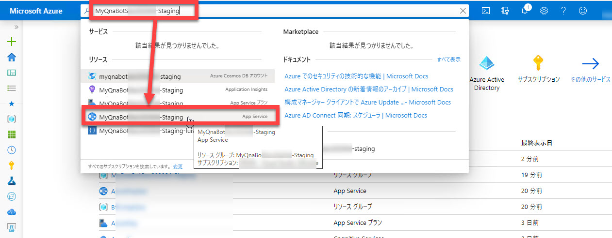
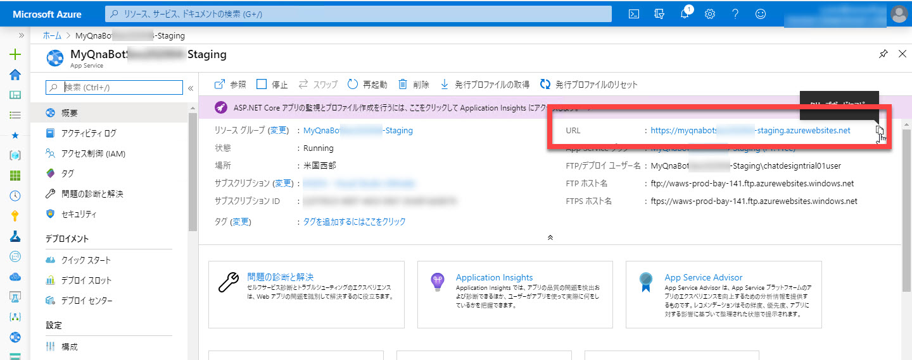
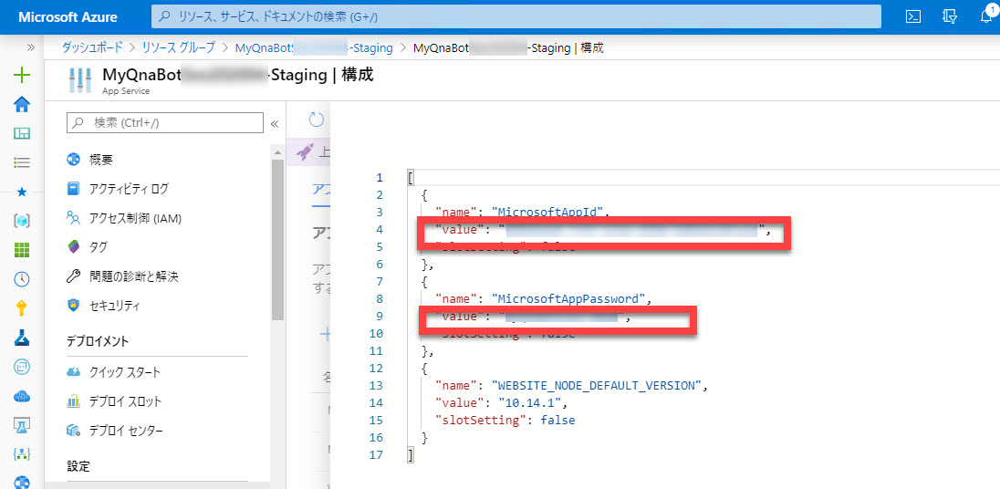
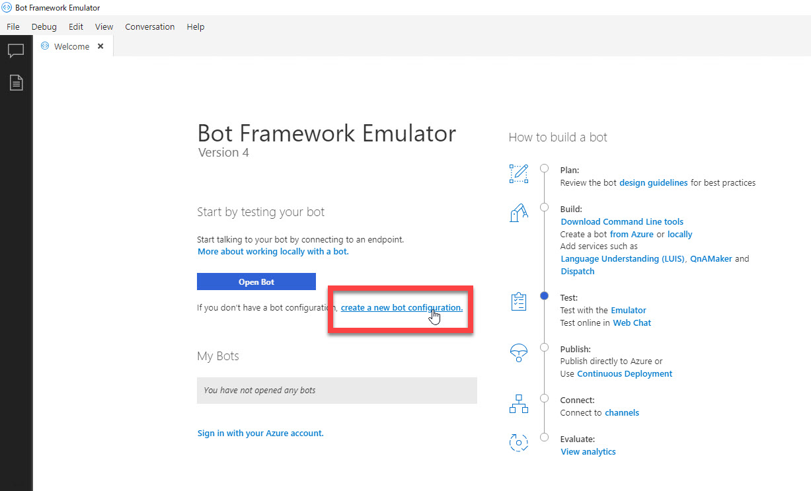
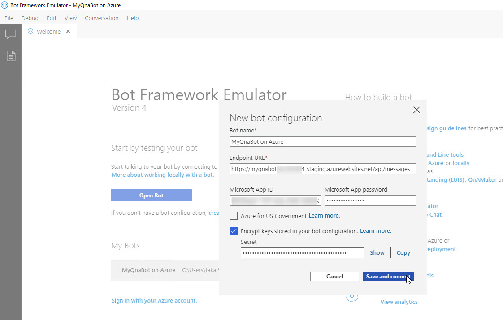
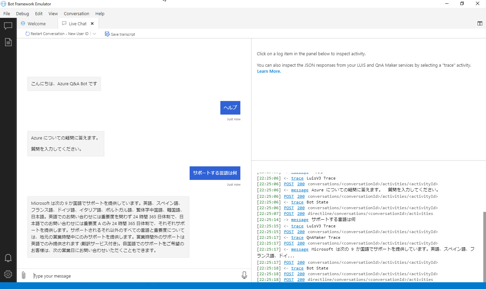

# QnA Bot アプリケーションをクラウドに配置

[前のステップ](06_composer_luis.md) では Q&A Bot に LUIS でユーザーの意図を予測する処理を追加して、Bot アプリケーションの開発はすべて完了しました。

このステップでは、開発した Bot アプリケーションを Azure に発行します。

[1. クラウドに配置するための環境構築](#%e3%82%af%e3%83%a9%e3%82%a6%e3%83%89%e3%81%ab%e9%85%8d%e7%bd%ae%e3%81%99%e3%82%8b%e3%81%9f%e3%82%81%e3%81%ae%e7%92%b0%e5%a2%83%e6%a7%8b%e7%af%89)  
[2. Azure のリソース作成](#azure-%e3%81%ae%e3%83%aa%e3%82%bd%e3%83%bc%e3%82%b9%e4%bd%9c%e6%88%90)  
[3. (オプション) App Service プランの変更](#%e3%82%aa%e3%83%97%e3%82%b7%e3%83%a7%e3%83%b3-app-service-%e3%83%97%e3%83%a9%e3%83%b3%e3%81%ae%e5%a4%89%e6%9b%b4)  
[4. Azure に発行](#azure-%e3%81%ab%e7%99%ba%e8%a1%8c)  
[5. Azure ポータルで App Id を確認](#azure-%e3%83%9d%e3%83%bc%e3%82%bf%e3%83%ab%e3%81%a7-app-id-%e3%82%92%e7%a2%ba%e8%aa%8d)  
[6. Bot Framework Emulator で動作確認](#bot-framework-emulator-%e3%81%a7%e5%8b%95%e4%bd%9c%e7%a2%ba%e8%aa%8d)

---

## クラウドに配置するための環境構築

Bot Framework Composer で開発したアプリケーションを Azure に配置するには、開発で使用したツールとは別に、以下のインストールが必要です。

1. Azure CLI  
 [Azure CLI](https://docs.microsoft.com/ja-jp/cli/azure/install-azure-cli?view=azure-cli-latest) をダウンロードしてインストールします。

2. PowerShell 6.0 以上  
[PowerShell 6.0 以上](https://github.com/PowerShell/PowerShell) をダウンロードしてインストールします。  
事前に [npm](https://www.npmjs.com/) がインストールされている必要がありますが、node.js のインストールで一緒にインストールされています。  
ハンズオンのここまでの手順を実施できていれば既にインストール済みのはずです。

3. LuBuild  
   LuBuild はコマンドプロンプト（またはターミナルアプリ）で以下のコマンドでインストールします。

   ```cmd
   npm config set registry https://botbuilder.myget.org/F/botframework-cli/npm/
   npm install -g @microsoft/botframework-cli
   npm config set registry http://registry.npmjs.org
   ```

---

## Azure のリソース作成

作成した Bot アプリケーションを Azure に発行します。

1. Bot Framework Composer で [**Settings**] - [**Publish**] を選択します。

2. [**Create Azure Resources**] をクリックします。

   

   > [**Create Azure Resources**] はプロジェクトごとに最初の一回だけ必要な操作です。  
   > Bot を変更・修正して再度発行する場合には不要です。

3. [**Set bot name and password**] ダイアログで必要な情報を入力します。  
   入力したら [**Next**] をクリックします。

   |項目名|値|
   |---|---|
   |Bot Display Name|任意の表示名|
   |Environment Name|今回は "**Staging**"|
   |App Secret|任意の**16文字**、数字と特殊文字を最低1個含める必要があります|
   |Azure Region|デフォルトのまま|

   > "**Bot Display Name**" を元に App Service や App Service プランの名前が決まります。  
   > 重複する名前が存在するとリソース作成でエラー発生します。  
   > 名前を入力するタイミングでは重複チェックは実行されません。自分の名前や日付を使った名前を付けることをお勧めします。

   <br />
   

4. [**Create Azure Resources**] で [**Copy to Clipboard**] をクリックします。

   

5. "**PowerShell**" を起動して Azure にログインします。

   ```pwsd
   az login
   ```

6. [Create Azure Resources] でクリップボードにコピーしたスクリプトを PowerShell に貼り付けて実行します。  
   数分で Azure に必要なリソースが作成されます。  
   "**Done**" メッセージが表示されればリソース作成は完了です。

   ```txt
   > Updating appsettings.deployment.json ...
   > Done.
   - App Id: xxxxxxxx-xxxx-xxxx-xxxx-xxxxxxxxxxxx
   - App Password: xxxxxxxxxxxxxxxx
   - Resource Group: MyQnaBotxxxxxxxxx-Staging
   - ServicePlan: MyQnaBotxxxxxxxxx-Staging
   - Bot Name: MyQnaBotxxxxxxxxx
   - Web App Name : MyQnaBotxxxxxxxxx
   ```

   > 環境によっては "Done" メッセージが見えないかもしれません。  
   > 数分間待ってメッセージが表示されなければ、**プロンプトの位置** を確認します。  
   >
   > 
   >
   > 数行の空行のあとにプロンプトが表示されていれば、空行の部分をコピーしてメモ帳などに貼り付けてみてください。

7. [**Next**] をクリックします。

   

---

## (オプション) App Service プランの変更

コスト削減のために App Service プランを **無料の "F1" プラン** に変更します。  

> この手順は必須ではありません。  
> またサブスクリプションの利用状況によっては変更できないかもしれません。

1. [**Azure ポータル**] を開き、Bot Framework Composer で作成したリソースの "表示名" を検索ボックスに入力します。

2. 検索結果から "**App Service プラン**" を選択します。

   

3. [**スケールアップ**] を選択します。

   

4. [**開発/テスト**] - [**F1**] を選択して [**適用**] をクリックします。

   

---

## Azure に発行

Bot アプリケーションを Azure に発行します。

1. Bot Framwork Composer に戻ると、[**Publish your Bot**] ダイアログが表示されています。  
   [**Copy to Clipboard**] をクリックして、スクリプトをクリップボードにコピーします。

   

   > Bot Framework Composer を閉じてしまった場合、また Azure への発行が二度目以降の場合は、[**Settings**] - [**Settings**] - [**Publish Bot to Azure**] を選択します。  
   > 続いて [**Set bot name and password**] で、前の手順で作成した Bot の表示名、および "Environment Name" を入力してください。  
   > [Publish your Bot] ダイアログが表示されます。
   >
   > 
   > <br />
   >    

2. PowerShell クリップボードにコピーしたスクリプトを貼り付けて実行します。

以上で、Bot アプリケーションを Azure に発行できました。

---

## Azure ポータルで App Id を確認

1. [**Azure ポータル**] を開き、Bot Framework Composer で作成したリソースの "表示名" を検索ボックスに入力します。

2. 検索結果から "**App Service**" を選択します。

   

3. App Service の [**URL**] をメモ帳などに記録しておきます。

   

4. [**構成**] を選択して [**高度な編集**] をクリックします。

   

5. "MicrosoftAppId" の値、および "MicrosoftAppPassword" の値をメモ帳などに記録しておきます。

   

---

## Bot Framework Emulator で動作確認

最後に Bot Framework Emulator で動作確認します。

1. Bot Framework Emulator を起動します。  
   続いて、[**Settings**] をクリックして Settings 画面を開きます。 

2. [**Path to ngrok**] に "ngrok" のパスを入力します。  
   さらに "**Bypass ngrokfor local address**", "**Run ngrok after the Emulator starts up**" のチェックボックスを選択ます。  
   最後に [**Save**] をクリックします。
 
   

3. Bot Framework Emulator を一度終了して、改めて起動します。

4. [**create a new bot configuration**] を選択します。

   

5．[**New bot configuration**] で以下の入力・選択をします。  
   最後に [**Save and connect**] をクリックします。

   |項目名|値|
   |---|---|
   |Bot name|任意の名前|
   |Endpoint URL|発行した App Service の URL + "/api/messages"|
   |Microsoft App ID|発行した App Service の App ID|
   |Microsoft App password|発行した App Service のパスワード|
   |Encrypt keys stored ～|チェック|

   

6. BBot Framework Emulator で何か入力してみます。

   - このボットの使い方
   - サポートされる言語は何

   など、LUIS または QnA Maker で処理されることを確認します。

   

---

以上で Bot Framework Composer を使って Q&A Bot アプリケーションを開発、クラウドに発行する全ての手順は終わりです。

おつかれさまでした。

[前に戻る](06_composer_luis.md)  
[目次に戻る](../README.md)
