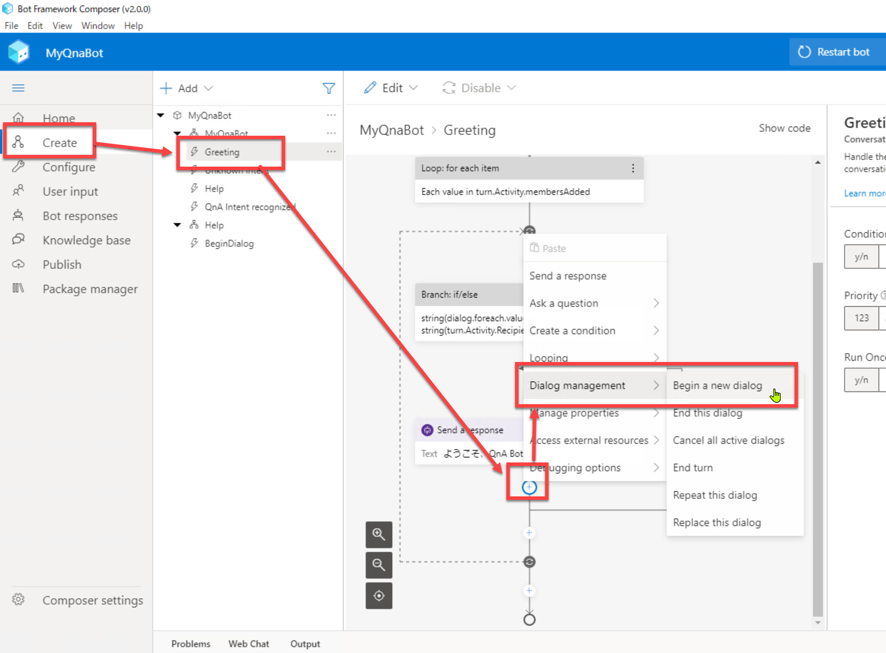
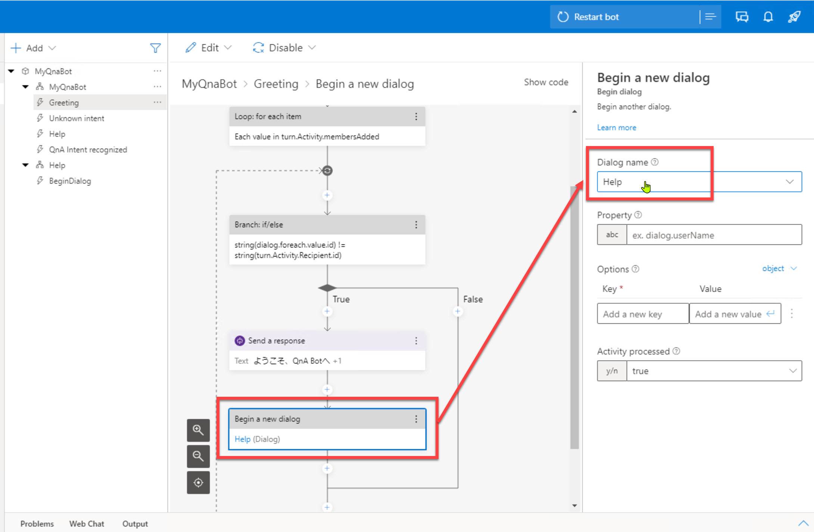
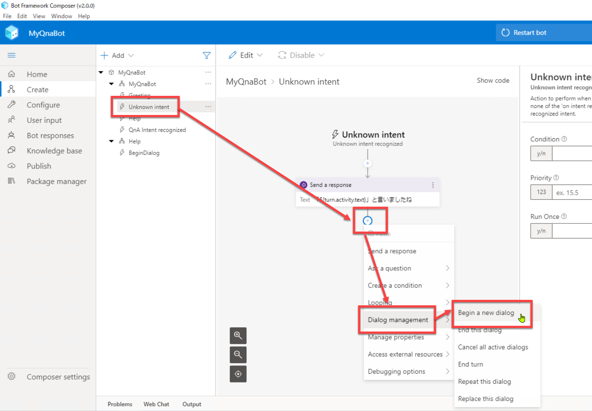
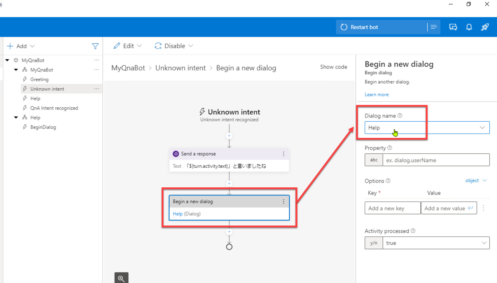
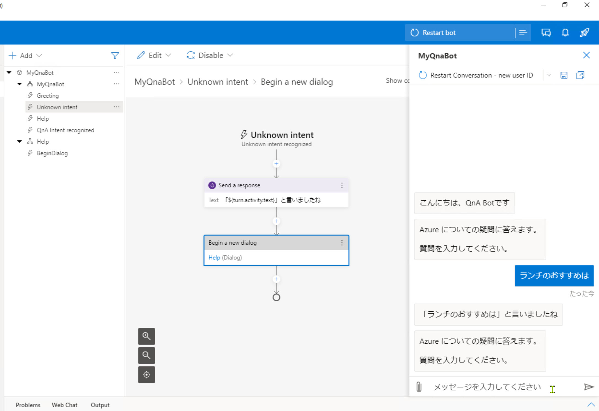
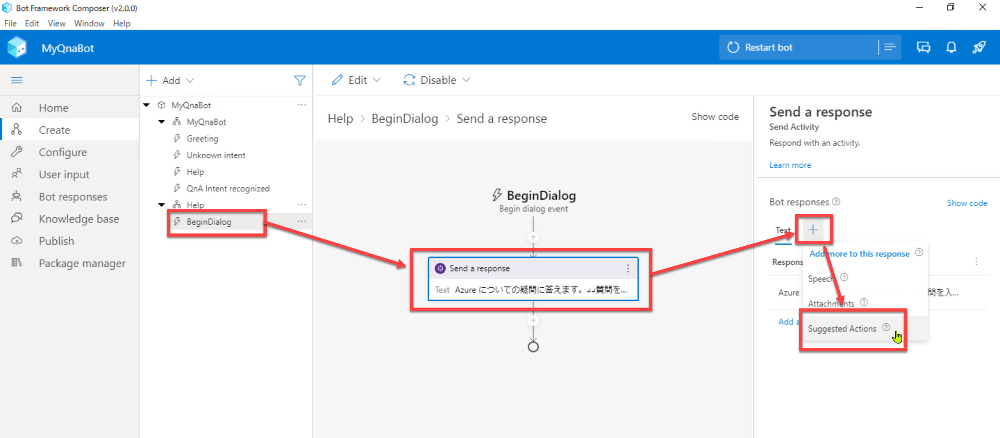
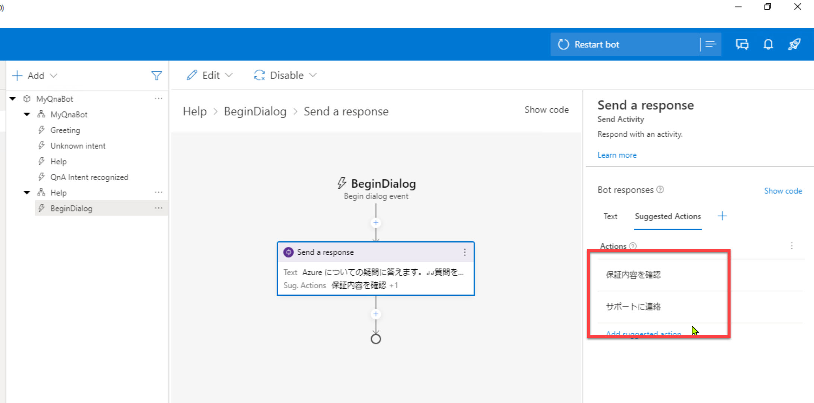
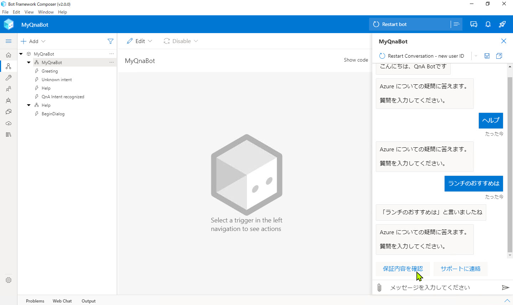

# 操作性の向上

[前のステップ](04_create_knowledgebase.md) で、Composer 組み込みの機能でナレッジベースを作成しました。

このステップでは、ユーザーにとっての操作性を向上する機能を追加します。

[1. ヘルプメッセージを応答するタイミングの追加](#ヘルプメッセージを応答するタイミングの追加)  
[2. サジェスチョンの追加](#サジェスチョンの追加)

 

---

## ヘルプメッセージを応答するタイミングの追加

[前のステップ](./04_composer_luis.md) で、ユーザーが "ヘルプ" などと入力した時にヘルプメッセージを応答する処理を実装しました。

ユーザーにとっての操作性を考えると、他のタイミングでもヘルプメッセージを応答するのがよさそうです。

- ユーザーが Bot と対話を開始した時（あいさつメッセージに加えてヘルプメッセージ）
- ユーザーが Q&A やヘルプを求める以外の入力をした場合（ユーザーの意図が不明で "Unknown Intent" に分類された場合）

これらのタイミングでもヘルプメッセージを応答する処理を追加します。  
すでに [Help ダイアログは実装済み](./03_composer_basic2.md) なので処理の追加は簡単です。

1. [**Create**] - [**Greeting**] でトリガーを開き、"**ようこそ、QnA Bot へ**" [**Send a response**] の下の [**+**] をクリックします。  
   続いて、[**Dialog management**] - [**Begin a new dialog**] を選択します。  

    

   

 

2. [**Dialog name**] で "**Help**" を選択します。

    

   

 

3. 同様に [**Unknown Intent**] にも [**Begin a new dialog**] を追加して、"**Help**" ダイアログを呼び出します。    

    

     
   

 

4. [**Restart bot**] で ローカルの Bot ランタイムを再起動します。  
   続いて Web Chat を開きます。  
   以下のタイミングでヘルプメッセージが表示されることを確認します。

   - チャットを開始した時（"Restart Conversation" で Web Chat を再起動した後）
   - "ランチのおすすめは" と入力した時

   

---

## サジェスチョンの追加

サジェスチョンとはユーザーに対する入力例の提示のことです。

ユーザーが Bot と対話する際、主にキーボードを通して自然言語の入力を行います。（クライアントによっては音声入力）

入力例を提示することで、ユーザーの操作性が向上することがあります。

- （そのタイミングで）ユーザーがよく入力すると思われる内容を提示することで入力の手間を省く
- ユーザーに何を入力したらいいかを例示する

1. [**Help**] - [**BeginDialog**] を選択して、さらに [**Send a response**] を選択します。
2. [**Bot responses**] で [**+**] をクリックして [Suggested Actions] を選択します。  

    
   
   

 

3. [**Suggested Actions**] に以下を入力します。  

   - 保証内容を確認  
   - サポートに連絡

    

   

    

   > [Suggested Actions] に入力したものは、[前のステップ](./05_create_knowledgebase.md) でナレッジベースに追加の Question として入力したものです。  
   > Bot から提示した内容がナレッジベースで確実に見つかるように Question として追加しておきました。

 

4. [**Restart bot**] で ローカルの Bot ランタイムを再起動して Web Chat を開きます。  
   以下のタイミングでヘルプメッセージと一緒にサジェスチョンが表示されることを確認します。

   - チャットを開始した時（"Restart Conversation" で Web Chat を再起動した後）
   - "ヘルプ" と入力した時  
   - "ランチのおすすめは" と入力した時

    

   

 

---

以上で、Q&A Bot アプリケーションを開発は完了です。

次のステップでは、作成したアプリケーションを Azure に発行します。

[前に戻る](./06_test_qnatrigger.md) | [次に進む](./08_deploy_bot.md)  
[目次に戻る](../README.md)