# Bot アプリケーションをクラウドに発行

[前のステップ](06_composer_luis.md) までで Q&A Bot アプリケーションの開発は完了しました。

このステップでは、作成したアプリケーションを Azure に発行します。

[1. 発行プロファイルの作成](#発行プロファイルの作成)  
[2. Azure に発行](#azure-に発行)  
[3. App ID および App Password の確認](#app-id-および-app-password-の確認)  
[4. Bot Framework Emulator で動作確認](#bot-framework-emulator-で動作確認)  
[5. Azure 上のリソースの削除](#azure-上のリソースの削除)

---

## 発行プロファイルの作成

Bot Framework Composer v2.0 では Composer の環境内から Azure への発行ができます。  
発行にはまず、発行プロファイルを作成します。

 

1. [**Publish**] - [**Publishing**] - [**Add new**] を選択します。  

    

   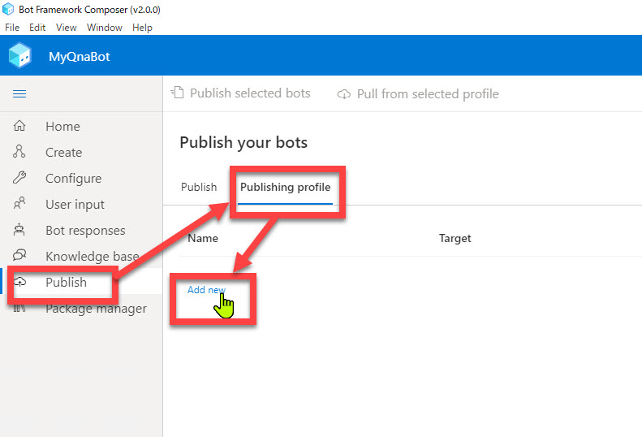

 

2. 以下の入力、選択をします。  

    
   
   |項目名|値|
   |---|---|
   |Name|任意|
   |Publishing target|Publish bot to Azure|

    

   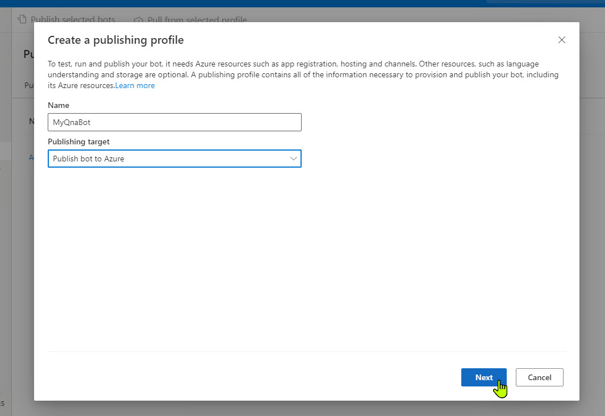

 

3. [**Create new resources**] を選択して [Next] をクリックします。  
   
    

   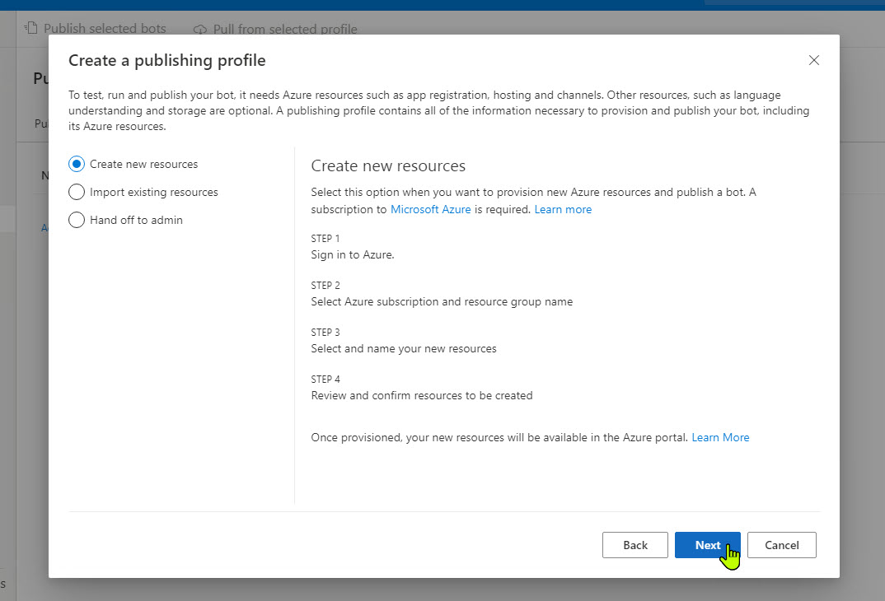

 

4. 必要に応じて Azure にサインインします。
5. 以下の選択、入力をします。   

    

   |項目名|値|
   |---|---|
   |Azure Directory|任意|
   |Subscription|任意|
   |Resource group|任意 (このハンズオンでは前のステップで作成したリソースグループでよい)|
   |Name|任意|
   |Region|今回は "米国西部"|
   |LUIS region|今回は "米国西部"|

    

   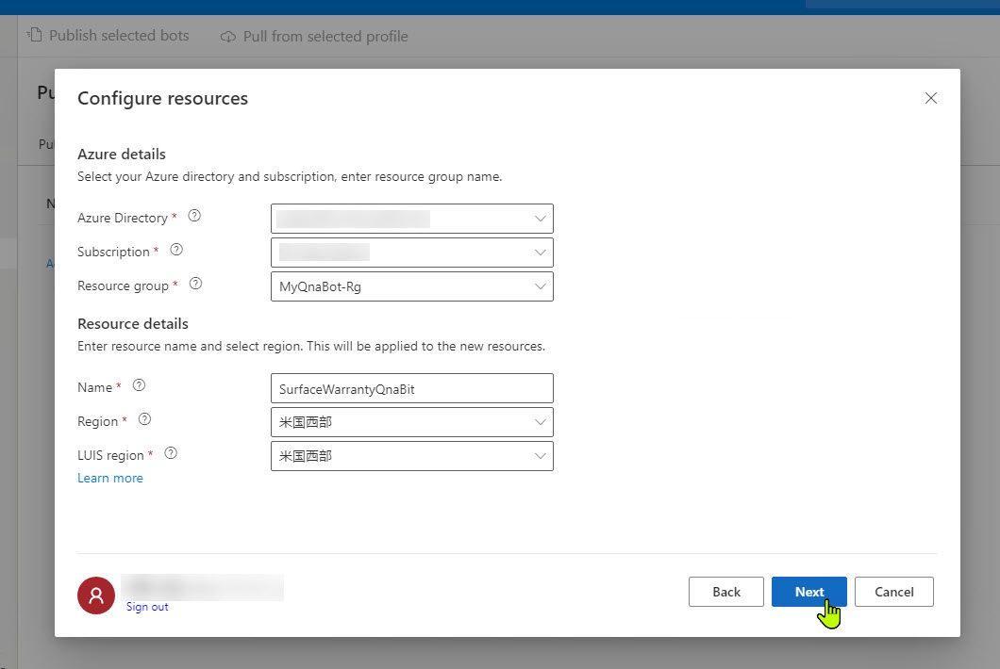

 

6. [**Add resources**] で [**Optional**] の以下のリソースのチェックを外します。
   
    

   - Azure Cosmos DB
   - Application Insights
   - Azure Blob Storage

    

   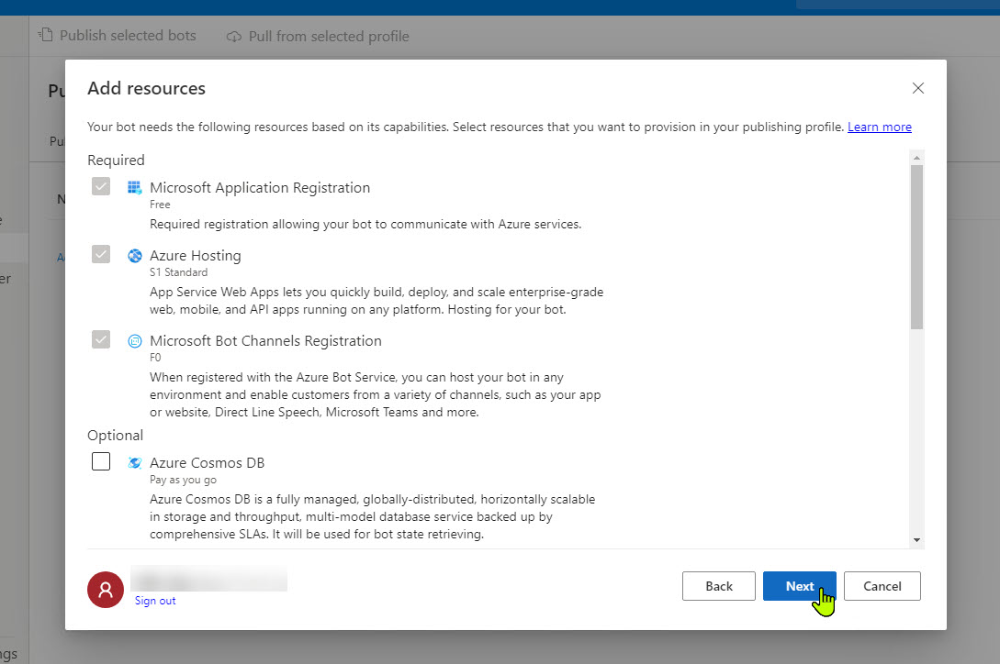

 

7. 確認画面で [**Create**] をクリックします。  
   プロファイル作成が完了するまで少し時間がかかります。

    

   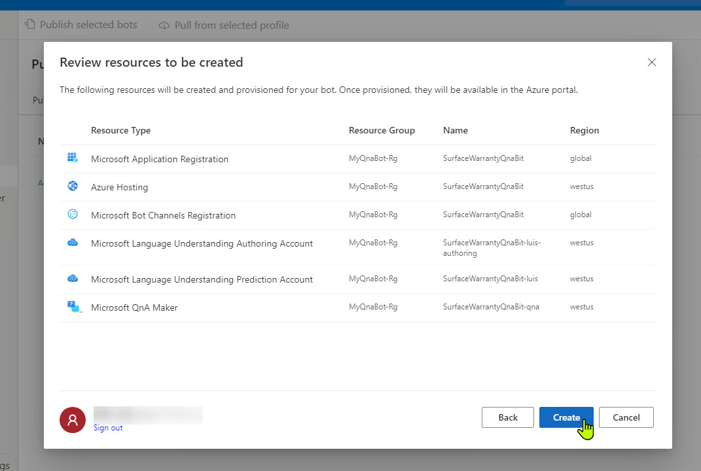

 

---

## Azure に発行

発行プロファイルができたので、それを使って Bot アプリケーションを Azure に発行します。

1. [**Publish**] で発行する **Bot をチェック** して、[**Publish target**] で今作成したプロファイルを選択します。  
   続いて [**Publish selected bots**] をクリックします。

    

   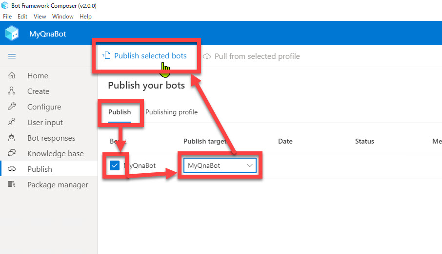

 

2. 管理用のコメントを任意で入力します。最後に [Okey] をクリックして発行します。　　
   発行に成功するまで少し待ちます。

    

   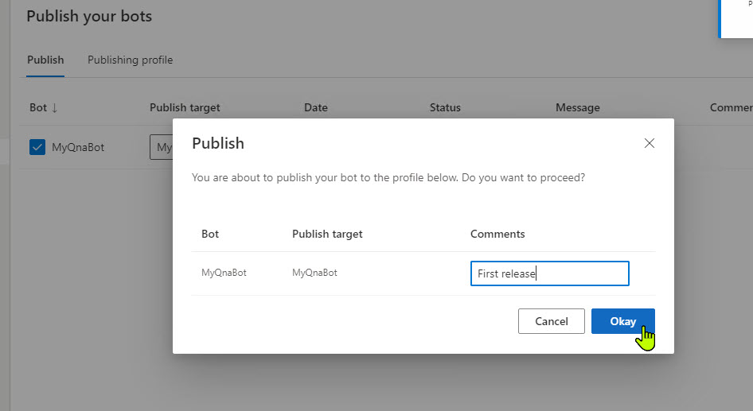

    

   > 発行に成功したら必要に応じて、作成された App Service プラン を F1 (無償) に変更します。  
   >
   > Azure ポータルで [**App Service プラン**] を選択して、[**開発 / テスト**] - [**F1**] を選択します。  
   >
   > 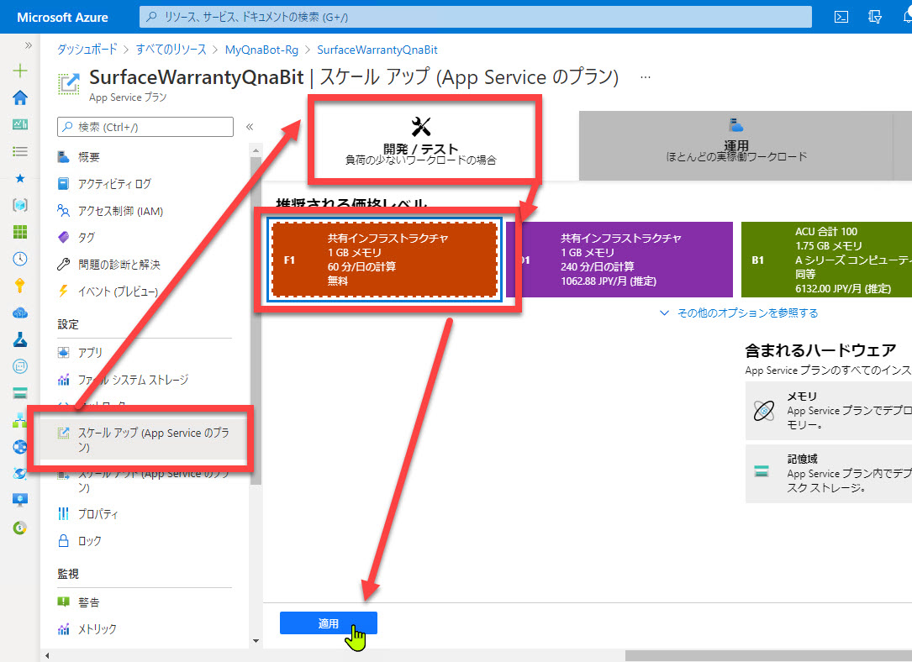

 

3. ハンズオンの最後の手順として、Bot Framework Emulator で動作確認する際に必要となるメッセージング エンドポイントを確認して、メモ帳などにコピーします。  
   Azure ポータルで [**Azure ボット**] ブレードを開き、[**メッセージングエンドポイント**] をコピーします。  
   Azure Bot の　メッセージング エンドポイントは、**Bot Framework Emulator での動作確認時** に使用します。

    

   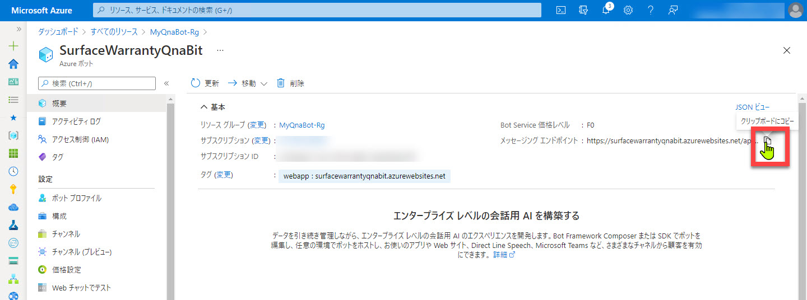

 

---

## App ID および App Password の確認

このあとの Bpt Framework Emulator での動作確認に必要になる App ID および App Password を確認して、メモ帳などにコピーします。

1. Bot Framework Composer に戻って、発行した Bot の App ID および App Password を確認します。  
   [**Publish**] - [**Publishing profile**] で発行に使用した発行プロファイルの [**Edit**] をクリックします。

    

   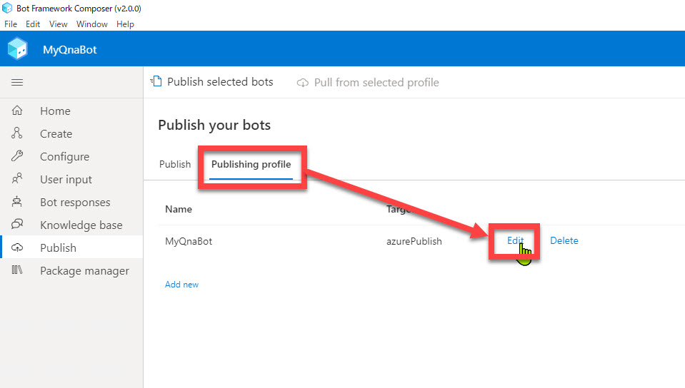

 

2. [**Import existing resources**] を選択して [Next] をクリックします。
   
    

   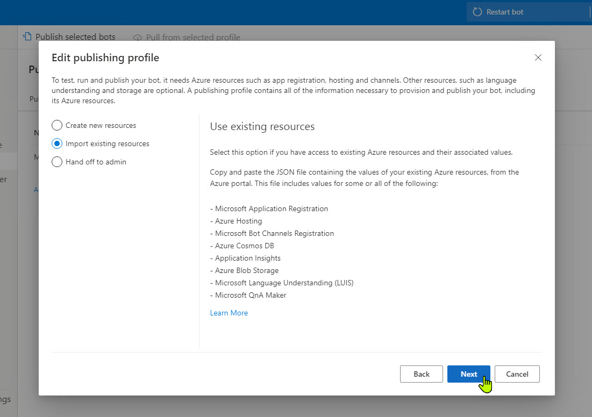

 

3. 表示された発行プロファイルの [**MicrosoftAppId**] および [**MicrosoftAppPassword**] の値をメモ帳などにコピーします。  
   コピーしたら [Cancel] で閉じます。  

    

   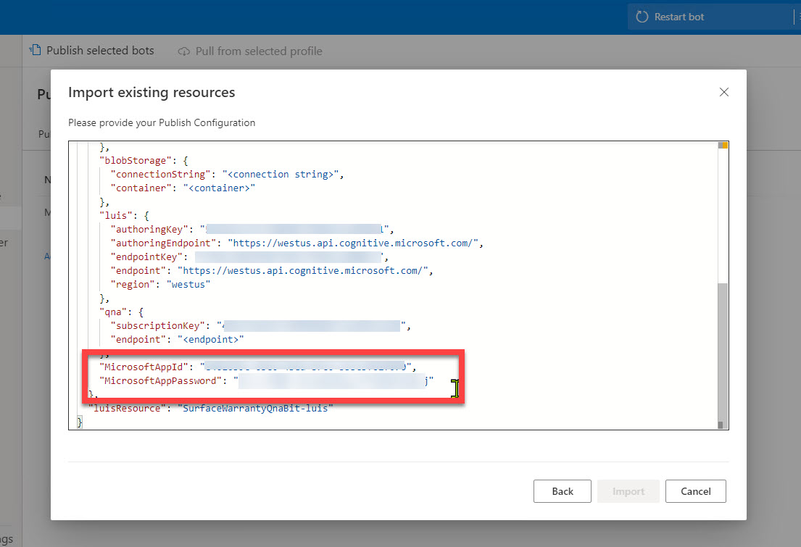

 

---

## Bot Framework Emulator で動作確認

Azure に発行したので Bot Framework Emulator から接続して Bot の動作を確認してみます。

1. ngrok の設定、およびロケールの設定  
   Bot Framework Emulator を起動して [**Settings**] を開き、以下の設定をします。  
   以下の設定後は、念のために Bot Framework Emulator を再起動します。

   ngrok はハンズオンの最初に [開発環境の構築](01_install.md) でインストール（ファイル配置）しているはずです。

    

   |項目|値|
   |---|---|
   |Path to ngrok|ngrok のパス|
   |Bypass ngrok for local addresses|チェック|
   |Run ngrok when the Emulator starts up|チェック|
   |Locale|ja-jp|

    

   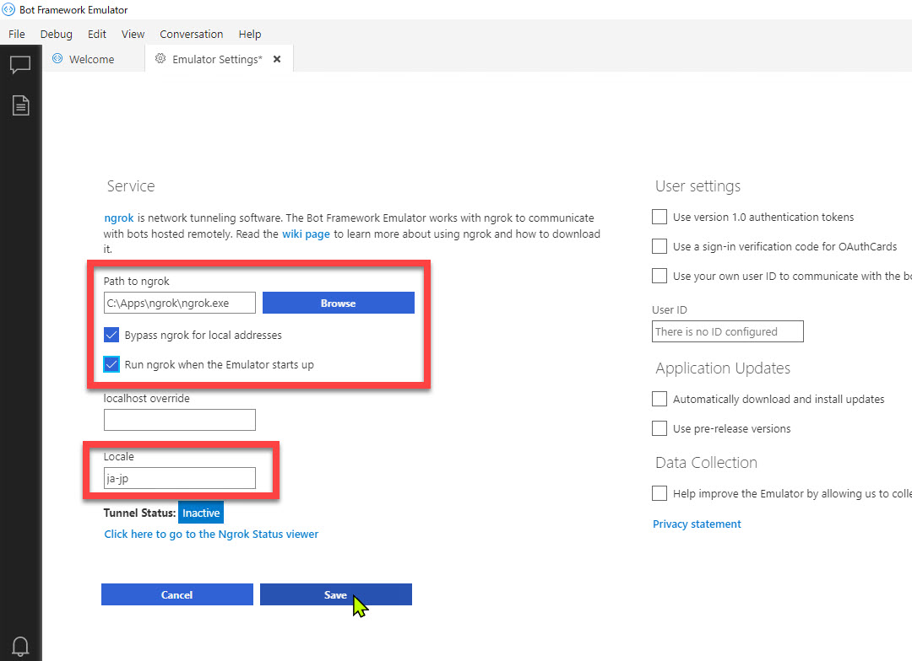

 

5. [**Welcome**] 画面の [**Open Bot**] をクリックして、以下の通り入力・選択して [**connect**] をクリックします。

    

   |項目|値|
   |---|---|
   |Endpoint URL|発行した Bot のメッセージ エンドポイント |
   |Microsoft App ID|"**MicrosoftAppId**" の値 |
   |Microsoft App password|"**MicrosoftAppPassword**" の値 |

    

   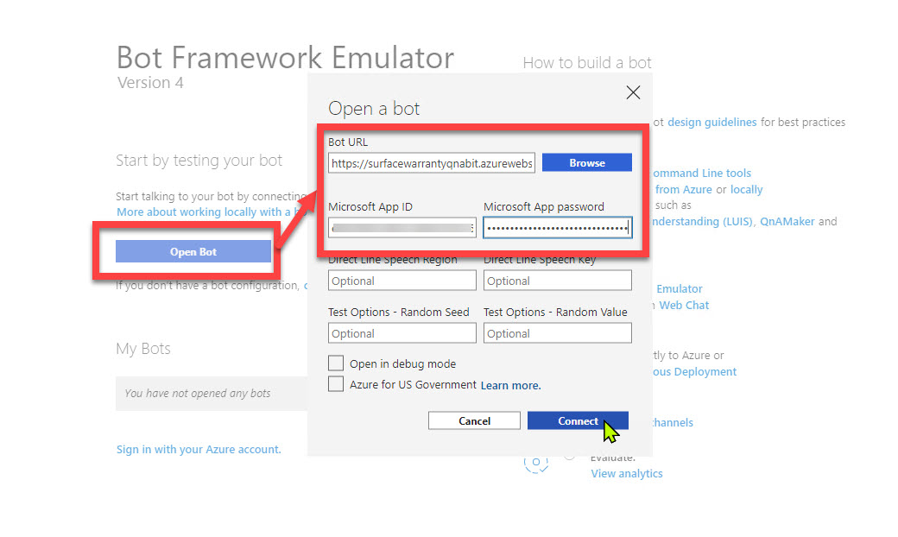

 

6. 任意の入力をして Bot から適切な応答があることを確認します。  
   
   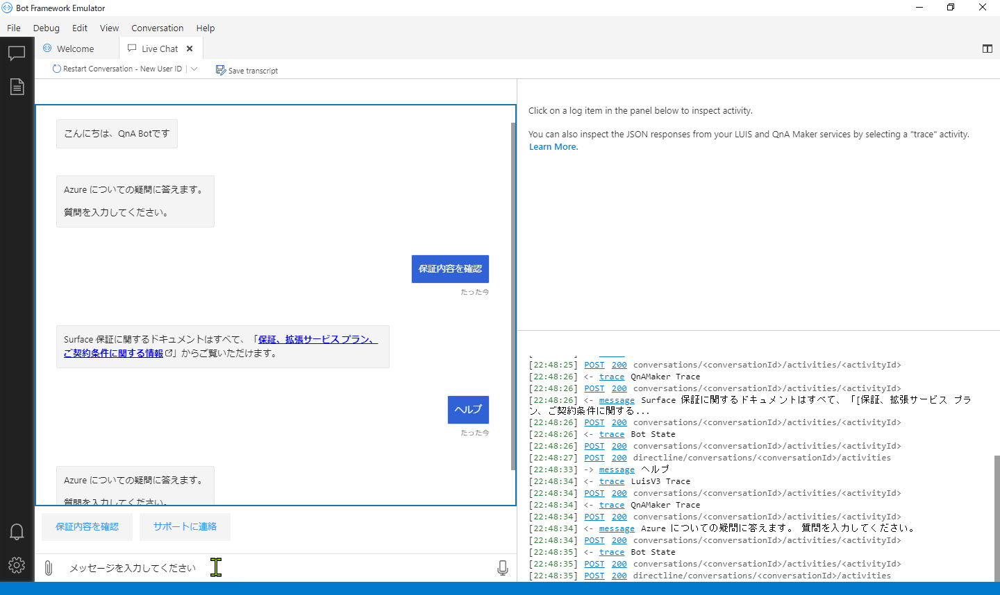

---

## Azure 上のリソースの削除

Azure に作成したリソースはコストがかかります。  

作成したアプリケーションを続けて使用するなどの場合（例えば、同僚に見せる、説明する）を除いて、作成したリソースを削除してください。

1. [Azure ポータル](https://portal.azure.com/) に接続します。

2. 検索ボックスに "**今回使用したリソースグループ名**" を入力して、リソースグループを選択します。

   > QnA Maker で作成したリソースについては、このハンズオンの手順通りに進めていれば無償の範囲です。

    

   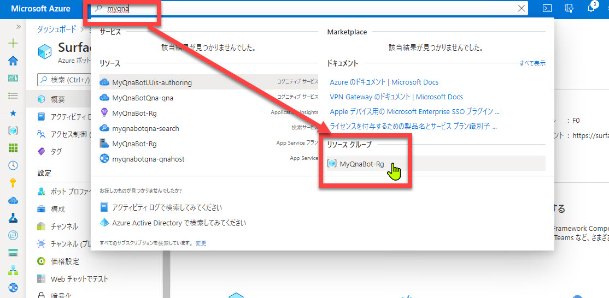

 

3. [**リソースグループの削除**] をクリックします。

    

   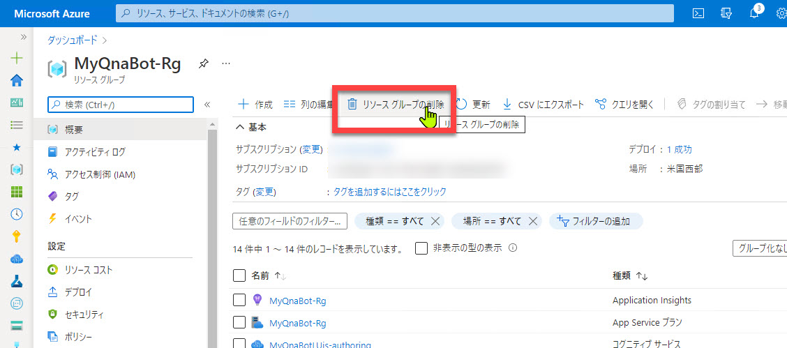

 

4. リソースグループの名前を入力して [削除] をクリックします。  
   しばらく待つと、リソースグループに含まれるすべてのリソースが削除されます。

    

   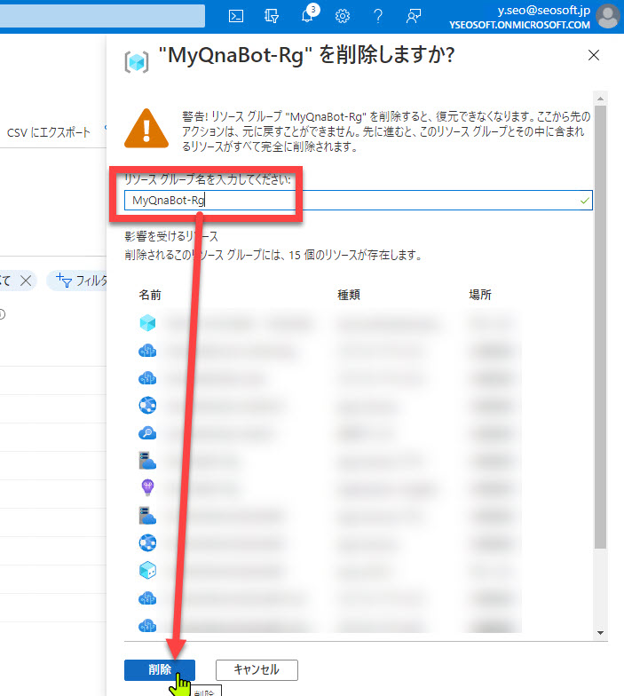

 

---

以上で Bot Framework Composer を使った Q&A Bot アプリケーションの開発、および Web サービス化のすべての手順は完了です。

おつかれさまでした。

[前に戻る](./07_help_and_suggestion.md)  
[目次に戻る](../README.md)